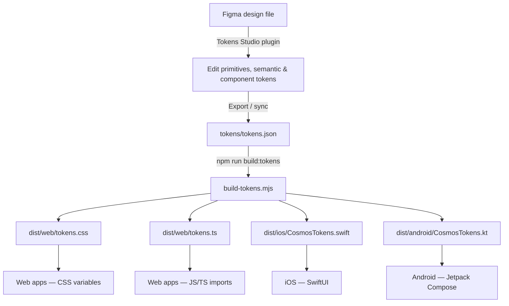

# MakeMyTrip Cosmos Design Tokens

Single source of truth for the MakeMyTrip Cosmos Design System. Tokens are authored in [Tokens Studio](https://tokens.studio/) format, stored in `tokens/tokens.json`, and compiled to web, iOS, and Android outputs via [Style Dictionary](https://styledictionary.com/).

```bash
npm install
npm run build:tokens
```

| Output | Path |
|--------|------|
| CSS custom properties | `dist/web/tokens.css` |
| JavaScript / TypeScript (ESM) | `dist/web/tokens.ts` |
| SwiftUI enum | `dist/ios/CosmosTokens.swift` |
| Jetpack Compose object | `dist/android/CosmosTokens.kt` |

The iOS and Android outputs are namespaced as `CosmosTokens` (Kotlin package `com.makemytrip.cosmos.tokens`) so an app can consume Cosmos tokens alongside another token set without symbol collisions.

---

## End-to-end workflow

Design tokens move from Figma authoring through a single JSON source file into platform-specific code. The pipeline is intentionally linear: one source of truth, one build command, four outputs.



### 1. Author in Figma (Tokens Studio)

Designers maintain the token system in Figma using the [Tokens Studio](https://tokens.studio/) plugin. The file is organized into three token sets that mirror the JSON structure:

| Token set | Contents |
|-----------|----------|
| **primitives** | Raw values — color palettes, font stacks, pixel scales |
| **semantic** | Role-based aliases (color, typography, radius, icon, **space**) that reference primitives via `{category.path}` syntax |
| **component** | Component-scoped aliases (`button/*`, `checkbox/*`, `radio/*`, `chip/*`) that reference semantic tokens — one key per property × variant × state |

Each tier may only reference the tier below it. When adding a new semantic color, always reference a primitive (e.g. `{color.brand.600}`) rather than entering a raw hex value. When adding a component token, always reference a semantic token (e.g. `{color.bg-fill-brand}`) — never a primitive and never a raw hex, or a palette change will stop propagating.

### 2. Export to JSON

Export or sync from Tokens Studio into `tokens/tokens.json`. This file is the **source of truth** for the repository and the only input the build reads.

The export must preserve:

- `$metadata.tokenSetOrder`: `["primitives", "semantic", "component"]` — each tier resolves before the one that references it
- W3C DTCG format: each token has `value` and `type`
- Cross-set references: `{fontSize.16}`, `{color.neutral.950}`, etc.
- `description` on every semantic and component token, and on every primitive colour — see below
- Opacity as a **decimal 0–1**, not a percentage. Figma's opacity binding is percentage-based, so the variable holds `32` where the JSON holds `0.32`; the primitive's key is the Figma number, which is what makes the two sides checkable against each other. The build throws on anything outside 0–1 — see [Opacity tokens](#11-opacity-tokens)

#### Token descriptions

Every token in the **semantic** and **component** sets carries a `description` alongside its `value` and `type`, as does every primitive colour:

```json
"bg-fill-brand": {
  "value": "{color.brand.700}",
  "type": "color",
  "description": "Solid brand fill for the highest-emphasis action — primary button default. Pair the label with text-brand-on-bg-fill. For a tinted brand background use bg-surface-brand."
}
```

These exist so that anyone choosing a token — a human reading the JSON, or an LLM implementing from it — can tell near-identical roles apart (`bg-surface-*` vs `bg-fill-*`, `*-strong` vs `*-subtle`, `warning` vs `caution`). A description states **intent and boundary**, not the value: what the token is for, and which neighbouring token to use instead. Restating the name (`"Brand fill colour"`) adds nothing.

Component-token descriptions name the part of the anatomy and the state combination (`"Outline of the checkbox box — checked and in the error state, while pressed."`), and carry the rules the names cannot: that `checkbox/min-touch-target` must not scale with `control-size-*`, that the label does not turn red in the error state, that a button's label keeps its rest colour on hover, pressed and focus, and that the button icon slots bind to semantic `color.icon-*` roles rather than to `button/label-*`.

Primitive descriptions work differently. A numeric step like `spacing.16` is its own definition and stays undescribed; 44 such steps are left bare on purpose. What does get described:

- **Every colour** carries which of the two text roles is safe on top of it and at what ratio — `"Safe text on top: text-inverse at 5.11:1 (passes AA); text-primary fails at 3.75:1."` Every swatch in the system has exactly one AA-safe text colour, except `violet.500`, which has none.
- **The steps the name under-specifies** — `spacing.10`, `spacing.86`, `spacing.200` and `spacing.320` and their single consumers (Radio dot, Button minimum width, Menu width range), the negative steps and their `minusN` build rename, the `borderRadius.999` pill sentinel, the three-weight ramp.
- **Anything nothing references**, flagged as raw scale rather than supported system.

Those ratios are computed, not hand-written, so they go stale when a ramp moves. Regenerate them with `node scripts/describe-primitives.mjs` and commit the result.

Descriptions map to the Description field on the corresponding Figma variable, so they round-trip through the Tokens Studio plugin. **A re-export that drops them is a regression** — check `git diff` before committing a fresh sync.

Where a token and the Figma component disagree, the description says so rather than papering over it — `button/gap-sm` is applied at every size despite its suffix, `button/min-height-md` and `-sm` sit below the WCAG 2.5.8 target, and `radio/state-layer-opacity-focus` is an accepted 1.4.11 deviation. Each points at the component spec in `components/` that records the anomaly.

They reach `dist/web/tokens.css` as comments above each custom property; the other platforms currently drop them (see [Adding descriptions to other platforms](#adding-descriptions-to-other-platforms)).

### 3. Build platform outputs

```bash
npm install        # once
npm run build:tokens
```

`build-tokens.mjs` runs [Style Dictionary](https://styledictionary.com/) with Tokens Studio transforms and custom MMT transforms. The build:

1. **Preprocesses** the dictionary (`tokens-studio` hoists token sets; `mmt/rename-negative` renames `-12` spacing keys to `minus12`; `mmt/comment-anchor` marks which expanded sub-token carries a composite token's description)
2. **Expands** composite typography tokens into individual `fontFamily`, `fontWeight`, `fontSize`, and `lineHeight` properties, and on iOS and Android only, each shadow layer into `offsetX`, `offsetY`, `blur` and `color`. Web keeps a shadow whole as one `box-shadow` value (`shadow/css/shorthand`)
3. **Resolves** all `{references}` to final values (including `{color.*}` refs embedded inside gradient strings via `mmt/resolve-gradient-colors`, kept for future gradient tokens)
4. **Transforms** values per platform:
   - Font weights → numbers
   - Dimensions: `px` → unitless (iOS), `sp`/`dp` (Android)
   - Opacity: `Float` literal (Android, `0.32f`); integral values gain a decimal place (iOS, so `1` is not inferred `Int`); web passes through
   - **Colors (iOS/Android only):** hex → native `Color(...)` (gradient → `Brush.linearGradient(...)` / `LinearGradient` when present) — web keeps hex strings and CSS gradients
5. **Emits** CSS, ESM, Swift, and Kotlin files into `dist/`

On web CSS only, `mmt/description/comment` copies each token's `description` into a comment above its custom property:

```css
  /** Default text colour — body copy, headings, and any content carrying the main message. */
  --color-text-primary: #0A0A0A;
```

Composite typography tokens expand into four custom properties that all inherit one description, so the comment is emitted once, above the first of the four. Shadows are not expanded on web, so each carries its own comment.

##### Adding descriptions to other platforms

- **Android** — add `"mmt/description/comment"` to the `android` transform list. Style Dictionary's Compose template already renders `token.comment` as KDoc.
- **iOS** — needs more than a transform: the stock `ios-swift/enum.swift` template emits no comments, so it would take a custom format.
- **`tokens.ts`** — built with `minify: true`, which reduces each token to its bare value. Carrying descriptions means either dropping `minify` (changing the shape consumers import) or emitting a separate metadata file.

All three sets land in a **flat output namespace** — there is no `primitives.`, `semantic.`, or `component.` prefix in generated code. Component tokens keep their group as part of the name, so `component.checkbox.bg-selected-default` emits as `--checkbox-bg-selected-default`.

### 4. Consume in product code

| Platform | Import | Naming | Example |
|----------|--------|--------|---------|
| Web (CSS) | `@import "./dist/web/tokens.css"` | kebab-case CSS vars | `var(--color-text-primary)` |
| Web (TS) | `import tokens from "./dist/web/tokens.ts"` | camelCase object keys | `tokens.colorTextPrimary` |
| iOS | Copy / link `CosmosTokens.swift` | camelCase static lets | `CosmosTokens.colorTextPrimary` (`Color`) |
| Android | Copy / link `CosmosTokens.kt` | camelCase vals in `com.makemytrip.cosmos.tokens` | `CosmosTokens.colorTextPrimary` (`Color`) |

**Rule of thumb:** product code should consume **semantic** tokens (`text-primary`, `radius-md`, `space-md`, `body.medium.regular`) rather than primitives (`neutral-950`, `borderRadius-8`, `spacing-16`). Inside a design system component, prefer that component's own **component** tokens (`--checkbox-bg-selected-hover`) — they are the contract the Figma component is bound to, so design and code stay in step.

### 5. Commit and ship

After any token change:

1. Update `tokens/tokens.json` (via Figma export or direct edit)
2. Run `npm run build:tokens`
3. Run `npm run lint` and fix what it reports (see [Linting](#linting))
4. Commit **both** the source JSON and regenerated `dist/` files together
5. Publish or copy `dist/` artifacts into consuming apps

---

## Architecture

```
Figma (Tokens Studio plugin)
        ↓ export
tokens/tokens.json
  ├── primitives   — raw values (colors, sizes, fonts)
  ├── semantic     — role-based aliases that reference primitives
  └── component    — component-scoped aliases that reference semantic tokens
        ↓ Style Dictionary + custom transforms
dist/web · dist/ios · dist/android
```

The token set order is fixed in `$metadata.tokenSetOrder`: **primitives first, semantic second, component third**. Each tier must resolve before the tier that references it — primitives before semantic aliases, semantic before component aliases.

### Build pipeline internals

`build-tokens.mjs` configures Style Dictionary with the following processing stages:

| Stage | Name | What it does |
|-------|------|--------------|
| Preprocessor | `mmt/validate-opacity` | Rejects an opacity value outside 0–1, a literal opacity outside the primitive tier, and any drift between the `opacityScale` ramp and its semantic mirrors. Runs **before** `tokens-studio`, the only point at which the three tiers are still distinguishable. The rules live in `scripts/lib/opacity.mjs`, shared with the linter's `tokens/opacity` rule |
| Preprocessor | `tokens-studio` | Hoists the `primitives`, `semantic`, and `component` sets to the dictionary root so cross-set references like `{fontSize.16}` and `{color.bg-fill-brand}` resolve |
| Preprocessor | `mmt/rename-negative` | Renames keys like `spacing.-12` → `spacing.minus12` (and `shadowOffset.-4`) to avoid collisions after camelCase/kebab-case conversion, and rewrites `{…-4}` references to match |
| Preprocessor | `mmt/resolve-gradient-colors` | Inlines `{color.family.step}` references inside `linear-gradient(...)` strings before platform transforms run |
| Expand | `typesMap: true` | Splits composite `typography` tokens into individual output properties |
| Transform | `mmt/fontWeight/number` | Normalizes font weight values to numbers for platform outputs |
| Transform | `mmt/dimension/unitless` (iOS) | Strips `px` suffix for CGFloat-compatible numbers |
| Transform | `mmt/dimension/compose` (Android) | Converts `px` → `sp` for text metrics, `dp` for layout |
| Transform | `mmt/opacity/ios` (iOS) | Gives integral opacities one decimal place, so `0` and `1` land as `Double` rather than `Int` and typecheck at `.opacity(_:)` |
| Transform | `mmt/opacity/compose` (Android) | Opacity → Compose `Float` literal (`0.32f`), which is what `Modifier.alpha()` and `Color.copy(alpha =)` take |
| Transform | `mmt/string/quote` (iOS/Android) | Wraps font family strings as native string literals |
| Transform | `mmt/color/ios` (iOS) | Hex colors → `Color(red:green:blue:)` (or sRGB + opacity for `#RRGGBBAA`) |
| Transform | `mmt/color/ios-gradient` (iOS) | CSS `linear-gradient(...)` → SwiftUI `LinearGradient(gradient:startPoint:endPoint:)` |
| Transform | `mmt/color/android` (Android) | Hex colors → Compose `Color(0xAARRGGBB)` |
| Transform | `mmt/color/android-gradient` (Android) | CSS `linear-gradient(...)` → Compose `Brush.linearGradient(...)` |

**Platform outputs:**

| Platform key | Transforms | Format | Output |
|--------------|------------|--------|--------|
| `web-css` | kebab-case names; hex / CSS gradients unchanged | `css/variables` | `dist/web/tokens.css` |
| `web-js` | camelCase names; hex / CSS gradients unchanged | `javascript/esm` | `dist/web/tokens.ts` |
| `ios` | unitless dimensions, `Double` opacities, quoted strings, native `Color` / `LinearGradient` | `ios-swift/enum.swift` | `dist/ios/CosmosTokens.swift` |
| `android` | compose units, `Float` opacities, quoted strings, native `Color` / `Brush` | `compose/object` | `dist/android/CosmosTokens.kt` |

#### Native color transforms (iOS & Android)

Web outputs keep token colors as hex strings (or CSS `linear-gradient(...)` if a gradient token is present). iOS and Android get **compile-ready native types** so engineers do not wrap hex values manually.

| Input (resolved token value) | iOS output | Android output |
|------------------------------|------------|----------------|
| `#0067E8` | `Color(red: 0, green: 0.403922, blue: 0.909804)` | `Color(0xFF0067E8)` |
| `#RRGGBBAA` (8-digit hex) | `Color(.sRGB, red: …, green: …, blue: …, opacity: …)` | `Color(0xAARRGGBB)` |
| `linear-gradient(90deg, #FFD230 0%, …)` | `LinearGradient(gradient: Gradient(stops: […]), startPoint: …, endPoint: …)` | `Brush.linearGradient(0f to Color(…), …, start = Offset(…), end = Offset(…))` |

How gradient conversion works (machinery retained; **currently unused** — Cosmos has 0 gradient tokens):

1. **`mmt/resolve-gradient-colors`** walks the dictionary and replaces `{color.violet.50}`-style references inside gradient strings with resolved hex values.
2. The CSS angle (e.g. `105deg`, `225deg`) is converted to normalized start/end points (CSS 0° = upward; converted for SwiftUI/Compose coordinate systems).
3. Each color stop (`#hex NN%`) becomes a native gradient stop with a 0–1 location.

Gradient transforms run **before** solid-color transforms on each platform (`mmt/color/ios-gradient` → `mmt/color/ios`, same on Android) so already-converted values are not double-processed.

**Affected tokens:** all 948 color tokens (150 primitive — 144 palette steps plus `alpha.transparent` and the five shadow alphas — + 266 semantic roles + 532 component tokens). No colour is a gradient; gradient transforms stay wired for future use.

---

## Major Design Decisions

### 1. Three-tier token model (primitives → semantic → component)

| Layer | Purpose | Who uses it |
|-------|---------|-------------|
| **Primitives** | Raw design values — hex colors, pixel sizes, font stacks | Token authors, design system maintainers |
| **Semantic** | Role-based names that describe *intent* (`text-primary`, `bg-fill-brand`) | Product engineers, designers in Figma |
| **Component** | Per-component keys for every property × variant × state (`button/bg-primary-hover`, `checkbox/border-selected-error-pressed`, `radio/dot-selected-default`) | Design system components, and the Figma variable bindings behind them |

**Why:** Primitives can be updated globally (e.g. re-tint the brand palette) without touching component code. Semantic tokens give engineers stable, meaningful API names that survive palette changes. Component tokens give each component a complete, enumerable surface that Figma variables bind to 1:1 — which is what lets a design and its implementation be checked against the same key names.

A component tier is only worth the key count when a component has enough variant × state combinations to make the mapping non-obvious. Button (153 tokens), Checkbox (65 tokens), Radio (57 tokens) and Chip (77 tokens, shared by the horizontal and vertical sets) qualify; a one-off layout does not — use semantic tokens there.

### 2. Tokens Studio as the authoring format

- Source file follows W3C Design Tokens Community Group conventions (`value` + `type` pairs).
- `$metadata.tokenSetOrder` enforces build order.
- `$themes` is currently empty — **one light theme only**; no dark mode or multi-brand variants yet.

### 3. Semantic color taxonomy (Polaris-inspired)

Semantic colors are grouped by **role**, not by hue:

| Role prefix | Meaning |
|-------------|---------|
| `bg`, `bg-secondary` | Page-level background (the canvas) |
| `bg-surface-*` | Elevated / grouped surface backgrounds |
| `bg-fill-*` | Interactive or emphasis fills (buttons, badges, banners) |
| `text-*` | Foreground text |
| `border-*` | Strokes and dividers |
| `icon-*` | Icon fill colors |

Within each role, **intent** is expressed with suffixes:

| Suffix | Meaning |
|--------|---------|
| `brand`, `info`, `success`, `caution`, `warning` | Semantic intent |
| `strong` / `subtle` | Fill intensity pairs |
| `on-bg-fill` / `on-bg-fill-strong` / `on-bg-fill-subtle` | Contrast-safe text and icons on filled backgrounds |
| `on-bg-surface-hover` / `on-bg-surface-pressed` | Contrast-safe text on a tinted surface that deepens on interaction |
| `hover` / `pressed` | Interaction steps of the token they extend |

#### Canvas and container pairing

MakeMyTrip screens sit on one of two canvases: white or grey. The container on top of a canvas must be the *other* colour, and the token names encode that pairing. **Match the suffix:**

| Canvas (page) | Container on it | Result |
|---------------|-----------------|--------|
| `bg` (white, `neutral.0`) | `bg-surface` (grey, `neutral.100`) | Grey wells, grouped sections and list backgrounds on a white page |
| `bg-secondary` (grey, `neutral.100`) | `bg-surface-secondary` (white, `neutral.0`) | White cards, sheets and menus on a grey page |

The crossed pairs, `bg` + `bg-surface-secondary` and `bg-secondary` + `bg-surface`, resolve to the same colour twice and have no contrast. Use them only when the container carries its own `border` or elevation.

For nested content, keep alternating. A grey well inside a white card on a grey page is `bg-surface` again.

`bg-fill-secondary` (segmented tracks, skeletons) is the same grey as `bg-secondary`. On the grey canvas, give those elements a `border` or put them inside a `bg-surface-secondary` container.

Interactive controls take their body colour from `bg-fill`, never from `bg`. That way a checkbox or radio stays white whichever canvas it sits on.

Chips follow the same rule, and their border toggle is what adapts them to the canvas. A borderless chip is white on the grey `bg-secondary` canvas. On white pages and cards, switch the border on. The chip hover and pressed fills (`bg-fill-hover`, `bg-fill-pressed-subtle`) are both the same grey as `bg-secondary`, so a borderless chip hovered or pressed on the grey canvas loses its fill and only its label remains; use `bg-fill-pressed-strong` where a press must read on either canvas. The vertical chip keeps the same toggle for unselected chips, but a selected vertical chip always draws its border: it has no free slot for a check icon, so the border is what keeps selection from relying on the fill colour alone.

### 4. Color scale system

- **13 palettes:** neutral, brand, red, orange, amber, yellow, lime, green, blue, indigo, violet, purple, fuchsia
- **11–12 steps per palette:** `50`, `100`–`900`, `950`, plus `0` on neutral only
- **Neutral is special:** includes both `0` (white) and `50`–`950`; other palettes start at `50`
- **Brand primary (interactive):** semantic brand roles rest on `color.brand.700` = `#0067E8` (WCAG AA on white). The lighter `color.brand.600` = `#0681FF` carries the hover and focus steps — `text-brand-hover`, `border-brand-hover`, `border-focus`.

### 5. Single-font typography system (Lato)

Cosmos uses **Lato** for all typography roles — headline, title, body, and label. There is no display scale and no letter-spacing tokens.

| Category | Font | Weights |
|----------|------|---------|
| **Headline / Title / Body / Label** | Lato | regular (400), bold (700), black (900) |

Lato is a [Google Font](https://fonts.google.com/specimen/Lato). **This repository does not ship font files.** Web consumers must load Lato themselves, for example:

```css
@import url("https://fonts.googleapis.com/css2?family=Lato:wght@400;700;900&display=swap");
```

Typography tokens are **composite** — each bundles `fontFamily`, `fontWeight`, `fontSize`, and `lineHeight` in a flat `{group}.{size}.{weight}` shape (e.g. `body.medium.regular`). The build pipeline expands them into individual output properties. Radius, icon, and space T-shirt sizes (`radius.md`, `icon.lg`, `space.md`, etc.) are unrelated and keep their existing names.

### 6. T-shirt sizing for radius, icon, and space tokens

Semantic radius, icon, and space tokens use abstract size names (`xs`, `sm`, `md`, …) that map to primitive pixel values. This decouples component code from raw numbers.

Opacity is deliberately **not** t-shirt sized. There is no perceptual scale to size, so its semantic tier names the thing being dimmed (`opacity.scrim`, `opacity.state-layer-focus`) and mirrors the numeric ramp for everything else — see [Opacity tokens](#11-opacity-tokens).

### 7. Semantic spacing via `space.*`

Primitives keep the numeric scale (`spacing.0` … `spacing.64`, plus negatives). Product layout should prefer the semantic **`space.*`** aliases (`space.none` … `space.7xl`), which reference those primitives. The semantic root is `space` (not `spacing`) so flat outputs stay collision-free (`--space-md` vs `--spacing-16`). Negative spacing stays primitive-only for optical tweaks. The same clipped-root logic separates `opacityScale.*` from `opacity.*`, where it is forced rather than chosen — see [Opacity tokens](#11-opacity-tokens). Leftover mid-steps (`10`, `44`, `52`, `56`, `60`, `86`, `200`, `320`) remain primitive-only when no semantic step fits — `10` exists for `radio/dot-size-md`, which needs a 50% dot on a 20px control and has no `space.*` step to alias, `86` exists for `button/min-width`, the one shared minimum that lets a stretched button keep its width when its size changes, and `200` and `320` exist for `menu/min-width` and `menu/max-width`, the width range a menu panel hugs its rows within.

### 8. Gradient tokens (currently unused)

Cosmos currently ships **0 gradient tokens**. The build still includes `mmt/resolve-gradient-colors` plus the iOS/Android gradient transforms so future gradient colors can be authored without pipeline work.

When a gradient token is added, author it as a CSS `linear-gradient(...)` string (optionally with `{color.*}` references) in `tokens/tokens.json`. Platform handling:

| Platform | Output |
|----------|--------|
| **Web** | CSS gradient string passed through unchanged |
| **iOS** | SwiftUI `LinearGradient` with `Gradient.Stop` entries and computed `UnitPoint` start/end |
| **Android** | Compose `Brush.linearGradient` with `Color` stops and `Offset` start/end |

Do not hand-write Swift or Kotlin gradient code in product apps.

### 9. Build pipeline customizations

| Transform | Purpose |
|-----------|---------|
| `tokens-studio` preprocessor | Hoists `primitives` / `semantic` / `component` sets to root so cross-set `{references}` resolve |
| `mmt/rename-negative` | Renames negative spacing and shadow-offset keys (`-12` → `minus12`) to avoid name collisions, and rewrites references to them |
| `mmt/resolve-gradient-colors` | Resolves `{color.*}` references embedded in gradient strings |
| `expand` (typography, shadow) | Splits composite typography tokens into individual properties on every platform, and shadow layers into `offsetX` / `offsetY` / `blur` / `color` on iOS and Android only |
| `shadow/css/shorthand` (web) | Joins a shadow's layers into one CSS `box-shadow` value |
| `mmt/fontWeight/number` | Normalizes font weight values to numbers for platform outputs |
| `mmt/dimension/unitless` (iOS) | Strips `px` and wraps as `CGFloat(...)` so values drop into SwiftUI APIs |
| `mmt/dimension/compose` (Android) | Converts `px` → `sp` (text) or `dp` (layout) |
| `mmt/string/quote` (iOS/Android) | Wraps font family strings as native literals |
| `mmt/color/ios` / `mmt/color/ios-gradient` | Hex → SwiftUI `Color`; CSS gradients → `LinearGradient` |
| `mmt/color/android` / `mmt/color/android-gradient` | Hex → Compose `Color`; CSS gradients → `Brush.linearGradient` |
| `mmt/ios-line-height-modifier` (iOS format) | Emits `LineHeight.swift` — a `.lineHeight` SwiftUI modifier that converts total line-box height → line spacing |

### 10. Flat output namespace

Primitives, semantics, and component tokens merge into a single flat namespace in generated outputs. There is no `primitives.`, `semantic.`, or `component.` prefix in CSS, JS, Swift, or Kotlin — all tokens are peers. Component tokens stay distinguishable because their group name leads the key (`checkbox-`, `button-`).

| Platform | Naming convention | Example (semantic) | Example (component) |
|----------|-------------------|--------------------|---------------------|
| CSS | kebab-case with CTI prefix | `--color-bg-fill-brand` | `--checkbox-bg-selected-hover` |
| JS / Swift / Kotlin | camelCase | `colorBgFillBrand` | `checkboxBgSelectedHover` |

Where a family spans both tiers, the primitive root carries the longer technical name and the semantic root the short one, so the two never collide in the flat namespace:

| Primitive | Semantic |
|-----------|----------|
| `--spacing-16` | `--space-md` |
| `--border-radius-8` | `--radius-md` |
| `--icon-size-24` | `--icon-md` |
| `--opacity-scale-45` | `--opacity-45`, `--opacity-scrim` |
| `--shadow-offset-4`, `--shadow-blur-12` | `--shadow-raised` |
| `--border-width-1` | `--stroke-default` |

### 11. Opacity tokens

Cosmos applies opacity **to a colour token**; it never bakes alpha into a hex. The only 8-digit hexes are in the `color.alpha.*` palette: `transparent`, and the five shadow colours, which need their alpha inside the colour because a shadow layer takes a single colour (see Shadow tokens below). There is no `rgba()` anywhere. A scrim is `color.bg-surface-inverse` rendered at `opacity.scrim`; a focus state layer is `radio/state-layer-*` rendered at `radio/state-layer-opacity-focus`. Keeping the two separable is what lets a state layer take its control's own content colour.

**Primitives are keyed by percent and valued as decimals.** `opacityScale.32` = `0.32`. The key is the number Figma's opacity binding holds; the value is the number CSS, SwiftUI and Compose want. This is a deliberate exception to the "name is the value" rule that governs the other primitive scales, and it is what makes the Figma file and `tokens.json` verifiable against each other at a glance.

**The two tiers need different roots, and that is forced rather than chosen.** `excludeParentKeys` deep-merges same-named group roots, so a semantic `opacity.30` sharing a root with primitive `opacity.30` would silently collapse into one token instead of two. Hence `opacityScale.*` (primitive) and `opacity.*` (semantic), following `spacing`→`space` and `iconSize`→`icon`.

**Every ramp step is mirrored into the semantic tier**, because product code may only consume semantic tokens. `--opacity-*` is the consumer surface; `--opacity-scale-*` is authoring-only. `mmt/validate-opacity` fails the build if the two lists drift apart.

**`ts/opacity` is deliberately not registered.** That sd-transforms transform would coerce a Figma-exported `"10%"` into `0.1` and leave the build green while `tokens.json` — the file humans and LLMs read as the source of truth — quietly held two notations. Failing loudly is the point; do not "fix" this by adding it.

**Disabled is not an opacity.** Every disabled state in Cosmos is a solid opaque neutral (`text-disabled`, `bg-fill-disabled-strong`, `border-disabled-subtle`). A dimming path would give the system two conflicting ways to say "disabled" with different and unpredictable contrast outcomes over a tinted surface. The same holds for hover and pressed, which are solid palette steps (`bg-fill-brand-hover`). Focus is the only state expressed as a layer, and only on Radio, whose ring was removed by design decision.

**Growth path.** `opacity.state-layer-hover` and `-pressed` exist but no component consumes them yet: switching Radio to layer-based hover and pressed would diverge it from Checkbox, so it is a system-wide decision that must land on both together — see `components/radio.md` → Known gaps. `state-layer-dragged` waits on a draggable component.
### 12. Shadow tokens

Cosmos has one elevation scale, written as shadows. There is no separate `elevation` number: on web a shadow is what elevation looks like, and iOS and Android get the same layers so the three platforms match.

**Four heights, named by what sits there, plus two softer cards.**

| Token | For | Layers (y / blur / alpha) |
|-------|-----|---------------------------|
| `shadow.card` | Cards and tiles resting on the page | 1 / 2 / 8%, 2 / 6 / 6% |
| `shadow.card-subtle` | Alternative to card at about half the weight, where a border would feel heavy | 1 / 2 / 4%, 2 / 8 / 4% |
| `shadow.card-soft` | Alternative to card that is diffuse with almost no edge, for feature and promotional cards | 2 / 8 / 4%, 8 / 24 / 6% |
| `shadow.raised` | Hovered or dragged cards, sticky headers, floating buttons | 2 / 4 / 8%, 4 / 12 / 8% |
| `shadow.sticky-bottom` | Bars pinned to the bottom of the screen: sticky footers, bottom navigation | −2 / 4 / 8%, −4 / 12 / 8% |
| `shadow.overlay` | Menus, dropdowns, popovers, tooltips, toasts | 4 / 8 / 8%, 8 / 24 / 12% |
| `shadow.modal` | Dialogs and bottom sheets, always over the scrim | 8 / 16 / 12%, 16 / 48 / 16% |

**Two layers, no spread.** Each shadow is a tight *key* layer that defines the edge and a soft *ambient* layer that carries the height. Shopify Polaris, which this scale was studied against, stacks five to seven layers per step and uses spread; that cannot be carried to mobile, because SwiftUI's `.shadow` draws one layer with no spread and Compose's `Modifier.shadow` takes only an elevation. Two layers are the most that stay identical everywhere, and `tokens/shadow` rejects a third layer, a spread or an inner shadow.

**No ring.** Polaris draws the card edge with a 1px shadow layer. In Cosmos the edge stays a `border-*` token, so a shadow only ever means height.

**Primitives follow typography.** A shadow is a composite of primitives, the way a text style is. `shadowOffset.*` and `shadowBlur.*` are named after their pixel value, and the colours are `color.alpha.neutral-950-{percent}`: neutral 950 (the text colour, not pure black) with its alpha in the hex. They are keyed `{family}-{step}-{percent}` and `describe-primitives.mjs` checks each hex against its key.

**Light only.** Cosmos has no dark theme yet. When it does, the shadows will need their own dark values (a dark page needs far stronger shadows to read), which the role names already allow for.

**Upward shadow.** `shadow.sticky-bottom` is `raised` mirrored: the same blur and alpha, with negative `y` offsets so the shadow falls onto the content above a bar pinned to the bottom edge. It is the only consumer of the negative `shadowOffset.*` steps.

**Not included yet:** inset shadows for pressed wells.

---

## Best Practices

1. **Always consume semantic tokens in product code.** Use `--color-text-primary` / `--space-md`, not `--color-neutral-950` / `--spacing-16`. Semantic names describe intent and survive palette updates.

2. **Edit `tokens/tokens.json` (or Figma via Tokens Studio), never generated files.** Everything in `dist/` is auto-generated and will be overwritten on the next build.

3. **Add new colors to primitives first, then wire semantic aliases, then component aliases.** Never put raw hex values in the semantic layer, and never let a component token skip the semantic tier to point straight at a primitive.

4. **Use paired contrast tokens.** When placing text on a filled background, use the matching `*-on-bg-fill*` token (e.g. `text-info-on-bg-fill-strong` on `bg-fill-info-strong`).

5. **Use composite typography tokens.** Reference the full typography token (e.g. `body.medium.regular`) rather than assembling individual font properties in components.

6. **Run the build and the linter after every token change.** `npm run build:tokens` regenerates all platform outputs; `npm run lint` checks the tier, naming, contrast and description rules and that `dist/` and the docs still match.

7. **Keep token set order intact.** `$metadata.tokenSetOrder` must remain `["primitives", "semantic", "component"]`. Reordering or dropping a set breaks reference resolution at build time.

8. **Name semantic tokens by role, not value.** Prefer `text-caution` over `text-yellow-700` in the semantic layer (the mapping to yellow happens internally).

9. **Use negative spacing primitives sparingly.** They exist for optical adjustments (overlapping elements, negative margins) — not for general layout gaps.

10. **Document intentional exceptions.** Some mappings are deliberate product choices (e.g. `bg-surface-info` uses `brand.50`, not `blue.50`). Note these when adding new tokens.

11. **Apply opacity to a colour token, not to a control.** A state layer or scrim is a separate element filled with a `color.*` token and rendered at an `opacity.*` token. Setting `opacity` on the control itself fades its label and border along with the tint.

---

## Do's and Don'ts

### Do

- Do reference primitives from semantic tokens using `{category.path}` syntax (e.g. `{color.brand.600}`).
- Do reference semantic tokens from component tokens the same way (e.g. `{color.bg-fill-brand}`), so a palette change propagates through both tiers.
- Do use the semantic color role system (`bg-surface`, `bg-fill`, `text`, `border`, `icon`) consistently.
- Do pair canvas and container by suffix: `bg` with `bg-surface`, `bg-secondary` with `bg-surface-secondary`. See [Canvas and container pairing](#canvas-and-container-pairing).
- Do add new palette steps at the primitive layer before creating semantic aliases.
- Do use t-shirt sizes (`radius.md`, `icon.lg`, `space.md`) in components instead of raw pixel values.
- Do expand typography composites via the build — do not manually duplicate font properties.
- Do commit both `tokens/tokens.json` and regenerated `dist/` outputs together.
- Do use `strong` / `subtle` pairs for status fills to maintain visual hierarchy.
- Do pair an opacity token with a colour token — `color.bg-surface-inverse` at `opacity.scrim` for a backdrop, never a pre-blended hex.
- Do reach for a role token (`opacity.scrim`, `opacity.state-layer-*`) before a numeric ramp step; the ramp is for one-off dimming the roles do not cover.
- Do test token changes across all three platforms after building.

### Don't

- Don't hardcode hex colors, pixel sizes, or font stacks in application code.
- Don't edit files in `dist/` directly — changes will be lost.
- Don't put raw values in the semantic layer — always alias a primitive.
- Don't point a component token at a primitive or a raw hex — always alias a semantic token, or the tier stops earning its keep.
- Don't skip the build step after modifying tokens.
- Don't use primitive color or spacing tokens (e.g. `color.red.500`, `spacing.16`) directly in UI components when a semantic equivalent exists (`text-*`, `space.md`).
- Don't create one-off semantic tokens for a single screen — extend the shared taxonomy instead.
- Don't add font sizes without corresponding line heights in the typography scale.
- Don't use negative spacing keys in references — the build renames them (`spacing.-8` → `spacing.minus8` in output).
- Don't hand-convert hex colors or CSS gradients in iOS/Android app code — use the generated `Tokens` values directly.
- Don't alias a control's fill to `bg` or `bg-secondary`; those are canvases. Use `bg-fill`.
- Don't use opacity to express a disabled state — disabled is a solid neutral (`text-disabled`, `bg-fill-disabled-strong`, `border-disabled-subtle`, `icon-disabled`).
- Don't use `opacityScale.*` in product code; it is the authoring ramp, and `opacity.*` mirrors every step of it.
- Don't author an opacity as a percentage — Figma holds `32`, `tokens.json` holds `0.32`, and the build throws on the difference.
- Don't add an opacity step to one tier only; every `opacityScale` step needs its `opacity` mirror, and the build checks both directions.
- Don't remove or rename tokens without checking downstream consumers and Figma sync.

---

## Token Inventory

**Totals:** 278 primitive tokens · 373 semantic tokens (266 colors + 36 typography + 10 radius + 3 stroke + 8 icon + 14 space + 29 opacity + 7 shadow) · 818 component tokens (153 `button/*` + 65 `checkbox/*` + 57 `radio/*` + 77 `chip/*` + 114 `snackbar/*` + 42 `badge/*` + 43 `tab/*` + 60 `list/*` + 51 `switch/*` + 47 `segmented-control/*` + 45 `slider/*` + 64 `menu/*`) · **1577 values on web** · **1647 on iOS and Android** · **0 gradients**

The emitted count exceeds the 1469 source tokens because the build expands each of the 36 composite typography tokens into four properties (`fontFamily`, `fontWeight`, `fontSize`, `lineHeight`). iOS and Android emit more than web because they also expand each of the 10 shadows (the 7 semantic ones plus `segmented-control/neutral-thumb-shadow` and `slider/neutral-thumb-shadow`, which alias `shadow.card`, and `slider/neutral-thumb-shadow-raised`, which aliases `shadow.raised`) into eight values (two layers of `offsetX`, `offsetY`, `blur` and `color`); web keeps each shadow as one `box-shadow`.

### Primitive tokens (278)

#### Color — 150 tokens (13 palettes, 144 steps, plus `alpha.transparent` and five shadow alphas)

Token path pattern: `color.{palette}.{step}`

| Step | Neutral | Brand | Red | Orange | Amber | Yellow | Lime | Green | Blue | Indigo | Violet | Purple | Fuchsia |
|------|---------|-------|-----|--------|-------|--------|------|-------|------|--------|--------|--------|---------|
| `0` | #FFFFFF | — | — | — | — | — | — | — | — | — | — | — | — |
| `50` | #FAFAFA | #EDF8FF | #FEF2F2 | #FFF7ED | #FFFBEB | #FEFCE8 | #F7FEE7 | #F0FDF4 | #EFF6FF | #EEF2FF | #F5F3FF | #FAF5FF | #FDF4FF |
| `100` | #F5F5F5 | #D6EFFF | #FFE2E2 | #FFEDD4 | #FEF3C6 | #FEF9C2 | #ECFCCA | #DCFCE7 | #DBEAFE | #E0E7FF | #EDE9FE | #F3E8FF | #FAE8FF |
| `200` | #E5E5E5 | #C2E8FF | #FFC9C9 | #FFD6A8 | #FEE685 | #FFF085 | #D8F999 | #B9F8CF | #BEDBFF | #C6D2FF | #DDD6FF | #E9D4FF | #F6CFFF |
| `300` | #D4D4D4 | #83D4FF | #FFA2A2 | #FFB86A | #FFD230 | #FFDF20 | #BBF451 | #7BF1A8 | #8EC5FF | #A3B3FF | #C4B4FF | #DAB2FF | #F4A8FF |
| `400` | #A1A1A1 | #48BBFF | #FF6467 | #FF8904 | #FFB900 | #FDC700 | #9AE600 | #05DF72 | #51A2FF | #7C86FF | #A684FF | #C27AFF | #ED6AFF |
| `500` | #737373 | #1E9CFF | #FB2C36 | #FF6900 | #FE9A00 | #F0B100 | #7CCF00 | #00C950 | #2B7FFF | #615FFF | #8E51FF | #AD46FF | #E12AFB |
| `600` | #525252 | #0681FF | #E7000B | #F54900 | #E17100 | #D08700 | #5EA500 | #00A63E | #155DFC | #4F39F6 | #7F22FE | #9810FA | #C800DE |
| `700` | #404040 | #0067E8 | #C10007 | #CA3500 | #BB4D00 | #A65F00 | #497D00 | #008236 | #1447E6 | #432DD7 | #7008E7 | #8200DB | #A800B7 |
| `800` | #262626 | #0857C5 | #9F0712 | #9F2D00 | #973C00 | #894B00 | #3C6300 | #016630 | #193CB8 | #372AAC | #5D0EC0 | #6E11B0 | #8A0194 |
| `900` | #171717 | #0D4C9B | #82181A | #7E2A0C | #7B3306 | #733E0A | #35530E | #0D542B | #1C398E | #312C85 | #4D179A | #59168B | #721378 |
| `950` | #0A0A0A | #0E2F5D | #460809 | #441306 | #461901 | #432004 | #192E03 | #032E15 | #162456 | #1E1A4D | #2F0D68 | #3C0366 | #4B004F |

The `alpha` palette holds the only translucent colours. Apart from `transparent`, each step is neutral 950 at a fixed alpha, for shadow layers only:

| Token | Value | Alpha |
|-------|-------|-------|
| `color.alpha.transparent` | #FFFFFF00 | 0% |
| `color.alpha.neutral-950-4` | #0A0A0A0A | 4% |
| `color.alpha.neutral-950-6` | #0A0A0A0F | 6% |
| `color.alpha.neutral-950-8` | #0A0A0A14 | 8% |
| `color.alpha.neutral-950-12` | #0A0A0A1F | 12% |
| `color.alpha.neutral-950-16` | #0A0A0A29 | 16% |

#### Font family — 1 token

| Token | Value |
|-------|-------|
| `fontFamily.lato` | Lato |

Lato is loaded by consumers (Google Fonts); no `.ttf` / `.woff` files are checked into this repo.

#### Font weight — 3 tokens

| Token | Value | Notes |
|-------|-------|-------|
| `fontWeight.regular` | 400 | Real Lato face |
| `fontWeight.bold` | 700 | Real Lato face |
| `fontWeight.black` | 900 | Real Lato face |

#### Font size — 18 tokens

| Token | Value |
|-------|-------|
| `fontSize.9` | 9px |
| `fontSize.10` | 10px |
| `fontSize.11` | 11px |
| `fontSize.12` | 12px |
| `fontSize.14` | 14px |
| `fontSize.16` | 16px |
| `fontSize.18` | 18px |
| `fontSize.20` | 20px |
| `fontSize.22` | 22px |
| `fontSize.24` | 24px |
| `fontSize.28` | 28px |
| `fontSize.32` | 32px |
| `fontSize.36` | 36px |
| `fontSize.40` | 40px |
| `fontSize.44` | 44px |
| `fontSize.52` | 52px |
| `fontSize.58` | 58px |
| `fontSize.64` | 64px |

> `fontSize.9` and `fontSize.10` are defined but not referenced by any semantic typography token.

#### Line height — 19 tokens

| Token | Value |
|-------|-------|
| `lineHeight.12` | 12px |
| `lineHeight.16` | 16px |
| `lineHeight.18` | 18px |
| `lineHeight.20` | 20px |
| `lineHeight.22` | 22px |
| `lineHeight.24` | 24px |
| `lineHeight.26` | 26px |
| `lineHeight.28` | 28px |
| `lineHeight.30` | 30px |
| `lineHeight.32` | 32px |
| `lineHeight.36` | 36px |
| `lineHeight.40` | 40px |
| `lineHeight.44` | 44px |
| `lineHeight.52` | 52px |
| `lineHeight.56` | 56px |
| `lineHeight.64` | 64px |
| `lineHeight.72` | 72px |
| `lineHeight.80` | 80px |
| `lineHeight.92` | 92px |

#### Spacing — 26 tokens

| Token | Value | Output name |
|-------|-------|-------------|
| `spacing.0` | 0px | `--spacing-0` / `spacing0` |
| `spacing.2` | 2px | `--spacing-2` / `spacing2` |
| `spacing.4` | 4px | `--spacing-4` / `spacing4` |
| `spacing.8` | 8px | `--spacing-8` / `spacing8` |
| `spacing.10` | 10px | `--spacing-10` / `spacing10` |
| `spacing.12` | 12px | `--spacing-12` / `spacing12` |
| `spacing.16` | 16px | `--spacing-16` / `spacing16` |
| `spacing.20` | 20px | `--spacing-20` / `spacing20` |
| `spacing.24` | 24px | `--spacing-24` / `spacing24` |
| `spacing.28` | 28px | `--spacing-28` / `spacing28` |
| `spacing.32` | 32px | `--spacing-32` / `spacing32` |
| `spacing.36` | 36px | `--spacing-36` / `spacing36` |
| `spacing.40` | 40px | `--spacing-40` / `spacing40` |
| `spacing.44` | 44px | `--spacing-44` / `spacing44` |
| `spacing.48` | 48px | `--spacing-48` / `spacing48` |
| `spacing.52` | 52px | `--spacing-52` / `spacing52` |
| `spacing.56` | 56px | `--spacing-56` / `spacing56` |
| `spacing.60` | 60px | `--spacing-60` / `spacing60` |
| `spacing.64` | 64px | `--spacing-64` / `spacing64` |
| `spacing.86` | 86px | `--spacing-86` / `spacing86` |
| `spacing.200` | 200px | `--spacing-200` / `spacing200` |
| `spacing.320` | 320px | `--spacing-320` / `spacing320` |
| `spacing.-2` | -2px | `--spacing-minus2` / `spacingMinus2` |
| `spacing.-4` | -4px | `--spacing-minus4` / `spacingMinus4` |
| `spacing.-8` | -8px | `--spacing-minus8` / `spacingMinus8` |
| `spacing.-12` | -12px | `--spacing-minus12` / `spacingMinus12` |

#### Border radius — 10 tokens

| Token | Value |
|-------|-------|
| `borderRadius.0` | 0px |
| `borderRadius.2` | 2px |
| `borderRadius.4` | 4px |
| `borderRadius.8` | 8px |
| `borderRadius.12` | 12px |
| `borderRadius.16` | 16px |
| `borderRadius.24` | 24px |
| `borderRadius.32` | 32px |
| `borderRadius.40` | 40px |
| `borderRadius.999` | 999px (pill / full) |

#### Icon size — 8 tokens

| Token | Value |
|-------|-------|
| `iconSize.12` | 12px |
| `iconSize.16` | 16px |
| `iconSize.20` | 20px |
| `iconSize.24` | 24px |
| `iconSize.32` | 32px |
| `iconSize.40` | 40px |
| `iconSize.48` | 48px |
| `iconSize.64` | 64px |

#### Opacity scale — 24 tokens

Every 5% from 0 to 100, plus three off-grid steps carrying Material's state-layer and scrim values (`8`, `16`, `32`). Keys are percentages — the number the Figma variable holds — and values are the matching decimal, which is what CSS, SwiftUI and Compose take. Product code should use the `opacity.*` mirrors, not these.

| Token | Value | Figma |
|-------|-------|-------|
| `opacityScale.0` | 0 | 0% |
| `opacityScale.5` | 0.05 | 5% |
| `opacityScale.8` | 0.08 | 8% |
| `opacityScale.10` | 0.1 | 10% |
| `opacityScale.15` | 0.15 | 15% |
| `opacityScale.16` | 0.16 | 16% |
| `opacityScale.20` | 0.2 | 20% |
| `opacityScale.25` | 0.25 | 25% |
| `opacityScale.30` | 0.3 | 30% |
| `opacityScale.32` | 0.32 | 32% |
| `opacityScale.35` | 0.35 | 35% |
| `opacityScale.40` | 0.4 | 40% |
| `opacityScale.45` | 0.45 | 45% |
| `opacityScale.50` | 0.5 | 50% |
| `opacityScale.55` | 0.55 | 55% |
| `opacityScale.60` | 0.6 | 60% |
| `opacityScale.65` | 0.65 | 65% |
| `opacityScale.70` | 0.7 | 70% |
| `opacityScale.75` | 0.75 | 75% |
| `opacityScale.80` | 0.8 | 80% |
| `opacityScale.85` | 0.85 | 85% |
| `opacityScale.90` | 0.9 | 90% |
| `opacityScale.95` | 0.95 | 95% |
| `opacityScale.100` | 1 | 100% |

#### Shadow offset — 8 tokens

The vertical (and, at `0`, horizontal) distance of a shadow layer. Consumed only through `shadow.*`. The negative steps cast a shadow upward, for `shadow.sticky-bottom`; like negative spacing they emit as `minus2` / `minus4`.

| Token | Value |
|-------|-------|
| `shadowOffset.0` | 0px |
| `shadowOffset.1` | 1px |
| `shadowOffset.2` | 2px |
| `shadowOffset.4` | 4px |
| `shadowOffset.8` | 8px |
| `shadowOffset.16` | 16px |
| `shadowOffset.-2` | -2px |
| `shadowOffset.-4` | -4px |

#### Shadow blur — 8 tokens

The blur of a shadow layer, in the CSS and Figma sense. Consumed only through `shadow.*`.

| Token | Value |
|-------|-------|
| `shadowBlur.2` | 2px |
| `shadowBlur.4` | 4px |
| `shadowBlur.6` | 6px |
| `shadowBlur.8` | 8px |
| `shadowBlur.12` | 12px |
| `shadowBlur.16` | 16px |
| `shadowBlur.24` | 24px |
| `shadowBlur.48` | 48px |

---

### Semantic tokens (373)

#### Color — 266 tokens

Role colors below plus experience (`exp-*`) palette aliases.

##### Background — canvas and surface (27)

| Token | Role |
|-------|------|
| `color.bg` | White page background (canvas) |
| `color.bg-secondary` | Grey page background (canvas) |
| `color.bg-surface` | Grey container on `bg` |
| `color.bg-surface-hover` | Grey container on `bg`, hovered — tappable list rows |
| `color.bg-surface-pressed` | Grey container on `bg`, pressed |
| `color.bg-surface-disabled` | Disabled surface |
| `color.bg-surface-disabled-subtle` | Lighter disabled surface — a whole unavailable section or card |
| `color.bg-surface-secondary` | White container on `bg-secondary` |
| `color.bg-surface-secondary-hover` | White container on `bg-secondary`, hovered — tappable cards and menu items |
| `color.bg-surface-secondary-pressed` | White container on `bg-secondary`, pressed |
| `color.bg-surface-brand` | Brand-tinted surface |
| `color.bg-surface-brand-hover` | Brand-tinted surface, hovered |
| `color.bg-surface-brand-pressed-subtle` | Brand-tinted surface, pressed, light — same tint as hover |
| `color.bg-surface-brand-pressed-strong` | Brand-tinted surface, pressed — secondary and tertiary buttons, the selected chip |
| `color.bg-surface-info` | Info surface |
| `color.bg-surface-info-hover` | Info surface, hovered |
| `color.bg-surface-info-pressed` | Info surface, pressed |
| `color.bg-surface-success` | Success surface |
| `color.bg-surface-success-hover` | Success surface, hovered |
| `color.bg-surface-success-pressed` | Success surface, pressed |
| `color.bg-surface-caution` | Caution surface |
| `color.bg-surface-caution-hover` | Caution surface, hovered |
| `color.bg-surface-caution-pressed` | Caution surface, pressed |
| `color.bg-surface-warning` | Warning surface |
| `color.bg-surface-warning-hover` | Warning surface, hovered |
| `color.bg-surface-warning-pressed` | Warning surface, pressed |
| `color.bg-surface-inverse` | Inverted (dark) container — tooltips, overlays, scrims |

##### Background — fill (35)

| Token | Role |
|-------|------|
| `color.bg-fill` | Default fill |
| `color.bg-fill-hover` | Default fill, hovered — neutral controls such as chips |
| `color.bg-fill-pressed-subtle` | Default fill, pressed, light — the unselected chip |
| `color.bg-fill-pressed-strong` | Default fill, pressed, strong — the chip remove button, and presses that must read on either canvas |
| `color.bg-fill-disabled-strong` | Strong disabled fill |
| `color.bg-fill-disabled` | Middle disabled fill — the disabled thumb of the Outlined Switch backup |
| `color.bg-fill-disabled-subtle` | Subtle disabled fill — disabled inputs and Switch tracks |
| `color.bg-fill-secondary` | Secondary fill |
| `color.bg-fill-secondary-hover` | Secondary fill, hovered |
| `color.bg-fill-secondary-pressed` | Secondary fill, pressed |
| `color.bg-fill-brand` | Brand button / emphasis fill |
| `color.bg-fill-brand-hover` | Brand fill, hovered |
| `color.bg-fill-brand-pressed` | Brand fill, pressed |
| `color.bg-fill-info-strong` | Strong info fill |
| `color.bg-fill-info-strong-hover` | Strong info fill, hovered |
| `color.bg-fill-info-strong-pressed` | Strong info fill, pressed |
| `color.bg-fill-info-subtle` | Subtle info fill |
| `color.bg-fill-success-strong` | Strong success fill |
| `color.bg-fill-success-strong-hover` | Strong success fill, hovered |
| `color.bg-fill-success-strong-pressed` | Strong success fill, pressed |
| `color.bg-fill-success-subtle` | Subtle success fill |
| `color.bg-fill-caution-strong` | Strong caution fill |
| `color.bg-fill-caution-strong-hover` | Strong caution fill, hovered |
| `color.bg-fill-caution-strong-pressed` | Strong caution fill, pressed |
| `color.bg-fill-caution-subtle` | Subtle caution fill |
| `color.bg-fill-warning-strong` | Strong warning fill |
| `color.bg-fill-warning-strong-hover` | Strong warning fill, hovered |
| `color.bg-fill-warning-strong-pressed` | Strong warning fill, pressed |
| `color.bg-fill-warning-subtle` | Subtle warning fill |
| `color.bg-fill-inverse` | Inverted (dark) fill — badges, toasts |
| `color.bg-fill-inverse-hover` | Inverted fill, hovered |
| `color.bg-fill-inverse-pressed` | Inverted fill, pressed |
| `color.bg-fill-neutral-strong` | Solid grey fill — the off Switch track |
| `color.bg-fill-neutral-strong-hover` | Solid grey fill, hovered |
| `color.bg-fill-neutral-strong-pressed` | Solid grey fill, pressed |

##### Text (40)

| Token | Role |
|-------|------|
| `color.text-primary` | Primary body text |
| `color.text-secondary` | Secondary text |
| `color.text-tertiary` | Tertiary / hint text |
| `color.text-placeholder` | Placeholder text in an empty input |
| `color.text-disabled` | Disabled text |
| `color.text-inverse` | Text on dark backgrounds |
| `color.text-inverse-secondary` | Supporting text on dark backgrounds |
| `color.text-inverse-disabled` | Disabled inverse text |
| `color.text-link` | Hyperlink text |
| `color.text-link-hover` | Hyperlink text, hovered |
| `color.text-link-pressed` | Hyperlink text, pressed |
| `color.text-link-inverse` | Hyperlink text on dark backgrounds |
| `color.text-brand` | Brand-colored text |
| `color.text-brand-hover` | Brand text, hovered |
| `color.text-brand-pressed` | Brand text, pressed |
| `color.text-brand-on-bg-fill` | Text on brand fill |
| `color.text-brand-on-bg-surface-hover` | Text on a hovered brand surface |
| `color.text-brand-on-bg-surface-pressed` | Text on a pressed brand surface |
| `color.text-info` | Info status text |
| `color.text-info-on-bg-fill-strong` | Text on strong info fill |
| `color.text-info-on-bg-fill-subtle` | Text on subtle info fill |
| `color.text-info-on-bg-surface-hover` | Text on a hovered info surface |
| `color.text-info-on-bg-surface-pressed` | Text on a pressed info surface |
| `color.text-success` | Success status text |
| `color.text-success-on-bg-fill-strong` | Text on strong success fill |
| `color.text-success-on-bg-fill-subtle` | Text on subtle success fill |
| `color.text-success-on-bg-surface-hover` | Text on a hovered success surface |
| `color.text-success-on-bg-surface-pressed` | Text on a pressed success surface |
| `color.text-caution` | Caution status text |
| `color.text-caution-on-bg-fill-strong` | Text on strong caution fill |
| `color.text-caution-on-bg-fill-subtle` | Text on subtle caution fill |
| `color.text-caution-on-bg-surface-hover` | Text on a hovered caution surface |
| `color.text-caution-on-bg-surface-pressed` | Text on a pressed caution surface |
| `color.text-warning` | Warning status text |
| `color.text-warning-hover` | Warning text, hovered |
| `color.text-warning-pressed` | Warning text, pressed |
| `color.text-warning-on-bg-fill-strong` | Text on strong warning fill |
| `color.text-warning-on-bg-fill-subtle` | Text on subtle warning fill |
| `color.text-warning-on-bg-surface-hover` | Text on a hovered warning surface |
| `color.text-warning-on-bg-surface-pressed` | Text on a pressed warning surface |

##### Border (19)

| Token | Role |
|-------|------|
| `color.border` | Default border |
| `color.border-hover` | Default border, hovered — input outlines |
| `color.border-secondary` | Secondary border |
| `color.border-strong` | High-contrast neutral border |
| `color.border-disabled-strong` | Strong disabled border |
| `color.border-disabled-subtle` | Subtle disabled border |
| `color.border-focus` | Focus ring |
| `color.border-brand` | Brand border |
| `color.border-brand-hover` | Brand border, hovered |
| `color.border-brand-pressed` | Brand border, pressed |
| `color.border-info` | Info border |
| `color.border-success` | Success border |
| `color.border-success-strong` | Strong success border — validated input outline |
| `color.border-caution` | Caution border |
| `color.border-warning` | Warning border |
| `color.border-warning-strong` | Strong warning border — destructive outline |
| `color.border-warning-strong-hover` | Strong warning border, hovered |
| `color.border-warning-strong-pressed` | Strong warning border, pressed |
| `color.border-inverse` | Divider or outline on dark backgrounds |

##### Icon (34)

| Token | Role |
|-------|------|
| `color.icon` | Default icon |
| `color.icon-disabled` | Disabled icon |
| `color.icon-on-bg-fill-disabled-strong` | Icon on the strong disabled fill — disabled Checkbox tick |
| `color.icon-inverse` | Icon on dark backgrounds |
| `color.icon-inverse-secondary` | Supporting icon on dark backgrounds |
| `color.icon-inverse-disabled` | Disabled icon on dark backgrounds |
| `color.icon-info-inverse` | Info status icon on dark backgrounds — inverse Snackbar |
| `color.icon-success-inverse` | Success status icon on dark backgrounds — inverse Snackbar |
| `color.icon-caution-inverse` | Caution status icon on dark backgrounds — inverse Snackbar |
| `color.icon-warning-inverse` | Warning or error status icon on dark backgrounds — inverse Snackbar |
| `color.icon-secondary` | Secondary icon |
| `color.icon-tertiary` | Tertiary icon |
| `color.icon-brand` | Brand icon |
| `color.icon-brand-hover` | Brand icon, hovered |
| `color.icon-brand-pressed` | Brand icon, pressed |
| `color.icon-brand-on-bg-fill` | Icon on brand fill |
| `color.icon-brand-on-bg-surface-hover` | Icon on a hovered brand surface |
| `color.icon-brand-on-bg-surface-pressed` | Icon on a pressed brand surface |
| `color.icon-success` | Success icon |
| `color.icon-success-on-bg-fill-strong` | Icon on strong success fill |
| `color.icon-success-on-bg-fill-subtle` | Icon on subtle success fill |
| `color.icon-caution` | Caution icon |
| `color.icon-caution-on-bg-fill-strong` | Icon on strong caution fill |
| `color.icon-caution-on-bg-fill-subtle` | Icon on subtle caution fill |
| `color.icon-warning` | Warning icon |
| `color.icon-warning-hover` | Warning icon, hovered |
| `color.icon-warning-pressed` | Warning icon, pressed |
| `color.icon-warning-on-bg-fill-strong` | Icon on strong warning fill |
| `color.icon-warning-on-bg-surface-hover` | Icon on a hovered warning surface |
| `color.icon-warning-on-bg-surface-pressed` | Icon on a pressed warning surface |
| `color.icon-warning-on-bg-fill-subtle` | Icon on subtle warning fill |
| `color.icon-info` | Info icon |
| `color.icon-info-on-bg-fill-strong` | Icon on strong info fill |
| `color.icon-info-on-bg-fill-subtle` | Icon on subtle info fill |

##### Utility (1)

| Token | Role |
|-------|------|
| `color.transparent` | Explicit no-fill (fully transparent) |

#### Typography — 36 composite tokens

Flat shape `{group}.{size}.{weight}` · font family Lato · no letter spacing.

| Category | Size | Font size | Line height | Weight variants |
|----------|------|-----------|-------------|-----------------|
| headline | large | 32px | 40px | regular, bold, black |
| headline | medium | 28px | 36px | regular, bold, black |
| headline | small | 24px | 32px | regular, bold, black |
| title | large | 22px | 30px | regular, bold, black |
| title | medium | 18px | 26px | regular, bold, black |
| title | small | 14px | 22px | regular, bold, black |
| body | large | 16px | 26px | regular, bold, black |
| body | medium | 14px | 22px | regular, bold, black |
| body | small | 12px | 18px | regular, bold, black |
| label | large | 16px | 24px | regular, bold, black |
| label | medium | 14px | 20px | regular, bold, black |
| label | small | 12px | 16px | regular, bold, black |

#### Radius — 10 tokens

| Token | Meaning |
|-------|---------|
| `radius.none` | No rounding |
| `radius.xs` | Extra small |
| `radius.sm` | Small |
| `radius.md` | Medium |
| `radius.lg` | Large |
| `radius.xl` | Extra large |
| `radius.2xl` | 2× extra large |
| `radius.3xl` | 3× extra large |
| `radius.4xl` | 4× extra large |
| `radius.full` | Pill / circle |

#### Stroke — 3 tokens

Border and outline thickness, named by role. Components bind these, never the `borderWidth.*` primitives.

| Token | Meaning |
|-------|---------|
| `stroke.default` | 1px — inputs, cards, chips, the Checkbox box, outlined buttons |
| `stroke.strong` | 2px — a control drawn as its outline, such as the Radio circle |
| `stroke.focus` | 2px — every keyboard focus ring |

#### Icon — 8 tokens

| Token | Meaning |
|-------|---------|
| `icon.2xs` | 12px |
| `icon.xs` | 16px |
| `icon.sm` | 20px |
| `icon.md` | 24px |
| `icon.lg` | 32px |
| `icon.xl` | 40px |
| `icon.2xl` | 48px |
| `icon.3xl` | 64px |

#### Space — 14 tokens

T-shirt aliases for layout spacing. Prefer these over primitive `spacing.*` in product code.

| Token | Meaning |
|-------|---------|
| `space.none` | No space |
| `space.3xs` | 2px |
| `space.2xs` | 4px |
| `space.xs` | 8px |
| `space.sm` | 12px |
| `space.md` | 16px |
| `space.lg` | 20px |
| `space.xl` | 24px |
| `space.2xl` | 28px |
| `space.3xl` | 32px |
| `space.4xl` | 36px |
| `space.5xl` | 40px |
| `space.6xl` | 48px |
| `space.7xl` | 64px |

#### Opacity — 29 tokens

Five role tokens naming what is being dimmed, plus a mirror of every ramp step so product code never has to reach into `opacityScale.*`.

| Token | Primitive | Meaning |
|-------|-----------|---------|
| `opacity.state-layer-hover` | `opacityScale.8` | Tint over a control under the pointer |
| `opacity.state-layer-focus` | `opacityScale.10` | Tint over a control holding keyboard focus |
| `opacity.state-layer-pressed` | `opacityScale.10` | Tint over a control being pressed |
| `opacity.state-layer-dragged` | `opacityScale.16` | Tint over a control being dragged |
| `opacity.scrim` | `opacityScale.32` | Wash behind a modal, drawer or bottom sheet |
| `opacity.0` … `opacity.100` | `opacityScale.0` … `opacityScale.100` | The 24 ramp steps, one-to-one |

#### Shadow — 7 tokens

Composite two-layer shadows: one per height, plus two softer alternatives to card. See Major Design Decisions → Shadow tokens for the layer values and why there are two.

| Token | Use for |
|-------|---------|
| `shadow.card` | Cards and tiles resting on the page |
| `shadow.card-subtle` | A lighter card, where a border would feel heavy |
| `shadow.card-soft` | A diffuse card for feature and promotional content |
| `shadow.raised` | Hovered or dragged cards, sticky headers, floating buttons |
| `shadow.sticky-bottom` | Bars pinned to the bottom of the screen: sticky footers, bottom navigation (casts upward) |
| `shadow.overlay` | Menus, dropdowns, popovers, tooltips, toasts |
| `shadow.modal` | Dialogs and bottom sheets, over the scrim |

### Component tokens (818)

Component tokens are aliases onto the semantic tier, one key per property × variant × state. They exist so a Figma component can bind every visual property to a named variable and a code component can consume the identical key. Each group mirrors a Figma component set 1:1 and lives in the `component` variable collection.

| Group | Tokens | Figma component set | Spec |
|-------|--------|---------------------|------|
| `button/*` | 153 | Button (`58:202`, 120 variants) | [`components/button.md`](components/button.md) |
| `checkbox/*` | 65 | Checkbox (`427:62`, 90 variants) | [`components/checkbox.md`](components/checkbox.md) |
| `radio/*` | 57 | Radio (`442:415`, 60 variants) | [`components/radio.md`](components/radio.md) |
| `chip/*` | 77 | Chip (`559:2943`, 60 variants) and Chip / Vertical (`592:327`, 60 variants) | [`components/chip.md`](components/chip.md), [`components/chip-vertical.md`](components/chip-vertical.md) |
| `snackbar/*` | 114 | Snackbar (`637:3233`, 20 variants) and Snackbar / Control (`636:3088`, 48 variants) | [`components/snackbar.md`](components/snackbar.md) |
| `badge/*` | 42 | Badge (`683:2823`, 60 variants) | [`components/badge.md`](components/badge.md) |
| `tab/*` | 43 | Tab / Primary (`694:2811`, 10 variants) and Tab / Secondary (`697:59`, 10 variants) | [`components/tab.md`](components/tab.md) |
| `list/*` | 60 | List (`797:4533`, 2 variants, with a More rows slot), List / Item (`710:474`, 30 variants), List / Leading (`709:119`, 28 variants), List / Trailing (`709:2983`, 24 variants) and List / Section header (`710:479`, 2 variants) | [`components/list.md`](components/list.md) |
| `switch/*` | 51 | Switch (`731:172`, 40 variants); .Switch / Outlined (`732:191`, 40 variants) is a hidden, unpublished backup and its `outlined-*` tokens are not for product use | [`components/switch.md`](components/switch.md) |
| `segmented-control/*` | 47 | Segmented control (`765:186`, 48 variants) and Segmented control / Segment (`764:131`, 96 variants). Three thumb styles (`neutral-*`, `brand-*`, `tinted-*`) and two shapes (Rounded, `pill-radius`) are under test; the losing options will be deleted | [`components/segmented-control.md`](components/segmented-control.md) |
| `slider/*` | 45 | Slider (`811:1622`, 80 variants), Slider / Thumb (`809:83`, 20 variants) and Slider / Tooltip (`812:568`, 2 variants), with the internal .Slider / Position spacer (`821:664`, 42 variants) exposed as the thumb position pickers. Two thumb styles (`neutral-*`, `brand-*`) are under test; the losing one will be deleted | [`components/slider.md`](components/slider.md) |
| `menu/*` | 64 | Menu / Item (`781:231`, 22 variants), Menu / Section header (`781:3971`, 2 variants), Menu / Divider (`781:3972`, 2 variants), and the panels Menu / Comfortable (`781:3973`) and Menu / Compact (`781:4046`), with exposed rows and a More items slot | [`components/menu.md`](components/menu.md) |

Naming follows `{group}/{property}-{variant}-{intent}-{state}`, with `intent` omitted for the default ramp:

| Token | Alias | Resolves to |
|-------|-------|-------------|
| `button/bg-primary-default` | `{color.bg-fill-brand}` | `#0067E8` |
| `button/bg-primary-destructive-hover` | `{color.bg-fill-warning-strong-hover}` | `#E7000B` |
| `checkbox/bg-selected-default` | `{color.bg-fill-brand}` | `#0067E8` |
| `checkbox/border-unselected-default` | `{color.border-strong}` | `#737373` |
| `checkbox/control-size-md` | `{space.lg}` | `20px` |
| `radio/dot-selected-default` | `{color.text-brand}` | `#0067E8` |
| `radio/radius` | `{radius.full}` | `999px` |
| `snackbar/icon-inverse-success` | `{color.icon-success-inverse}` | `#05DF72` |
| `badge/bg-strong-warning` | `{color.bg-fill-warning-strong}` | `#C10007` |
| `tab/label-selected-pressed` | `{color.text-brand-pressed}` | `#0857C5` |
| `list/item-bg-pressed` | `{color.bg-fill-pressed-strong}` | `#E5E5E5` |
| `switch/track-off-default` | `{color.bg-fill-neutral-strong}` | `#D4D4D4` |
| `segmented-control/brand-thumb-default` | `{color.bg-fill-brand}` | `#0067E8` |
| `slider/tick-inactive` | `{color.bg-fill-neutral-strong-pressed}` | `#737373` |
| `menu/item-bg-destructive-hover` | `{color.bg-surface-warning-hover}` | `#FFE2E2` |

Add a component group only when a component has enough variant × state combinations that the mapping is worth enumerating. For anything simpler, use semantic tokens directly.

---

## Primitive → Semantic Mappings

### Color mappings

| Semantic token | Primitive reference(s) |
|----------------|--------------------------|
| `bg` | `color.neutral.0` |
| `bg-secondary` | `color.neutral.100` |
| `bg-surface` | `color.neutral.100` |
| `bg-surface-hover` | `color.neutral.200` |
| `bg-surface-pressed` | `color.neutral.300` |
| `bg-surface-disabled` | `color.neutral.200` |
| `bg-surface-disabled-subtle` | `color.neutral.50` |
| `bg-surface-secondary` | `color.neutral.0` |
| `bg-surface-secondary-hover` | `color.neutral.50` |
| `bg-surface-secondary-pressed` | `color.neutral.100` |
| `bg-surface-brand` | `color.brand.50` |
| `bg-surface-brand-hover` | `color.brand.100` |
| `bg-surface-brand-pressed-subtle` | `color.brand.100` |
| `bg-surface-brand-pressed-strong` | `color.brand.200` |
| `bg-surface-info` | `color.brand.50` |
| `bg-surface-info-hover` | `color.brand.100` |
| `bg-surface-info-pressed` | `color.brand.200` |
| `bg-surface-success` | `color.green.50` |
| `bg-surface-success-hover` | `color.green.100` |
| `bg-surface-success-pressed` | `color.green.200` |
| `bg-surface-caution` | `color.yellow.50` |
| `bg-surface-caution-hover` | `color.yellow.100` |
| `bg-surface-caution-pressed` | `color.yellow.200` |
| `bg-surface-warning` | `color.red.50` |
| `bg-surface-warning-hover` | `color.red.100` |
| `bg-surface-warning-pressed` | `color.red.200` |
| `bg-surface-inverse` | `color.neutral.950` |
| `bg-fill` | `color.neutral.0` |
| `bg-fill-hover` | `color.neutral.100` |
| `bg-fill-pressed-subtle` | `color.neutral.100` |
| `bg-fill-pressed-strong` | `color.neutral.200` |
| `bg-fill-disabled-strong` | `color.neutral.400` |
| `bg-fill-disabled` | `color.neutral.300` |
| `bg-fill-disabled-subtle` | `color.neutral.200` |
| `bg-fill-secondary` | `color.neutral.100` |
| `bg-fill-secondary-hover` | `color.neutral.200` |
| `bg-fill-secondary-pressed` | `color.neutral.300` |
| `bg-fill-brand` | `color.brand.700` |
| `bg-fill-brand-hover` | `color.brand.800` |
| `bg-fill-brand-pressed` | `color.brand.900` |
| `bg-fill-info-strong` | `color.brand.700` |
| `bg-fill-info-strong-hover` | `color.brand.800` |
| `bg-fill-info-strong-pressed` | `color.brand.900` |
| `bg-fill-info-subtle` | `color.brand.50` |
| `bg-fill-success-strong` | `color.green.700` |
| `bg-fill-success-strong-hover` | `color.green.800` |
| `bg-fill-success-strong-pressed` | `color.green.900` |
| `bg-fill-success-subtle` | `color.green.100` |
| `bg-fill-caution-strong` | `color.yellow.700` |
| `bg-fill-caution-strong-hover` | `color.yellow.800` |
| `bg-fill-caution-strong-pressed` | `color.yellow.900` |
| `bg-fill-caution-subtle` | `color.yellow.100` |
| `bg-fill-warning-strong` | `color.red.700` |
| `bg-fill-warning-strong-hover` | `color.red.600` |
| `bg-fill-warning-strong-pressed` | `color.red.800` |
| `bg-fill-warning-subtle` | `color.red.100` |
| `bg-fill-inverse` | `color.neutral.950` |
| `bg-fill-inverse-hover` | `color.neutral.900` |
| `bg-fill-inverse-pressed` | `color.neutral.800` |
| `bg-fill-neutral-strong` | `color.neutral.300` |
| `bg-fill-neutral-strong-hover` | `color.neutral.400` |
| `bg-fill-neutral-strong-pressed` | `color.neutral.500` |
| `text-primary` | `color.neutral.950` |
| `text-secondary` | `color.neutral.600` |
| `text-tertiary` | `color.neutral.500` |
| `text-placeholder` | `color.neutral.500` |
| `text-disabled` | `color.neutral.400` |
| `text-inverse` | `color.neutral.0` |
| `text-inverse-secondary` | `color.neutral.400` |
| `text-inverse-disabled` | `color.neutral.500` |
| `text-link` | `color.brand.700` |
| `text-link-hover` | `color.brand.800` |
| `text-link-pressed` | `color.brand.900` |
| `text-link-inverse` | `color.brand.300` |
| `text-brand` | `color.brand.700` |
| `text-brand-hover` | `color.brand.600` |
| `text-brand-pressed` | `color.brand.800` |
| `text-brand-on-bg-fill` | `color.neutral.0` |
| `text-brand-on-bg-surface-hover` | `color.brand.800` |
| `text-brand-on-bg-surface-pressed` | `color.brand.900` |
| `text-info` | `color.brand.700` |
| `text-info-on-bg-fill-strong` | `color.neutral.0` |
| `text-info-on-bg-fill-subtle` | `color.brand.700` |
| `text-info-on-bg-surface-hover` | `color.brand.800` |
| `text-info-on-bg-surface-pressed` | `color.brand.900` |
| `text-success` | `color.green.700` |
| `text-success-on-bg-fill-strong` | `color.neutral.0` |
| `text-success-on-bg-fill-subtle` | `color.green.700` |
| `text-success-on-bg-surface-hover` | `color.green.800` |
| `text-success-on-bg-surface-pressed` | `color.green.900` |
| `text-caution` | `color.yellow.700` |
| `text-caution-on-bg-fill-strong` | `color.neutral.0` |
| `text-caution-on-bg-fill-subtle` | `color.yellow.800` |
| `text-caution-on-bg-surface-hover` | `color.yellow.800` |
| `text-caution-on-bg-surface-pressed` | `color.yellow.900` |
| `text-warning` | `color.red.700` |
| `text-warning-hover` | `color.red.600` |
| `text-warning-pressed` | `color.red.800` |
| `text-warning-on-bg-fill-strong` | `color.neutral.0` |
| `text-warning-on-bg-fill-subtle` | `color.red.700` |
| `text-warning-on-bg-surface-hover` | `color.red.800` |
| `text-warning-on-bg-surface-pressed` | `color.red.900` |
| `border` | `color.neutral.300` |
| `border-hover` | `color.neutral.400` |
| `border-secondary` | `color.neutral.200` |
| `border-strong` | `color.neutral.500` |
| `border-disabled-strong` | `color.neutral.400` |
| `border-disabled-subtle` | `color.neutral.300` |
| `border-focus` | `color.brand.600` |
| `border-brand` | `color.brand.700` |
| `border-brand-hover` | `color.brand.600` |
| `border-brand-pressed` | `color.brand.800` |
| `border-info` | `color.brand.300` |
| `border-success` | `color.green.300` |
| `border-success-strong` | `color.green.700` |
| `border-caution` | `color.yellow.300` |
| `border-warning` | `color.red.300` |
| `border-warning-strong` | `color.red.700` |
| `border-warning-strong-hover` | `color.red.600` |
| `border-warning-strong-pressed` | `color.red.800` |
| `border-inverse` | `color.neutral.800` |
| `icon` | `color.neutral.950` |
| `icon-disabled` | `color.neutral.400` |
| `icon-on-bg-fill-disabled-strong` | `color.neutral.0` |
| `icon-inverse` | `color.neutral.0` |
| `icon-inverse-secondary` | `color.neutral.400` |
| `icon-inverse-disabled` | `color.neutral.500` |
| `icon-info-inverse` | `color.brand.400` |
| `icon-success-inverse` | `color.green.400` |
| `icon-caution-inverse` | `color.yellow.400` |
| `icon-warning-inverse` | `color.red.400` |
| `icon-secondary` | `color.neutral.600` |
| `icon-tertiary` | `color.neutral.500` |
| `icon-brand` | `color.brand.700` |
| `icon-brand-hover` | `color.brand.600` |
| `icon-brand-pressed` | `color.brand.800` |
| `icon-brand-on-bg-fill` | `color.neutral.0` |
| `icon-brand-on-bg-surface-hover` | `color.brand.800` |
| `icon-brand-on-bg-surface-pressed` | `color.brand.900` |
| `icon-success` | `color.green.700` |
| `icon-success-on-bg-fill-strong` | `color.neutral.0` |
| `icon-success-on-bg-fill-subtle` | `color.green.700` |
| `icon-caution` | `color.yellow.700` |
| `icon-caution-on-bg-fill-strong` | `color.neutral.0` |
| `icon-caution-on-bg-fill-subtle` | `color.yellow.800` |
| `icon-warning` | `color.red.700` |
| `icon-warning-hover` | `color.red.600` |
| `icon-warning-pressed` | `color.red.800` |
| `icon-warning-on-bg-fill-strong` | `color.neutral.0` |
| `icon-warning-on-bg-surface-hover` | `color.red.800` |
| `icon-warning-on-bg-surface-pressed` | `color.red.900` |
| `icon-warning-on-bg-fill-subtle` | `color.red.700` |
| `icon-info` | `color.brand.700` |
| `icon-info-on-bg-fill-strong` | `color.neutral.0` |
| `icon-info-on-bg-fill-subtle` | `color.brand.700` |
| `transparent` | `color.alpha.transparent` |

### Radius mappings

| Semantic | Primitive |
|----------|-----------|
| `radius.none` | `borderRadius.0` |
| `radius.xs` | `borderRadius.2` |
| `radius.sm` | `borderRadius.4` |
| `radius.md` | `borderRadius.8` |
| `radius.lg` | `borderRadius.12` |
| `radius.xl` | `borderRadius.16` |
| `radius.2xl` | `borderRadius.24` |
| `radius.3xl` | `borderRadius.32` |
| `radius.4xl` | `borderRadius.40` |
| `radius.full` | `borderRadius.999` |

### Stroke mappings

| Semantic | Primitive |
|----------|-----------|
| `stroke.default` | `borderWidth.1` |
| `stroke.strong` | `borderWidth.2` |
| `stroke.focus` | `borderWidth.2` |

### Icon size mappings

| Semantic | Primitive |
|----------|-----------|
| `icon.2xs` | `iconSize.12` |
| `icon.xs` | `iconSize.16` |
| `icon.sm` | `iconSize.20` |
| `icon.md` | `iconSize.24` |
| `icon.lg` | `iconSize.32` |
| `icon.xl` | `iconSize.40` |
| `icon.2xl` | `iconSize.48` |
| `icon.3xl` | `iconSize.64` |

### Space mappings

| Semantic | Primitive |
|----------|-----------|
| `space.none` | `spacing.0` |
| `space.3xs` | `spacing.2` |
| `space.2xs` | `spacing.4` |
| `space.xs` | `spacing.8` |
| `space.sm` | `spacing.12` |
| `space.md` | `spacing.16` |
| `space.lg` | `spacing.20` |
| `space.xl` | `spacing.24` |
| `space.2xl` | `spacing.28` |
| `space.3xl` | `spacing.32` |
| `space.4xl` | `spacing.36` |
| `space.5xl` | `spacing.40` |
| `space.6xl` | `spacing.48` |
| `space.7xl` | `spacing.64` |

### Opacity mappings

Role tokens:

| Semantic | Primitive |
|----------|-----------|
| `opacity.state-layer-hover` | `opacityScale.8` |
| `opacity.state-layer-focus` | `opacityScale.10` |
| `opacity.state-layer-pressed` | `opacityScale.10` |
| `opacity.state-layer-dragged` | `opacityScale.16` |
| `opacity.scrim` | `opacityScale.32` |

Ramp mirrors — each step aliases the primitive of the same name, and the build enforces it:

| Semantic | Primitive |
|----------|-----------|
| `opacity.0` | `opacityScale.0` |
| `opacity.5` | `opacityScale.5` |
| `opacity.8` | `opacityScale.8` |
| `opacity.10` | `opacityScale.10` |
| `opacity.15` | `opacityScale.15` |
| `opacity.16` | `opacityScale.16` |
| `opacity.20` | `opacityScale.20` |
| `opacity.25` | `opacityScale.25` |
| `opacity.30` | `opacityScale.30` |
| `opacity.32` | `opacityScale.32` |
| `opacity.35` | `opacityScale.35` |
| `opacity.40` | `opacityScale.40` |
| `opacity.45` | `opacityScale.45` |
| `opacity.50` | `opacityScale.50` |
| `opacity.55` | `opacityScale.55` |
| `opacity.60` | `opacityScale.60` |
| `opacity.65` | `opacityScale.65` |
| `opacity.70` | `opacityScale.70` |
| `opacity.75` | `opacityScale.75` |
| `opacity.80` | `opacityScale.80` |
| `opacity.85` | `opacityScale.85` |
| `opacity.90` | `opacityScale.90` |
| `opacity.95` | `opacityScale.95` |
| `opacity.100` | `opacityScale.100` |

### Shadow mappings

Each layer aliases one primitive per property. `x` is `shadowOffset.0` in every layer.

| Semantic | Layer | `y` | `blur` | `color` |
|----------|-------|-----|--------|---------|
| `shadow.card` | 1 | `shadowOffset.1` | `shadowBlur.2` | `color.alpha.neutral-950-8` |
| `shadow.card` | 2 | `shadowOffset.2` | `shadowBlur.6` | `color.alpha.neutral-950-6` |
| `shadow.card-subtle` | 1 | `shadowOffset.1` | `shadowBlur.2` | `color.alpha.neutral-950-4` |
| `shadow.card-subtle` | 2 | `shadowOffset.2` | `shadowBlur.8` | `color.alpha.neutral-950-4` |
| `shadow.card-soft` | 1 | `shadowOffset.2` | `shadowBlur.8` | `color.alpha.neutral-950-4` |
| `shadow.card-soft` | 2 | `shadowOffset.8` | `shadowBlur.24` | `color.alpha.neutral-950-6` |
| `shadow.raised` | 1 | `shadowOffset.2` | `shadowBlur.4` | `color.alpha.neutral-950-8` |
| `shadow.raised` | 2 | `shadowOffset.4` | `shadowBlur.12` | `color.alpha.neutral-950-8` |
| `shadow.sticky-bottom` | 1 | `shadowOffset.-2` | `shadowBlur.4` | `color.alpha.neutral-950-8` |
| `shadow.sticky-bottom` | 2 | `shadowOffset.-4` | `shadowBlur.12` | `color.alpha.neutral-950-8` |
| `shadow.overlay` | 1 | `shadowOffset.4` | `shadowBlur.8` | `color.alpha.neutral-950-8` |
| `shadow.overlay` | 2 | `shadowOffset.8` | `shadowBlur.24` | `color.alpha.neutral-950-12` |
| `shadow.modal` | 1 | `shadowOffset.8` | `shadowBlur.16` | `color.alpha.neutral-950-12` |
| `shadow.modal` | 2 | `shadowOffset.16` | `shadowBlur.48` | `color.alpha.neutral-950-16` |

### Typography mappings

Each typography token is a composite reference. Pattern:

```
{group}.{size}.{weight}
  → fontFamily.lato
  → fontWeight.{weight}
  → fontSize.{N}
  → lineHeight.{N}
```

Full token list with resolved primitive references (generated from `tokens/tokens.json`):

- `headline.large.regular` → fontFamily.lato · fontWeight.regular · 32px · 40px
- `headline.large.bold` → fontFamily.lato · fontWeight.bold · 32px · 40px
- `headline.large.black` → fontFamily.lato · fontWeight.black · 32px · 40px
- `headline.medium.regular` → fontFamily.lato · fontWeight.regular · 28px · 36px
- `headline.medium.bold` → fontFamily.lato · fontWeight.bold · 28px · 36px
- `headline.medium.black` → fontFamily.lato · fontWeight.black · 28px · 36px
- `headline.small.regular` → fontFamily.lato · fontWeight.regular · 24px · 32px
- `headline.small.bold` → fontFamily.lato · fontWeight.bold · 24px · 32px
- `headline.small.black` → fontFamily.lato · fontWeight.black · 24px · 32px
- `title.large.regular` → fontFamily.lato · fontWeight.regular · 22px · 30px
- `title.large.bold` → fontFamily.lato · fontWeight.bold · 22px · 30px
- `title.large.black` → fontFamily.lato · fontWeight.black · 22px · 30px
- `title.medium.regular` → fontFamily.lato · fontWeight.regular · 18px · 26px
- `title.medium.bold` → fontFamily.lato · fontWeight.bold · 18px · 26px
- `title.medium.black` → fontFamily.lato · fontWeight.black · 18px · 26px
- `title.small.regular` → fontFamily.lato · fontWeight.regular · 14px · 22px
- `title.small.bold` → fontFamily.lato · fontWeight.bold · 14px · 22px
- `title.small.black` → fontFamily.lato · fontWeight.black · 14px · 22px
- `body.large.regular` → fontFamily.lato · fontWeight.regular · 16px · 26px
- `body.large.bold` → fontFamily.lato · fontWeight.bold · 16px · 26px
- `body.large.black` → fontFamily.lato · fontWeight.black · 16px · 26px
- `body.medium.regular` → fontFamily.lato · fontWeight.regular · 14px · 22px
- `body.medium.bold` → fontFamily.lato · fontWeight.bold · 14px · 22px
- `body.medium.black` → fontFamily.lato · fontWeight.black · 14px · 22px
- `body.small.regular` → fontFamily.lato · fontWeight.regular · 12px · 18px
- `body.small.bold` → fontFamily.lato · fontWeight.bold · 12px · 18px
- `body.small.black` → fontFamily.lato · fontWeight.black · 12px · 18px
- `label.large.regular` → fontFamily.lato · fontWeight.regular · 16px · 24px
- `label.large.bold` → fontFamily.lato · fontWeight.bold · 16px · 24px
- `label.large.black` → fontFamily.lato · fontWeight.black · 16px · 24px
- `label.medium.regular` → fontFamily.lato · fontWeight.regular · 14px · 20px
- `label.medium.bold` → fontFamily.lato · fontWeight.bold · 14px · 20px
- `label.medium.black` → fontFamily.lato · fontWeight.black · 14px · 20px
- `label.small.regular` → fontFamily.lato · fontWeight.regular · 12px · 16px
- `label.small.bold` → fontFamily.lato · fontWeight.bold · 12px · 16px
- `label.small.black` → fontFamily.lato · fontWeight.black · 12px · 16px

### Space (semantic layer)

Prefer semantic `space.*` aliases in layout code. They resolve to the primitive spacing scale:

| CSS variable | Value | Primitive |
|--------------|-------|-----------|
| `--space-none` | 0px | `spacing.0` |
| `--space-3xs` | 2px | `spacing.2` |
| `--space-2xs` | 4px | `spacing.4` |
| `--space-xs` | 8px | `spacing.8` |
| `--space-sm` | 12px | `spacing.12` |
| `--space-md` | 16px | `spacing.16` |
| `--space-lg` | 20px | `spacing.20` |
| `--space-xl` | 24px | `spacing.24` |
| `--space-2xl` | 28px | `spacing.28` |
| `--space-3xl` | 32px | `spacing.32` |
| `--space-4xl` | 36px | `spacing.36` |
| `--space-5xl` | 40px | `spacing.40` |
| `--space-6xl` | 48px | `spacing.48` |
| `--space-7xl` | 64px | `spacing.64` |

Primitive `spacing.*` remains available for leftover steps (`44`, `52`, `56`, `60`) and negatives (`--spacing-minus2`, etc.). Use those only for optical exceptions.

---

## Usage Examples

### Web (CSS)

```css
@import url("https://fonts.googleapis.com/css2?family=Lato:wght@400;700;900&display=swap");
@import "./dist/web/tokens.css";

.card {
  background: var(--color-bg-surface);
  border: 1px solid var(--color-border);
  border-radius: var(--radius-md);
  padding: var(--space-md);
  color: var(--color-text-primary);
  font-size: var(--body-medium-regular-font-size);
  line-height: var(--body-medium-regular-line-height);
  font-family: var(--body-medium-regular-font-family);
  font-weight: var(--body-medium-regular-font-weight);
}

.button-brand {
  background: var(--color-bg-fill-brand);
  color: var(--color-text-brand-on-bg-fill);
  border-radius: var(--radius-sm);
}
```

### Web (JavaScript / TypeScript)

```ts
import tokens from "./dist/web/tokens.ts";

console.log(tokens.colorBgFillBrand); // "#0067E8"
```

### iOS (SwiftUI)

Color tokens are emitted as SwiftUI `Color` values — use them directly (no `Color(...)` wrapper). Numeric dimension tokens (font size, line height, radius, spacing) are emitted as `CGFloat`, so they drop straight into SwiftUI APIs without manual casting:

```swift
Text("Hello")
  .font(.custom(CosmosTokens.bodyMediumRegularFontFamily,
                size: CosmosTokens.bodyMediumRegularFontSize))
  .foregroundColor(CosmosTokens.colorTextPrimary)

RoundedRectangle(cornerRadius: CosmosTokens.radiusMd)
  .fill(CosmosTokens.colorBgFillBrand)
```

#### Line height

⚠️ **Do not pass a `*LineHeight` token to `.lineSpacing(_:)`.** Line-height tokens store the **total line-box height** (the same model Figma, CSS `line-height`, and Compose `lineHeight` use). SwiftUI's `.lineSpacing(_:)` is different — it only adds space *between* lines, so passing the token directly over-spaces text and makes iOS diverge from web/Android.

Use the generated `.lineHeight` modifier (`dist/ios/LineHeight.swift`) instead. It converts the total line height into the correct SwiftUI line spacing (`lineHeight − font.lineHeight`) and pads the top/bottom by half the leading so single lines and the first/last line match the web/Android box:

```swift
// Preferred: pass the exact UIFont you render with (most accurate metrics)
Text("Multi-line copy that wraps")
  .font(.custom(CosmosTokens.bodyMediumRegularFontFamily,
                size: CosmosTokens.bodyMediumRegularFontSize))
  .lineHeight(CosmosTokens.bodyMediumRegularLineHeight,
              for: UIFont(name: CosmosTokens.bodyMediumRegularFontFamily,
                          size: CosmosTokens.bodyMediumRegularFontSize)
                   ?? .systemFont(ofSize: CosmosTokens.bodyMediumRegularFontSize))

// Convenience: resolve a UIFont from token font family + size
// (falls back to the system font if the custom font isn't registered)
Text("Multi-line copy that wraps")
  .lineHeight(CosmosTokens.bodyMediumRegularLineHeight,
              fontName: CosmosTokens.bodyMediumRegularFontFamily,
              fontSize: CosmosTokens.bodyMediumRegularFontSize)
```

Why this exists: SwiftUI's `Font` doesn't expose line metrics, and `.lineSpacing` models *leading between lines* rather than a total line box. Web (`line-height`) and Android (Compose `lineHeight`) both interpret the token as a total box, so only iOS needs this conversion step to render identically.

### Android (Compose)

Color tokens are Compose `Color` values (gradient tokens would be `Brush` if any were defined — currently none):

```kotlin
Text(
  text = "Hello",
  fontSize = CosmosTokens.bodyMediumRegularFontSize,
  color = CosmosTokens.colorTextPrimary,
)

Box(
  modifier = Modifier.background(CosmosTokens.colorBgFillBrand),
)
```

---

### Opacity

Opacity tokens are always applied **to a colour token** — apart from the five shadow colours, the system ships no pre-blended alpha colours. A state layer and a scrim are both a separate element filled with a colour and rendered at an opacity, never `opacity` set on the thing itself.

```css
/* Scrim: a full-page wash behind a modal or bottom sheet. */
.modal-scrim {
  position: fixed;
  inset: 0;
  background: var(--color-bg-surface-inverse);
  opacity: var(--opacity-scrim);
}

/* State layer: a pseudo-element behind the control, so focus never reflows the row. */
.radio__control { position: relative; }
.radio__control::before {
  content: "";
  position: absolute;
  top: 50%;
  left: 50%;
  width: var(--radio-state-layer-size-md);
  height: var(--radio-state-layer-size-md);
  translate: -50% -50%;
  border-radius: var(--radius-full);
  background: var(--radio-state-layer-unselected);
  opacity: var(--opacity-0);
  transition: opacity 150ms;
}
.radio__control:focus-visible::before { opacity: var(--radio-state-layer-opacity-focus); }

/* Where a separate layer isn't possible, blend rather than dimming the element. */
.inline-scrim {
  background: color-mix(
    in srgb,
    var(--color-bg-surface-inverse) calc(var(--opacity-scrim) * 100%),
    transparent
  );
}

/* A ramp step, for one-off dimming no role token describes. */
.hero-image { opacity: var(--opacity-45); }
```

```swift
// Emitted as bare Double literals — exactly what .opacity(_:) takes, no cast needed.
Color.clear
  .background(CosmosTokens.colorBgSurfaceInverse)
  .opacity(CosmosTokens.opacityScrim)
  .ignoresSafeArea()

Circle()
  .fill(CosmosTokens.radioStateLayerUnselected)
  .frame(width: CosmosTokens.radioStateLayerSizeMd,
         height: CosmosTokens.radioStateLayerSizeMd)
  .opacity(CosmosTokens.radioStateLayerOpacityFocus)
```

```kotlin
// Emitted as Float literals (0.32f) — both Compose alpha APIs take Float, so there is
// no .toFloat() at the call site.
Box(
  Modifier
    .fillMaxSize()
    .background(CosmosTokens.colorBgSurfaceInverse.copy(alpha = CosmosTokens.opacityScrim)),
)

Box(
  Modifier
    .size(CosmosTokens.radioStateLayerSizeMd)
    .alpha(CosmosTokens.radioStateLayerOpacityFocus)
    .background(CosmosTokens.radioStateLayerUnselected, CircleShape),
)
```

### Shadow

On web a shadow is one custom property holding both layers. On iOS and Android each layer is four values, applied as two shadow modifiers, key layer first.

```css
.card { box-shadow: var(--shadow-card); }
.card:hover { box-shadow: var(--shadow-raised); }
.menu { box-shadow: var(--shadow-overlay); }
```

```swift
// SwiftUI measures shadow radius as half the CSS / Figma blur, so halve the blur.
RoundedRectangle(cornerRadius: CosmosTokens.radiusLg)
  .fill(CosmosTokens.colorBgSurfaceSecondary)
  .shadow(color: CosmosTokens.shadowCard1Color, radius: CosmosTokens.shadowCard1Blur / 2,
          x: CosmosTokens.shadowCard1OffsetX, y: CosmosTokens.shadowCard1OffsetY)
  .shadow(color: CosmosTokens.shadowCard2Color, radius: CosmosTokens.shadowCard2Blur / 2,
          x: CosmosTokens.shadowCard2OffsetX, y: CosmosTokens.shadowCard2OffsetY)
```

```kotlin
// Compose 1.9+ dropShadow takes the CSS blur as its radius directly.
val shape = RoundedCornerShape(CosmosTokens.radiusLg)
Box(
  Modifier
    .dropShadow(shape, Shadow(radius = CosmosTokens.shadowCard1Blur, color = CosmosTokens.shadowCard1Color,
      offset = DpOffset(CosmosTokens.shadowCard1OffsetX, CosmosTokens.shadowCard1OffsetY)))
    .dropShadow(shape, Shadow(radius = CosmosTokens.shadowCard2Blur, color = CosmosTokens.shadowCard2Color,
      offset = DpOffset(CosmosTokens.shadowCard2OffsetX, CosmosTokens.shadowCard2OffsetY)))
    .background(CosmosTokens.colorBgSurfaceSecondary, shape),
)
```

---

## File Reference

| File | Description |
|------|-------------|
| `tokens/tokens.json` | Source of truth — edit here or sync from Figma |
| `scripts/describe-primitives.mjs` | Regenerates primitive descriptions, including the computed contrast ratios |
| `scripts/lint/` | The repository linter (`npm run lint`); rules in `rules/`, tests in `test/` |
| `scripts/lib/` | Code shared by the build, `describe-primitives.mjs` and the linter (opacity rules, WCAG contrast) |
| `lint.config.mjs` | Linter severity overrides and reasoned ignores |
| `eslint.config.mjs` | ESLint config for the build scripts and the docs site |
| `proposals/` | Drafted token changes that need a design decision or Figma work before they can land |
| `build-tokens.mjs` | Style Dictionary config and custom transforms |
| `package.json` | Package metadata and build script |
| `dist/web/tokens.css` | Generated CSS custom properties |
| `dist/web/tokens.ts` | Generated ESM token object |
| `dist/ios/CosmosTokens.swift` | Generated SwiftUI enum |
| `dist/ios/LineHeight.swift` | Generated SwiftUI `.lineHeight` modifier (total line-box height → line spacing) |
| `dist/android/CosmosTokens.kt` | Generated Compose object (`com.makemytrip.cosmos.tokens`) |
| `docs-site/` | Browsable documentation site for every token (see below) |
| `components/*.md` | Component specifications — uSpec-generated where noted, otherwise hand-authored (see below) |
| `uspecs.config.json` | uSpec CLI configuration (agent, Figma MCP provider, pinned CLI version) |
| `.claude/skills/`, `.cursor/skills/`, `references/` | Vendored uSpec agent skills and reference instructions — do not hand-edit |

---

## Linting

`npm run lint` checks the whole repository against the rules this README states, in one report with one exit code. CI runs it on every pull request (`.github/workflows/lint.yml`) and annotates findings on the diff.

```bash
npm run lint                         # everything
npm run lint -- --fix                # apply automatic fixes, then report what is left
npm run lint -- --only tokens        # one category: tokens, dist, docs-site, docs, skills, js
npm run lint -- --list               # every rule, with what it checks and why
npm run lint -- --format json        # machine-readable (also: github)
npm run test:lint                    # the linter's own tests
```

| Category | What it catches |
|----------|-----------------|
| `tokens/*` | Anything in `tokens/tokens.json` that breaks the conventions above: duplicate keys a bad merge left behind, a tier referencing the wrong tier (or a component skipping a semantic alias that exists), raw values above the primitive tier, dangling or circular references, values the platform transforms cannot parse, opacity outside 0–1 or out of step with its mirror, disabled expressed as opacity, a control filled with a canvas colour, typography composites with the wrong weight or missing metrics, shadows with more than two layers, a spread or an off-scale primitive, t-shirt scales that do not grow, palettes that do not darken, names outside the role taxonomy, flat-namespace collisions, on-fill text and component labels below WCAG AA, missing or Figma-unsafe descriptions (apostrophes become `&#39;`), stale computed primitive descriptions, and non-canonical formatting |
| `dist/*` | `dist/` differs from a fresh build of the current tokens — stale, hand-edited, or carrying files the build does not produce |
| `docs-site/*` | The site's derived CSS names drift from the build, it uses a `var(--…)` that no longer exists, or it fails to type-check |
| `docs/*` | Markdown that has drifted from the tokens: broken links and anchors, references to tokens that do not exist, wrong values, aliases, hexes and counts in the README's tables, a semantic colour missing from the inventory, a component group without a spec |
| `skills/*` | The `.claude` and `.cursor` uSpec installs disagree where they must be byte-identical, or `uspecs.config.json` and the docs pin different CLI versions |
| `js/*` | ESLint over the build scripts and the docs site (typescript-eslint, React hooks, jsx-a11y, Next.js), plus `cosmos/no-hardcoded-color`, which rejects colour literals in styles |

`--fix` regenerates stale primitive descriptions, reformats `tokens.json`, rebuilds `dist/` and applies ESLint's fixes. Everything else needs a decision, and the message says which rule of this README it enforces.

To accept a specific finding, add an entry to `ignores` in `lint.config.mjs` naming the rule, the file or token, and a `reason`. An ignore that stops matching is itself reported, so an exception cannot outlive what it excused.

---

## Documentation site

`docs-site/` is a Next.js app that renders every token in `tokens/tokens.json` as a browsable reference: primitive palettes, semantic roles, expressive ramps, WCAG contrast pairs, type specimens, and the spacing, radius, and sizing scales. Each token can be copied as a CSS variable, JS accessor, Swift, or Kotlin symbol.

```bash
cd docs-site
npm install
npm run dev      # http://localhost:3000
```

The site does not maintain its own copy of the tokens. A pre-step (`npm run tokens`, run automatically before `dev` and `build`) reads `tokens/tokens.json`, resolves every `{reference}`, derives the platform names, computes contrast ratios, and writes `docs-site/data/tokens.json`. It also copies `dist/web/tokens.css` into the site so the documentation is styled with the tokens it documents. Run `npm run build:tokens` in the repo root first so that CSS exists.

The generated platform names are checked against `dist/web/tokens.css` on every run; if the naming rules in `build-tokens.mjs` change, the generator prints a warning listing the names that no longer match.

`npm run build` produces a static export in `docs-site/out/` that can be hosted anywhere.

---

## Figma component pages

Every component gets its own page in the Cosmos Figma file, laid out the way the **Button** page is. Every component page follows it: Button (`58:202`), Snackbar (`637:3233`), Chip (`559:2943`, with Chip / Vertical `592:327`), Checkbox (`427:62`), Radio (`442:415`), Badge (`683:2823`), Tab (`694:2811`, with Tab / Secondary `697:59`), List (`797:4533`, with List / Item `710:474`, List / Leading `709:119`, List / Trailing `709:2983` and List / Section header `710:479`) Switch (`731:172`, with the hidden backup .Switch / Outlined `732:191`), Segmented control (`765:186`, with Segmented control / Segment `764:131`), Slider (`811:1622`, with Slider / Thumb `809:83` and Slider / Tooltip `812:568`) and Menu (`781:231`, with Menu / Section header `781:3971`, Menu / Divider `781:3972` and the panels Menu / Comfortable `781:3973` and Menu / Compact `781:4046`). When a page holds two top-level components, such as Chip and Chip / Vertical, give each its own column: Docs card, showcases, then examples. Align the first showcases of both columns. Follow these steps whenever you create a component, and check the finished page against the Button page before calling it done.

### 1. Page

- One page per component, named after it, such as `Snackbar`. Its sub-components, such as Snackbar / Control, live on the same page.
- From top to bottom, the page holds:
  1. the **Docs** card
  2. one **showcase** frame per component set, with the main set first and then its sub-components, 120 px apart
  3. the **examples** frame

### 2. Docs card

- A frame named `Docs`: 1100 px wide, white, radius 32, vertical auto layout, padding 32, gap 16. Its bottom edge sits 300 px above the first showcase.
- **Title:** the component name, in Lato Bold 40.
- **Description:** Lato Regular 16 in `color/text-tertiary`. Cover, in order:
  - the variant formula (for example "Hierarchy x State x Size x Intent = 120 variants") and the non-variant properties
  - which axes are design-only (State: Hover, Pressed and Focus exist for mocks; in code they are `:hover`, `:active` and `:focus-visible`)
  - that variants carry placeholder copy
  - the binding rule, with one example key mapping (`button/bg-primary-hover` here is `--button-bg-primary-hover` in code)
  - the spec path
- The quickest start is to clone the Button Docs card and replace its two texts.

### 3. Showcase frame

- A frame named with the plural of the set, such as `Buttons` or `Snackbars`. Fill #FAFAFA, radius 56, no auto layout, no clipping.
- **Component set:** placed 250 px in from the left and 140 px down from the top. The frame extends 126 px to the right of the set and 100 px below it.
- **Set styling:** white fill, radius 32, 80 px padding.
- **Spacing:** the grid should feel spacious, never compact. For an auto-grid set, set every column and row track to Hug, and let the set hug too. Use a column gap of about 160 and a row gap of 80; Button uses 189 and 80. When the row labels run to two or three lines, make every row track a fixed height equal to the tallest row label, and centre each variant in it. **Row labels are always at least 80 apart.** Measure from the bottom of one label to the top of the next, so tiny parts such as Chip / Remove get their rows spread out too. Each row of variants stays centred on its label; Chip and Chip / Vertical use 72 tracks for their three-line labels, and Snackbar / Control uses 48 tracks for its two-line labels. For a free-positioned set, give each row a pitch of at least the label height plus 80. Tiny parts use about 120 between columns.
- **Grid:** each column is one value of one axis. Each row is one combination of the remaining axes. Values run in the same order as the property dropdown. Every cell in a row is the same height, with its variant vertically centred.
- **Column axis:** State, when the component has one. Otherwise, use the axis that changes the look most. For Snackbar that is Intent.

### 4. Grid Legend

A frame named `Grid Legend`, the same position and size as the set, with no fill and locked. It holds one text label per column and per row:

| | Column labels | Row labels |
|---|---|---|
| Text | The variant value exactly as in the property (`Hover`) | One line per axis value (`Primary` / `Medium`), up to three lines. True / False axes use the adjective (`Selected` / `Unselected`) |
| Position | Centred on the column, top edge 60 px above the set | Right-aligned, right edge 92 px left of the set, centred on the row |
| Type | SF Mono Medium 14, `color/text-tertiary`, line height 20 | SF Mono Medium 14, `color/text-tertiary`, line height 24 |

The Figma scripting API cannot load SF Mono, so labels written by Claude come out in JetBrains Mono Medium at the same size, colour and line height. Afterwards, select the `Grid Legend` frames, unlock them and switch the font to SF Mono Medium.

### 5. Variants and examples

- Variants carry placeholder copy that names the slot: `Label`, `Title`, `Message`, `Action`. Expose each text as a TEXT component property.
- Realistic copy lives only in a separate examples frame, named `{Component} examples`, below the last showcase.
- Every fill, stroke, radius, padding, gap and size binds to a `{component}/*` variable. Check this with a script before publishing.

## Component specifications (uSpec)

The token pipeline above documents *values*. [uSpec](https://github.com/redongreen/uSpec) documents *components*: one self-contained Markdown file per component covering its API, structure, color, and screen-reader behavior, extracted from the Figma component set. Those files live in `components/` and are the source of truth — humans read them, LLMs implement from them.

`components/button.md` is the first one, generated from the Button component set (`58:202`, 120 variants).

`components/checkbox.md` covers the Checkbox component set (`427:62`, 90 variants) , `components/radio.md` the Radio component set (`442:415`, 60 variants) `components/chip.md` the Chip component set (`559:2943`, 60 variants), `components/chip-vertical.md` the Chip / Vertical component set (`592:327`, 60 variants) `components/snackbar.md` the Snackbar component set (`637:3233`, 20 variants) with its Snackbar / Control sub-component (`636:3088`, 48 variants), `components/badge.md` the Badge component set (`683:2823`, 60 variants), `components/tab.md` the Tab / Primary (`694:2811`, 10 variants) and Tab / Secondary (`697:59`, 10 variants) component sets, `components/list.md` the List container (`797:4533`, 2 variants) and the List / Item (`710:474`, 30 variants) component set with its List / Leading (`709:119`), List / Trailing (`709:2983`) and List / Section header (`710:479`) sub-components, and `components/menu.md` the Menu / Item (`781:231`, 22 variants) component set with its Menu / Section header (`781:3971`), Menu / Divider (`781:3972`) sets and the Menu / Comfortable (`781:3973`) and Menu / Compact (`781:4046`) panel components. All nine are **hand-authored**, not uSpec-generated — Stage 1 needs the Extract plugin to run inside Figma Desktop, which cannot be automated. Re-run the flow below to replace them with extracted specs; each file says so in its own header.

### Pinned versions

Schema drift between the CLI and the Figma plugin is a known failure mode, so keep these aligned:

| Component | Version |
|------|---------|
| `uspec-skills` CLI | `0.3.2` (recorded in `uspecs.config.json` as `cliVersion`) |
| uSpec Extract Figma plugin | `2.7.0` (recorded in each export's `_meta.pluginVersion`) |
| `_base.json` schema | `1` |

### Agent platform

`environment` in `uspecs.config.json` selects which skills directory the orchestrator dispatches its sub-skills from: `claude-code` -> `.claude/skills/`, `cursor` -> `.cursor/skills/`, `codex` -> `.agents/skills/`. Both the Claude Code and Cursor skill sets are installed here; `environment` is set to `claude-code`.

Switch platforms with `npx uspec-skills install --platform <p>`, which installs the skills but deliberately leaves `environment` untouched — edit that field yourself, or the orchestrator will keep dispatching from the old directory. Only the seven Stage 2 `create-*` skills differ between platform renders, and only in invocation syntax; `create-component-md` and the four `extract-*` skills are byte-identical.

Verify the install at any time with `npx uspec-skills@0.3.2 doctor`. After upgrading the npm package, run `npx uspec-skills update` to re-render the vendored skills for the platform named in `environment` and `references/`. `update` only re-renders the configured platform, so run `npx uspec-skills install --platform cursor` as well to keep the Cursor copy from going stale. All of these are vendored upstream files — never hand-edit them, or the next update will silently discard your changes.

### Generating a spec for a new component

Step 1 is manual and cannot be automated: the [uSpec Extract](https://www.figma.com/community/plugin/1635184425006534227/uspec-extract) plugin runs entirely inside the Figma Desktop sandbox with no network access, and there is no REST API equivalent.

1. In Figma Desktop, select the component set and run **Plugins → uSpec Extract**. Classify each child as constitutive, referenced, or decorative when prompted — generic primitives like icons and spinners are *referenced*. Download `{slug}-_base.json`.
2. Validate and stage the export. This step is deterministic, takes about 200ms, and costs no agent tokens, so use it to catch a bad export before spending anything:

   ```bash
   npx uspec-skills@0.3.2 component-md prepare --base ~/Downloads/{slug}-_base.json --json
   ```

   Check the manifest for `validation.ok: true`, the expected `variantsWalked` count, and the correct variant axes.
3. In a **fresh agent chat** on a high-capacity model, invoke the `create-component-md` skill with `baseJsonPath=~/Downloads/{slug}-_base.json` (in Cursor: `@create-component-md baseJsonPath=...`). Expect 50k–200k tokens for a component of Button's size. Supply human context the geometry cannot convey — which Figma axes are interaction states rather than API props, the intended focus order, and which children are presentational.
4. Cross-check the generated Color and Structure sections against `tokens/tokens.json` and `dist/web/tokens.css`. For Button this caught five real Figma binding defects; see the "Validation against the Cosmos token pipeline" section of `components/button.md`.

`.uspec-cache/` holds the staged export and per-specialist caches. It is gitignored and regenerated on every run; the `.md` is the only artifact that belongs in version control.

### Scope

Only uSpec's Stage 1 (Markdown generation) is set up. Stage 2 renders spec sections back into Figma as annotation frames, which additionally requires the uSpec Template file published as a library in the MakeMyTrip org plus a `firstrun` skill pass to capture its template component keys. `uspecs.config.json` therefore has no `templateKeys` entry yet. The `create-anatomy`, `create-api`, `create-color`, `create-property`, `create-structure`, `create-voice`, and `create-motion` skills are installed but will not work until that setup is done.

uSpec does not generate a docs site, React components, or Storybook stories. Surfacing these specs in `docs-site/` would be a separate piece of work.
