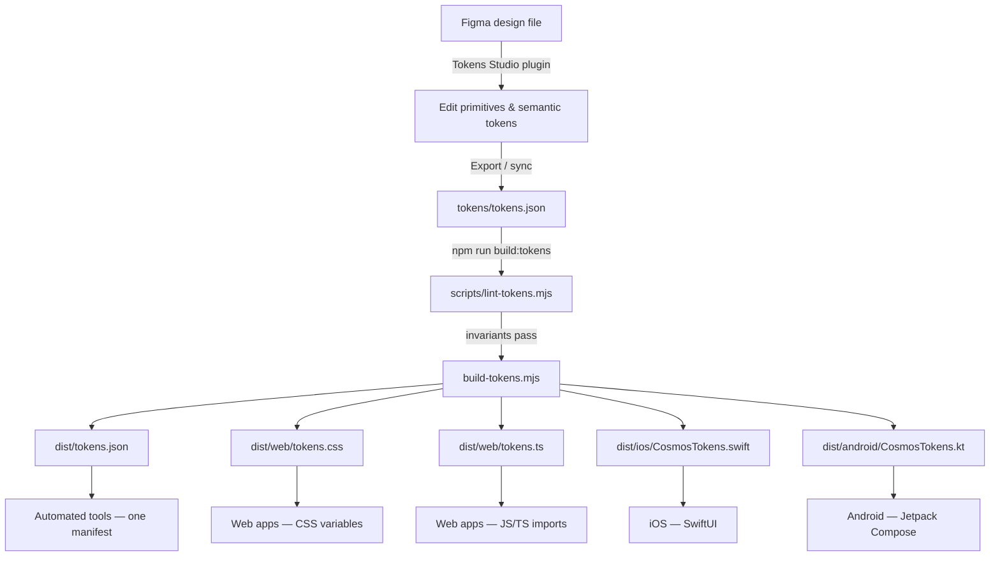

# MakeMyTrip Cosmos Design Tokens

Single source of truth for the MakeMyTrip Cosmos Design System. Tokens are authored in [Tokens Studio](https://tokens.studio/) format, stored in `tokens/tokens.json`, and compiled to web, iOS, and Android outputs via [Style Dictionary](https://styledictionary.com/).

```bash
npm install
npm run build:tokens
```

| Output | Path |
|--------|------|
| **Machine-readable manifest** | **`dist/tokens.json`** |
| CSS custom properties | `dist/web/tokens.css` |
| JavaScript / TypeScript (ESM) | `dist/web/tokens.ts` |
| SwiftUI enum | `dist/ios/CosmosTokens.swift` |
| Jetpack Compose object | `dist/android/CosmosTokens.kt` |

The iOS and Android outputs are namespaced as `CosmosTokens` (Kotlin package `com.makemytrip.cosmos.tokens`) so an app can consume Cosmos tokens alongside another token set without symbol collisions.

`dist/tokens.json` is the authoritative inventory — one entry per token with its value, tier, status, description, contrast verdict, paired foreground, state variants and per-platform names. Prefer it over the tables further down this file, which are a snapshot.

---

## Consuming Cosmos from an automated tool

If you are an AI coding agent or writing a codemod, start with **[AGENTS.md](AGENTS.md)**, not this file.

| Artifact | What it is for |
|---|---|
| [`dist/tokens.json`](dist/tokens.json) | Every token, machine-readable, with per-platform names. Load this instead of parsing four dialects. |
| [`AGENTS.md`](AGENTS.md) | The rules for writing product code — which tier to use, how to find a contrast-safe foreground, what is deliberately missing. |
| [`docs/recipes.md`](docs/recipes.md) | The exact token for every part of a button, input, card, badge, banner, modal, list row, tab, tooltip, toggle and empty state. |
| [`docs/naming.md`](docs/naming.md) | The naming grammar, so a name can be derived from intent rather than recalled. |
| [`llms.txt`](llms.txt) | Short index of the above. |

Three properties make the token set safe to consume without reading prose:

1. **Every token is self-describing.** All 542 carry a `description` saying what they are for and what they are not for, plus `$extensions.mmt` with `tier`, `status`, and — where relevant — `pairsWith`, `states` and a computed `contrast` verdict.
2. **The tier is explicit.** Primitives and semantic tokens share one flat output namespace, so `--color-neutral-500` and `--color-text-primary` look alike. `tier` in the manifest distinguishes them, which is what makes "use semantic, never primitives" checkable rather than merely stated.
3. **The rules are enforced, not documented.** `scripts/lint-tokens.mjs` gates every build on the naming grammar, foreground pairing completeness, contrast minimums, semantic-must-alias, metadata presence, and orphan primitives. Known exceptions live in `scripts/token-lint-baseline.json`, each with a written reason, and the baseline is checked in both directions so it can shrink but never grow silently.

> **Read this before picking a status colour:** the `warning` intent resolves to **red**, not amber, which inverts the usual convention. It is deprecated in favour of `danger`. Amber advisory is `caution`.

---

## End-to-end workflow

Design tokens move from Figma authoring through a single JSON source file into platform-specific code. The pipeline is intentionally linear: one source of truth, one build command, five outputs.



### 1. Author in Figma (Tokens Studio)

Designers maintain the token system in Figma using the [Tokens Studio](https://tokens.studio/) plugin. The file is organized into two token sets that mirror the JSON structure:

| Token set | Contents |
|-----------|----------|
| **primitives** | Raw values — color palettes, font stacks, pixel scales |
| **semantic** | Role-based aliases (color, typography, radius, icon, space, border width, focus ring, motion) that reference primitives via `{category.path}` syntax |

When adding a new semantic color, always reference a primitive (e.g. `{color.brand.600}`) rather than entering a raw hex value.

### 2. Export to JSON

Export or sync from Tokens Studio into `tokens/tokens.json`. This file is the **source of truth** for the repository and the only input the build reads.

The export must preserve:

- `$metadata.tokenSetOrder`: `["primitives", "semantic"]` — primitives resolve first
- W3C DTCG format: each token has `value` and `type`, plus a Cosmos `description` and `$extensions.mmt`
- Cross-set references: `{fontSize.16}`, `{color.neutral.950}`, etc.

### 3. Build platform outputs

```bash
npm install        # once
npm run build:tokens
```

`build-tokens.mjs` runs [Style Dictionary](https://styledictionary.com/) with Tokens Studio transforms and custom MMT transforms. The build:

1. **Preprocesses** the dictionary (`tokens-studio` hoists token sets; `mmt/rename-negative` renames `-12` spacing keys to `minus12`)
2. **Expands** composite typography tokens into individual `fontFamily`, `fontWeight`, `fontSize`, and `lineHeight` properties
3. **Resolves** all `{references}` to final values (including `{color.*}` refs embedded inside gradient strings via `mmt/resolve-gradient-colors`, kept for future gradient tokens)
4. **Transforms** values per platform:
   - Font weights → numbers
   - Dimensions: `px` → unitless (iOS), `sp`/`dp` (Android)
   - **Colors (iOS/Android only):** hex → native `Color(...)` (gradient → `Brush.linearGradient(...)` / `LinearGradient` when present) — web keeps hex strings and CSS gradients
5. **Emits** CSS, ESM, Swift, and Kotlin files into `dist/`, then `dist/tokens.json` — the manifest carrying every platform's name for each token in one entry

Both `primitives` and `semantic` tokens land in a **flat output namespace** — there is no `primitives.` prefix in generated code.

### 4. Consume in product code

| Platform | Import | Naming | Example |
|----------|--------|--------|---------|
| Web (CSS) | `@import "./dist/web/tokens.css"` | kebab-case CSS vars | `var(--color-text-primary)` |
| Web (TS) | `import tokens from "./dist/web/tokens.ts"` | camelCase object keys | `tokens.colorTextPrimary` |
| iOS | Copy / link `CosmosTokens.swift` | camelCase static lets | `CosmosTokens.colorTextPrimary` (`Color`) |
| Android | Copy / link `CosmosTokens.kt` | camelCase vals in `com.makemytrip.cosmos.tokens` | `CosmosTokens.colorTextPrimary` (`Color`) |

**Rule of thumb:** product code should consume **semantic** tokens (`text-primary`, `radius-md`, `space-md`, `body.medium.regular`) rather than primitives (`neutral-950`, `borderRadius-8`, `spacing-16`). The two share one flat namespace, so check `tier` in `dist/tokens.json` when the name alone is ambiguous.

### 5. Commit and ship

After any token change:

1. Update `tokens/tokens.json` (via Figma export or direct edit)
2. Run `npm run build:tokens`
3. Commit **both** the source JSON and regenerated `dist/` files together
4. Publish or copy `dist/` artifacts into consuming apps

---

## Architecture

```
Figma (Tokens Studio plugin)
        ↓ export
tokens/tokens.json
  ├── primitives   — raw values (colors, sizes, fonts)
  └── semantic     — role-based aliases that reference primitives
        ↓ Style Dictionary + custom transforms
dist/web · dist/ios · dist/android
```

The token set order is fixed in `$metadata.tokenSetOrder`: **primitives first, semantic second**. Primitives must resolve before semantic aliases can reference them.

### Build pipeline internals

`build-tokens.mjs` configures Style Dictionary with the following processing stages:

| Stage | Name | What it does |
|-------|------|--------------|
| Preprocessor | `tokens-studio` | Hoists `primitives` and `semantic` sets to the dictionary root so cross-set references like `{fontSize.16}` resolve |
| Preprocessor | `mmt/rename-negative` | Renames keys like `spacing.-12` → `spacing.minus12` to avoid collisions after camelCase/kebab-case conversion |
| Preprocessor | `mmt/resolve-gradient-colors` | Inlines `{color.family.step}` references inside `linear-gradient(...)` strings before platform transforms run |
| Expand | `typesMap: true` | Splits composite `typography` tokens into individual output properties |
| Transform | `mmt/fontWeight/number` | Normalizes font weight values to numbers for platform outputs |
| Transform | `mmt/dimension/unitless` (iOS) | Strips `px` suffix for CGFloat-compatible numbers |
| Transform | `mmt/dimension/compose` (Android) | Converts `px` → `sp` for text metrics, `dp` for layout |
| Transform | `mmt/duration/seconds` (iOS) | `150ms` → `0.15` — SwiftUI takes TimeInterval in seconds |
| Transform | `mmt/duration/millis` (Android) | `150ms` → `150` — Compose animation specs take Int milliseconds |
| Transform | `mmt/easing/ios` (iOS) | `cubic-bezier(a, b, c, d)` → a 4-tuple that splats into `Animation.timingCurve` |
| Transform | `mmt/easing/compose` (Android) | `cubic-bezier(a, b, c, d)` → Compose `CubicBezierEasing` |
| Transform | `mmt/string/quote` (iOS/Android) | Wraps font family strings as native string literals |
| Transform | `mmt/color/ios` (iOS) | Hex colors → `Color(red:green:blue:)` (or sRGB + opacity for `#RRGGBBAA`) |
| Transform | `mmt/color/ios-gradient` (iOS) | CSS `linear-gradient(...)` → SwiftUI `LinearGradient(gradient:startPoint:endPoint:)` |
| Transform | `mmt/color/android` (Android) | Hex colors → Compose `Color(0xAARRGGBB)` |
| Transform | `mmt/color/android-gradient` (Android) | CSS `linear-gradient(...)` → Compose `Brush.linearGradient(...)` |

**Platform outputs:**

| Platform key | Transforms | Format | Output |
|--------------|------------|--------|--------|
| `web-css` | kebab-case names; hex / CSS gradients unchanged | `css/variables` | `dist/web/tokens.css` |
| `web-js` | camelCase names; hex / CSS gradients unchanged | `javascript/esm` | `dist/web/tokens.ts` |
| `ios` | unitless dimensions, seconds, quoted strings, native `Color` / `LinearGradient` | `ios-swift/enum.swift` | `dist/ios/CosmosTokens.swift` |
| `android` | compose units, millis, quoted strings, native `Color` / `Brush` | `compose/object` | `dist/android/CosmosTokens.kt` |

The manifest is emitted separately, after Style Dictionary runs, because it has to carry *every* platform's name for a token in a single entry — which a Style Dictionary platform (one name per platform) cannot express. `scripts/build-manifest.mjs` derives names using the shared rules in `scripts/token-model.mjs` and validates them against the CSS just written, so a naming change the manifest does not follow fails the build rather than publishing wrong names.

### Lint gate

`npm run build:tokens` runs `scripts/lint-tokens.mjs` first and refuses to build on:

| Rule | Catches |
|------|---------|
| `schema` | Structural drift from `tokens/tokens.schema.json` |
| `metadata` | A token with no usable description, or no `tier` / `status`; a deprecation with no replacement |
| `raw-value` | A semantic token holding a literal instead of a `{reference}` |
| `grammar` | A semantic colour name that does not parse against `docs/naming.md` |
| `pairing` | A fill or surface that declares no contrast-checked text and icon foreground |
| `contrast` | A stale recorded ratio, or a new pairing below 4.5:1 for text / 3:1 for icons |
| `orphan` | A new primitive with no semantic role |
| `docs` | A token cited in `AGENTS.md` or `docs/recipes.md` that does not exist |

#### Native color transforms (iOS & Android)

Web outputs keep token colors as hex strings (or CSS `linear-gradient(...)` if a gradient token is present). iOS and Android get **compile-ready native types** so engineers do not wrap hex values manually.

| Input (resolved token value) | iOS output | Android output |
|------------------------------|------------|----------------|
| `#008CFF` | `Color(red: 0, green: 0.54902, blue: 1)` | `Color(0xFF008CFF)` |
| `#RRGGBBAA` (8-digit hex) | `Color(.sRGB, red: …, green: …, blue: …, opacity: …)` | `Color(0xAARRGGBB)` |
| `linear-gradient(90deg, #FFD230 0%, …)` | `LinearGradient(gradient: Gradient(stops: […]), startPoint: …, endPoint: …)` | `Brush.linearGradient(0f to Color(…), …, start = Offset(…), end = Offset(…))` |

How gradient conversion works (machinery retained; **currently unused** — Cosmos has 0 gradient tokens):

1. **`mmt/resolve-gradient-colors`** walks the dictionary and replaces `{color.violet.50}`-style references inside gradient strings with resolved hex values.
2. The CSS angle (e.g. `105deg`, `225deg`) is converted to normalized start/end points (CSS 0° = upward; converted for SwiftUI/Compose coordinate systems).
3. Each color stop (`#hex NN%`) becomes a native gradient stop with a 0–1 location.

Gradient transforms run **before** solid-color transforms on each platform (`mmt/color/ios-gradient` → `mmt/color/ios`, same on Android) so already-converted values are not double-processed.

**Affected tokens:** all 367 color tokens (144 primitive palette steps + 113 semantic roles + 110 `exp-*` aliases). All current colors are solid; gradient transforms stay wired for future use.

---

## Major Design Decisions

### 1. Two-tier token model (primitives → semantic)

| Layer | Purpose | Who uses it |
|-------|---------|-------------|
| **Primitives** | Raw design values — hex colors, pixel sizes, font stacks | Token authors, design system maintainers |
| **Semantic** | Role-based names that describe *intent* (`text-primary`, `bg-fill-brand`) | Product engineers, designers in Figma |

**Why:** Primitives can be updated globally (e.g. re-tint the brand palette) without touching component code. Semantic tokens give engineers stable, meaningful API names that survive palette changes.

### 2. Tokens Studio as the authoring format

- Source file follows W3C Design Tokens Community Group conventions (`value` + `type` pairs).
- `$metadata.tokenSetOrder` enforces build order.
- `$themes` is currently empty — **one light theme only**; no dark mode or multi-brand variants yet.

### 3. Semantic color taxonomy (Polaris-inspired)

Semantic colors are grouped by **role**, not by hue:

| Role prefix | Meaning |
|-------------|---------|
| `bg` | Page-level background |
| `bg-surface-*` | Elevated / grouped surface backgrounds |
| `bg-fill-*` | Interactive or emphasis fills (buttons, badges, banners) |
| `text-*` | Foreground text |
| `border-*` | Strokes and dividers |
| `icon-*` | Icon fill colors |

Within each role, **intent** is expressed with suffixes:

| Suffix | Meaning |
|--------|---------|
| `brand`, `info`, `success`, `caution`, `warning` | Semantic intent |
| `strong` / `subtle` | Fill intensity pairs |
| `on-bg-fill` / `on-bg-fill-strong` / `on-bg-fill-subtle` | Contrast-safe text on filled backgrounds |

### 4. Color scale system

- **12 palettes:** neutral, brand, red, orange, amber, yellow, lime, green, blue, indigo, violet, purple, fuchsia
- **12 steps per palette:** `0`, `50`, `100`–`900`, `950`
- **Neutral is special:** includes both `0` (white) and `50`–`950`; other palettes start at `50`
- **Brand primary (interactive):** semantic brand roles use `color.brand.700` = `#008CFF` (WCAG AA on white). Scale step `color.brand.600` = `#069BFF` remains in the palette but is not used for those roles.

### 5. Single-font typography system (Lato)

Cosmos uses **Lato** for all typography roles — headline, title, body, and label. There is no display scale and no letter-spacing tokens. Font sizes from 36px to 64px exist as primitives but have no semantic role, so `headline.large` (32px) is the largest type style available.

| Category | Font | Weights |
|----------|------|---------|
| **Headline / Title / Body / Label** | Lato | regular (400), bold (700), black (900) |

Lato is a [Google Font](https://fonts.google.com/specimen/Lato). **This repository does not ship font files.** Web consumers must load Lato themselves, for example:

```css
@import url("https://fonts.googleapis.com/css2?family=Lato:wght@400;700;900&display=swap");
```

Typography tokens are **composite** — each bundles `fontFamily`, `fontWeight`, `fontSize`, and `lineHeight` in a flat `{group}.{size}.{weight}` shape (e.g. `body.medium.regular`). The build pipeline expands them into individual output properties. Radius, icon, and space T-shirt sizes (`radius.md`, `icon.lg`, `space.md`, etc.) are unrelated and keep their existing names.

### 6. T-shirt sizing for radius, icon, and space tokens

Semantic radius, icon, and space tokens use abstract size names (`xs`, `sm`, `md`, …) that map to primitive pixel values. This decouples component code from raw numbers.

### 7. Semantic spacing via `space.*`

Primitives keep the numeric scale (`spacing.0` … `spacing.64`, plus negatives). Product layout should prefer the semantic **`space.*`** aliases (`space.none` … `space.7xl`), which reference those primitives. The semantic root is `space` (not `spacing`) so flat outputs stay collision-free (`--space-md` vs `--spacing-16`). Negative spacing stays primitive-only for optical tweaks. Leftover mid-steps (`44`, `52`, `56`, `60`) remain primitive-only when no semantic step fits.

### 8. Gradient tokens (currently unused)

Cosmos currently ships **0 gradient tokens**. The build still includes `mmt/resolve-gradient-colors` plus the iOS/Android gradient transforms so future gradient colors can be authored without pipeline work.

When a gradient token is added, author it as a CSS `linear-gradient(...)` string (optionally with `{color.*}` references) in `tokens/tokens.json`. Platform handling:

| Platform | Output |
|----------|--------|
| **Web** | CSS gradient string passed through unchanged |
| **iOS** | SwiftUI `LinearGradient` with `Gradient.Stop` entries and computed `UnitPoint` start/end |
| **Android** | Compose `Brush.linearGradient` with `Color` stops and `Offset` start/end |

Do not hand-write Swift or Kotlin gradient code in product apps.

### 9. Build pipeline customizations

| Transform | Purpose |
|-----------|---------|
| `tokens-studio` preprocessor | Hoists `primitives` / `semantic` sets to root so cross-set `{references}` resolve |
| `mmt/rename-negative` | Renames `-12` spacing keys to `minus12` to avoid name collisions |
| `mmt/resolve-gradient-colors` | Resolves `{color.*}` references embedded in gradient strings |
| `expand` (typography) | Splits composite typography tokens into individual properties |
| `mmt/fontWeight/number` | Normalizes font weight values to numbers for platform outputs |
| `mmt/dimension/unitless` (iOS) | Strips `px` and wraps as `CGFloat(...)` so values drop into SwiftUI APIs |
| `mmt/dimension/compose` (Android) | Converts `px` → `sp` (text) or `dp` (layout) |
| `mmt/string/quote` (iOS/Android) | Wraps font family strings as native literals |
| `mmt/color/ios` / `mmt/color/ios-gradient` | Hex → SwiftUI `Color`; CSS gradients → `LinearGradient` |
| `mmt/color/android` / `mmt/color/android-gradient` | Hex → Compose `Color`; CSS gradients → `Brush.linearGradient` |
| `mmt/ios-line-height-modifier` (iOS format) | Emits `LineHeight.swift` — a `.lineHeight` SwiftUI modifier that converts total line-box height → line spacing |

### 10. Flat output namespace

Both primitives and semantics merge into a single flat namespace in generated outputs. There is no `primitives.` prefix in CSS, JS, Swift, or Kotlin — all tokens are peers.

| Platform | Naming convention | Example |
|----------|-------------------|---------|
| CSS | kebab-case with CTI prefix | `--color-bg-fill-brand` |
| JS / Swift / Kotlin | camelCase | `colorBgFillBrand` |

---

## Best Practices

1. **Always consume semantic tokens in product code.** Use `--color-text-primary` / `--space-md`, not `--color-neutral-950` / `--spacing-16`. Semantic names describe intent and survive palette updates.

2. **Edit `tokens/tokens.json` (or Figma via Tokens Studio), never generated files.** Everything in `dist/` is auto-generated and will be overwritten on the next build.

3. **Add new colors to primitives first, then wire semantic aliases.** Never put raw hex values in the semantic layer.

4. **Use paired contrast tokens.** When placing text on a filled background, take the foreground from `pairsWith` in `dist/tokens.json` rather than choosing one (e.g. `text-info-on-bg-fill-strong` on `bg-fill-info-strong`). Check `contrast.wcag` first — the caution pairings are recorded as `FAIL` and need `text-primary` instead.

5. **Use composite typography tokens.** Reference the full typography token (e.g. `body.medium.regular`) rather than assembling individual font properties in components.

6. **Run the build after every token change.** `npm run build:tokens` lints the invariants, validates references, and regenerates every output. A failing lint names the fix.

7. **Keep token set order intact.** `$metadata.tokenSetOrder` must remain `["primitives", "semantic"]`.

8. **Name semantic tokens by role, not value.** Prefer `text-caution` over `text-yellow-700` in the semantic layer (the mapping to yellow happens internally).

9. **Use negative spacing primitives sparingly.** They exist for optical adjustments (overlapping elements, negative margins) — not for general layout gaps.

10. **Document intentional exceptions.** Some mappings are deliberate product choices (e.g. `bg-surface-info` uses `brand.50`, not `blue.50`). Record them in the token's `description`, and — if they trip a lint rule — in `scripts/token-lint-baseline.json` with a reason.

11. **Never invent a state colour.** Hover, active and selected variants are tokenised; take them from `states` in the manifest rather than darkening a value yourself.

12. **Prefer `danger-*` over `warning-*`.** The red `warning-*` tokens are deprecated; `warning` is reserved to become amber in a future major version.

---

## Do's and Don'ts

### Do

- Do reference primitives from semantic tokens using `{category.path}` syntax (e.g. `{color.brand.600}`).
- Do use the semantic color role system (`bg-surface`, `bg-fill`, `text`, `border`, `icon`) consistently.
- Do add new palette steps at the primitive layer before creating semantic aliases.
- Do use t-shirt sizes (`radius.md`, `icon.lg`, `space.md`) in components instead of raw pixel values.
- Do expand typography composites via the build — do not manually duplicate font properties.
- Do commit both `tokens/tokens.json` and regenerated `dist/` outputs together.
- Do use `strong` / `subtle` pairs for status fills to maintain visual hierarchy.
- Do test token changes across all three platforms after building.

### Don't

- Don't hardcode hex colors, pixel sizes, font stacks, durations, or `cubic-bezier` curves in application code.
- Don't use an `exp-*` token in product code — they are hue-named passthroughs, not role tokens.
- Don't compute a hover or pressed colour by darkening a value — use the `-hover` / `-active` token.
- Don't edit files in `dist/` directly — changes will be lost.
- Don't put raw values in the semantic layer — always alias a primitive.
- Don't skip the build step after modifying tokens.
- Don't use primitive color or spacing tokens (e.g. `color.red.500`, `spacing.16`) directly in UI components when a semantic equivalent exists (`text-*`, `space.md`).
- Don't create one-off semantic tokens for a single screen — extend the shared taxonomy instead.
- Don't add font sizes without corresponding line heights in the typography scale.
- Don't use negative spacing keys in references — the build renames them (`spacing.-8` → `spacing.minus8` in output).
- Don't hand-convert hex colors or CSS gradients in iOS/Android app code — use the generated `Tokens` values directly.
- Don't remove or rename tokens without checking downstream consumers and Figma sync.

---

## Token Inventory

**Totals:** 542 tokens — 237 primitive · 305 semantic (223 colors, of which 113 are role tokens and 110 are `exp-*` aliases; 36 typography; 14 space; 10 radius; 8 icon; 8 motion; 4 border width; 2 focus ring) · **0 gradients**

`dist/tokens.json` is generated from the source and is always current; the tables below are a hand-maintained snapshot and may lag.

#### Added since the original inventory

| Family | Count | Notes |
|---|---|---|
| Interaction states | 26 | `-hover`, `-active`, `-selected` on fills, surfaces, borders and links. `-hover` is one palette step darker than the resting token, `-active` two. |
| `danger-*` intent | 10 | Red error/destructive intent, superseding the deprecated red `warning-*`. |
| Arity completion | 14 | `bg-fill-brand-subtle` and its states, `text-brand-on-bg-fill-subtle`, `icon-link`, and twelve `icon-*-on-bg-fill-*` tokens mirroring the text set. |
| Motion | 20 | 7 duration + 5 easing primitives; `motion.duration.{instant,fast,normal,slow}` and `motion.easing.{enter,exit,move,emphasis}`. |
| Border width | 8 | 4 `strokeWidth` primitives; `borderWidth.{none,thin,thick,thicker}`. |
| Focus ring | 2 | `focusRing.width`, `focusRing.offset`. |

#### Deprecated

The twelve red `warning-*` colour tokens are deprecated in favour of their `danger-*` equivalents. They still resolve to the same values and nothing breaks; they are reserved so `warning` can be reintroduced as amber in a future major version without silently changing a live token. Each names its replacement in `$extensions.mmt.replacedBy`.

### Primitive tokens (237)

#### Color — 144 tokens (12 palettes × 12 steps)

Token path pattern: `color.{palette}.{step}`

| Step | Neutral | Brand | Red | Orange | Amber | Yellow | Lime | Green | Blue | Indigo | Violet | Purple | Fuchsia |
|------|---------|-------|-----|--------|-------|--------|------|-------|------|--------|--------|--------|---------|
| `0` | #FFFFFF | — | — | — | — | — | — | — | — | — | — | — | — |
| `50` | #FAFAFA | #EDFAFF | #FEF2F2 | #FFF7ED | #FFFBEB | #FEFCE8 | #F7FEE7 | #F0FDF4 | #EFF6FF | #EEF2FF | #F5F3FF | #FAF5FF | #FDF4FF |
| `100` | #F5F5F5 | #D6F3FF | #FFE2E2 | #FFEDD4 | #FEF3C6 | #FEF9C2 | #ECFCCA | #DCFCE7 | #DBEAFE | #E0E7FF | #EDE9FE | #F3E8FF | #FAE8FF |
| `200` | #E6E6E6 | #B5EBFF | #FFC9C9 | #FFD6A8 | #FEE685 | #FFF085 | #D8F999 | #B9F8CF | #BEDBFF | #C6D2FF | #DDD6FF | #E9D4FF | #F6CFFF |
| `300` | #D6D6D6 | #83E1FF | #FFA2A2 | #FFB86A | #FFD230 | #FFDF20 | #BBF451 | #7BF1A8 | #8EC5FF | #A3B3FF | #C4B4FF | #DAB2FF | #F4A8FF |
| `400` | #A5A5A5 | #48CFFF | #FF6467 | #FF8904 | #FFB900 | #FDC700 | #9AE600 | #05DF72 | #51A2FF | #7C86FF | #A684FF | #C27AFF | #ED6AFF |
| `500` | #767676 | #1EB4FF | #FB2C36 | #FF6900 | #FE9A00 | #F0B100 | #7CCF00 | #00C950 | #2B7FFF | #615FFF | #8E51FF | #AD46FF | #E12AFB |
| `600` | #575757 | #069BFF | #E7000B | #F54900 | #E17100 | #D08700 | #5EA500 | #00A63E | #155DFC | #4F39F6 | #7F22FE | #9810FA | #C800DE |
| `700` | #434343 | #008CFF | #C10007 | #CA3500 | #BB4D00 | #A65F00 | #497D00 | #008236 | #1447E6 | #432DD7 | #7008E7 | #8200DB | #A800B7 |
| `800` | #292929 | #086BC5 | #9F0712 | #9F2D00 | #973C00 | #894B00 | #3C6300 | #016630 | #193CB8 | #372AAC | #5D0EC0 | #6E11B0 | #8A0194 |
| `900` | #1A1A1A | #0D5B9B | #82181A | #7E2A0C | #7B3306 | #733E0A | #35530E | #0D542B | #1C398E | #312C85 | #4D179A | #59168B | #721378 |
| `950` | #000000 | #0E375D | #460809 | #441306 | #461901 | #432004 | #192E03 | #032E15 | #162456 | #1E1A4D | #2F0D68 | #3C0366 | #4B004F |

#### Font family — 1 token

| Token | Value |
|-------|-------|
| `fontFamily.lato` | Lato |

Lato is loaded by consumers (Google Fonts); no `.ttf` / `.woff` files are checked into this repo.

#### Font weight — 3 tokens

| Token | Value | Notes |
|-------|-------|-------|
| `fontWeight.regular` | 400 | Real Lato face |
| `fontWeight.bold` | 700 | Real Lato face |
| `fontWeight.black` | 900 | Real Lato face |

#### Font size — 18 tokens

| Token | Value |
|-------|-------|
| `fontSize.9` | 9px |
| `fontSize.10` | 10px |
| `fontSize.11` | 11px |
| `fontSize.12` | 12px |
| `fontSize.14` | 14px |
| `fontSize.16` | 16px |
| `fontSize.18` | 18px |
| `fontSize.20` | 20px |
| `fontSize.22` | 22px |
| `fontSize.24` | 24px |
| `fontSize.28` | 28px |
| `fontSize.32` | 32px |
| `fontSize.36` | 36px |
| `fontSize.40` | 40px |
| `fontSize.44` | 44px |
| `fontSize.52` | 52px |
| `fontSize.58` | 58px |
| `fontSize.64` | 64px |

> `fontSize.9` and `fontSize.10` are defined but not referenced by any semantic typography token.

#### Line height — 15 tokens

| Token | Value |
|-------|-------|
| `lineHeight.12` | 12px |
| `lineHeight.16` | 16px |
| `lineHeight.20` | 20px |
| `lineHeight.24` | 24px |
| `lineHeight.28` | 28px |
| `lineHeight.32` | 32px |
| `lineHeight.36` | 36px |
| `lineHeight.40` | 40px |
| `lineHeight.44` | 44px |
| `lineHeight.52` | 52px |
| `lineHeight.56` | 56px |
| `lineHeight.64` | 64px |
| `lineHeight.72` | 72px |
| `lineHeight.80` | 80px |
| `lineHeight.92` | 92px |

#### Spacing — 22 tokens

| Token | Value | Output name |
|-------|-------|-------------|
| `spacing.0` | 0px | `--spacing-0` / `spacing0` |
| `spacing.2` | 2px | `--spacing-2` / `spacing2` |
| `spacing.4` | 4px | `--spacing-4` / `spacing4` |
| `spacing.8` | 8px | `--spacing-8` / `spacing8` |
| `spacing.12` | 12px | `--spacing-12` / `spacing12` |
| `spacing.16` | 16px | `--spacing-16` / `spacing16` |
| `spacing.20` | 20px | `--spacing-20` / `spacing20` |
| `spacing.24` | 24px | `--spacing-24` / `spacing24` |
| `spacing.28` | 28px | `--spacing-28` / `spacing28` |
| `spacing.32` | 32px | `--spacing-32` / `spacing32` |
| `spacing.36` | 36px | `--spacing-36` / `spacing36` |
| `spacing.40` | 40px | `--spacing-40` / `spacing40` |
| `spacing.44` | 44px | `--spacing-44` / `spacing44` |
| `spacing.48` | 48px | `--spacing-48` / `spacing48` |
| `spacing.52` | 52px | `--spacing-52` / `spacing52` |
| `spacing.56` | 56px | `--spacing-56` / `spacing56` |
| `spacing.60` | 60px | `--spacing-60` / `spacing60` |
| `spacing.64` | 64px | `--spacing-64` / `spacing64` |
| `spacing.-2` | -2px | `--spacing-minus2` / `spacingMinus2` |
| `spacing.-4` | -4px | `--spacing-minus4` / `spacingMinus4` |
| `spacing.-8` | -8px | `--spacing-minus8` / `spacingMinus8` |
| `spacing.-12` | -12px | `--spacing-minus12` / `spacingMinus12` |

#### Border radius — 10 tokens

| Token | Value |
|-------|-------|
| `borderRadius.0` | 0px |
| `borderRadius.2` | 2px |
| `borderRadius.4` | 4px |
| `borderRadius.8` | 8px |
| `borderRadius.12` | 12px |
| `borderRadius.16` | 16px |
| `borderRadius.24` | 24px |
| `borderRadius.32` | 32px |
| `borderRadius.40` | 40px |
| `borderRadius.999` | 999px (pill / full) |

#### Icon size — 8 tokens

| Token | Value |
|-------|-------|
| `iconSize.12` | 12px |
| `iconSize.16` | 16px |
| `iconSize.20` | 20px |
| `iconSize.24` | 24px |
| `iconSize.32` | 32px |
| `iconSize.40` | 40px |
| `iconSize.48` | 48px |
| `iconSize.64` | 64px |

---

### Semantic tokens (305)

#### Color — 223 tokens

113 role colors (listed below) plus 110 experience (`exp-*`) palette aliases. The role tables that follow predate the interaction states and the `danger-*` intent; see `dist/tokens.json` for the current set.

##### Background — surface (9)

| Token | Role |
|-------|------|
| `color.bg` | Page background |
| `color.bg-surface` | Default elevated surface |
| `color.bg-surface-disabled` | Disabled surface |
| `color.bg-surface-secondary` | Secondary surface |
| `color.bg-surface-brand` | Brand-tinted surface |
| `color.bg-surface-info` | Info surface |
| `color.bg-surface-success` | Success surface |
| `color.bg-surface-caution` | Caution surface |
| `color.bg-surface-warning` | Warning surface |

##### Background — fill (12)

| Token | Role |
|-------|------|
| `color.bg-fill` | Default fill |
| `color.bg-fill-disabled` | Disabled fill |
| `color.bg-fill-secondary` | Secondary fill |
| `color.bg-fill-brand` | Brand button / emphasis fill |
| `color.bg-fill-info-strong` | Strong info fill |
| `color.bg-fill-info-subtle` | Subtle info fill |
| `color.bg-fill-success-strong` | Strong success fill |
| `color.bg-fill-success-subtle` | Subtle success fill |
| `color.bg-fill-caution-strong` | Strong caution fill |
| `color.bg-fill-caution-subtle` | Subtle caution fill |
| `color.bg-fill-warning-strong` | Strong warning fill |
| `color.bg-fill-warning-subtle` | Subtle warning fill |

##### Text (21)

| Token | Role |
|-------|------|
| `color.text-primary` | Primary body text |
| `color.text-secondary` | Secondary text |
| `color.text-tertiary` | Tertiary / hint text |
| `color.text-disabled` | Disabled text |
| `color.text-inverse` | Text on dark backgrounds |
| `color.text-inverse-disabled` | Disabled inverse text |
| `color.text-link` | Hyperlink text |
| `color.text-brand` | Brand-colored text |
| `color.text-brand-on-bg-fill` | Text on brand fill |
| `color.text-info` | Info status text |
| `color.text-info-on-bg-fill-strong` | Text on strong info fill |
| `color.text-info-on-bg-fill-subtle` | Text on subtle info fill |
| `color.text-success` | Success status text |
| `color.text-success-on-bg-fill-strong` | Text on strong success fill |
| `color.text-success-on-bg-fill-subtle` | Text on subtle success fill |
| `color.text-caution` | Caution status text |
| `color.text-caution-on-bg-fill-strong` | Text on strong caution fill |
| `color.text-caution-on-bg-fill-subtle` | Text on subtle caution fill |
| `color.text-warning` | Warning status text |
| `color.text-warning-on-bg-fill-strong` | Text on strong warning fill |
| `color.text-warning-on-bg-fill-subtle` | Text on subtle warning fill |

##### Border (9)

| Token | Role |
|-------|------|
| `color.border` | Default border |
| `color.border-secondary` | Secondary border |
| `color.border-disabled` | Disabled border |
| `color.border-focus` | Focus ring |
| `color.border-brand` | Brand border |
| `color.border-info` | Info border |
| `color.border-success` | Success border |
| `color.border-caution` | Caution border |
| `color.border-warning` | Warning border |

##### Icon (10)

| Token | Role |
|-------|------|
| `color.icon` | Default icon |
| `color.icon-disabled` | Disabled icon |
| `color.icon-inverse` | Icon on dark backgrounds |
| `color.icon-secondary` | Secondary icon |
| `color.icon-tertiary` | Tertiary icon |
| `color.icon-brand` | Brand icon |
| `color.icon-success` | Success icon |
| `color.icon-caution` | Caution icon |
| `color.icon-warning` | Warning icon |
| `color.icon-info` | Info icon |

#### Typography — 36 composite tokens

Flat shape `{group}.{size}.{weight}` · font family Lato · no letter spacing.

| Category | Size | Font size | Line height | Weight variants |
|----------|------|-----------|-------------|-----------------|
| headline | large | 32px | 40px | regular, bold, black |
| headline | medium | 28px | 36px | regular, bold, black |
| headline | small | 24px | 32px | regular, bold, black |
| title | large | 22px | 28px | regular, bold, black |
| title | medium | 18px | 24px | regular, bold, black |
| title | small | 14px | 20px | regular, bold, black |
| body | large | 16px | 24px | regular, bold, black |
| body | medium | 14px | 20px | regular, bold, black |
| body | small | 12px | 16px | regular, bold, black |
| label | large | 16px | 24px | regular, bold, black |
| label | medium | 14px | 20px | regular, bold, black |
| label | small | 12px | 16px | regular, bold, black |

#### Radius — 10 tokens

| Token | Meaning |
|-------|---------|
| `radius.none` | No rounding |
| `radius.xs` | Extra small |
| `radius.sm` | Small |
| `radius.md` | Medium |
| `radius.lg` | Large |
| `radius.xl` | Extra large |
| `radius.2xl` | 2× extra large |
| `radius.3xl` | 3× extra large |
| `radius.4xl` | 4× extra large |
| `radius.full` | Pill / circle |

#### Icon — 8 tokens

| Token | Meaning |
|-------|---------|
| `icon.2xs` | 12px |
| `icon.xs` | 16px |
| `icon.sm` | 20px |
| `icon.md` | 24px |
| `icon.lg` | 32px |
| `icon.xl` | 40px |
| `icon.2xl` | 48px |
| `icon.3xl` | 64px |

#### Space — 14 tokens

T-shirt aliases for layout spacing. Prefer these over primitive `spacing.*` in product code.

| Token | Meaning |
|-------|---------|
| `space.none` | No space |
| `space.3xs` | 2px |
| `space.2xs` | 4px |
| `space.xs` | 8px |
| `space.sm` | 12px |
| `space.md` | 16px |
| `space.lg` | 20px |
| `space.xl` | 24px |
| `space.2xl` | 28px |
| `space.3xl` | 32px |
| `space.4xl` | 36px |
| `space.5xl` | 40px |
| `space.6xl` | 48px |
| `space.7xl` | 64px |

---

## Primitive → Semantic Mappings

### Color mappings

| Semantic token | Primitive reference(s) |
|----------------|--------------------------|
| `bg` | `color.neutral.0` |
| `bg-surface` | `color.neutral.100` |
| `bg-surface-disabled` | `color.neutral.50` |
| `bg-surface-secondary` | `color.neutral.0` |
| `bg-surface-brand` | `color.brand.50` |
| `bg-surface-info` | `color.brand.50` |
| `bg-surface-success` | `color.green.50` |
| `bg-surface-caution` | `color.yellow.50` |
| `bg-surface-warning` | `color.red.50` |
| `bg-fill` | `color.neutral.0` |
| `bg-fill-disabled` | `color.neutral.300` |
| `bg-fill-secondary` | `color.neutral.100` |
| `bg-fill-brand` | `color.brand.700` |
| `bg-fill-info-strong` | `color.blue.600` |
| `bg-fill-info-subtle` | `color.blue.50` |
| `bg-fill-success-strong` | `color.green.700` |
| `bg-fill-success-subtle` | `color.green.100` |
| `bg-fill-caution-strong` | `color.yellow.600` |
| `bg-fill-caution-subtle` | `color.yellow.100` |
| `bg-fill-warning-strong` | `color.red.700` |
| `bg-fill-warning-subtle` | `color.red.100` |
| `text-primary` | `color.neutral.950` |
| `text-secondary` | `color.neutral.600` |
| `text-tertiary` | `color.neutral.500` |
| `text-disabled` | `color.neutral.400` |
| `text-inverse` | `color.neutral.0` |
| `text-inverse-disabled` | `color.neutral.200` |
| `text-link` | `color.brand.700` |
| `text-brand` | `color.brand.700` |
| `text-brand-on-bg-fill` | `color.neutral.0` |
| `text-info` | `color.blue.700` |
| `text-info-on-bg-fill-strong` | `color.neutral.0` |
| `text-info-on-bg-fill-subtle` | `color.blue.700` |
| `text-success` | `color.green.700` |
| `text-success-on-bg-fill-strong` | `color.neutral.0` |
| `text-success-on-bg-fill-subtle` | `color.green.700` |
| `text-caution` | `color.yellow.600` |
| `text-caution-on-bg-fill-strong` | `color.neutral.0` |
| `text-caution-on-bg-fill-subtle` | `color.yellow.600` |
| `text-warning` | `color.red.700` |
| `text-warning-on-bg-fill-strong` | `color.neutral.0` |
| `text-warning-on-bg-fill-subtle` | `color.red.700` |
| `border` | `color.neutral.300` |
| `border-secondary` | `color.neutral.200` |
| `border-disabled` | `color.neutral.100` |
| `border-focus` | `color.brand.400` |
| `border-brand` | `color.brand.700` |
| `border-info` | `color.blue.100` |
| `border-success` | `color.green.300` |
| `border-caution` | `color.yellow.300` |
| `border-warning` | `color.red.300` |
| `icon` | `color.neutral.950` |
| `icon-disabled` | `color.neutral.200` |
| `icon-inverse` | `color.neutral.50` |
| `icon-secondary` | `color.neutral.600` |
| `icon-tertiary` | `color.neutral.400` |
| `icon-brand` | `color.brand.700` |
| `icon-success` | `color.green.700` |
| `icon-caution` | `color.yellow.600` |
| `icon-warning` | `color.red.700` |
| `icon-info` | `color.blue.700` |

### Radius mappings

| Semantic | Primitive |
|----------|-----------|
| `radius.none` | `borderRadius.0` |
| `radius.xs` | `borderRadius.2` |
| `radius.sm` | `borderRadius.4` |
| `radius.md` | `borderRadius.8` |
| `radius.lg` | `borderRadius.12` |
| `radius.xl` | `borderRadius.16` |
| `radius.2xl` | `borderRadius.24` |
| `radius.3xl` | `borderRadius.32` |
| `radius.4xl` | `borderRadius.40` |
| `radius.full` | `borderRadius.999` |

### Icon size mappings

| Semantic | Primitive |
|----------|-----------|
| `icon.2xs` | `iconSize.12` |
| `icon.xs` | `iconSize.16` |
| `icon.sm` | `iconSize.20` |
| `icon.md` | `iconSize.24` |
| `icon.lg` | `iconSize.32` |
| `icon.xl` | `iconSize.40` |
| `icon.2xl` | `iconSize.48` |
| `icon.3xl` | `iconSize.64` |

### Space mappings

| Semantic | Primitive |
|----------|-----------|
| `space.none` | `spacing.0` |
| `space.3xs` | `spacing.2` |
| `space.2xs` | `spacing.4` |
| `space.xs` | `spacing.8` |
| `space.sm` | `spacing.12` |
| `space.md` | `spacing.16` |
| `space.lg` | `spacing.20` |
| `space.xl` | `spacing.24` |
| `space.2xl` | `spacing.28` |
| `space.3xl` | `spacing.32` |
| `space.4xl` | `spacing.36` |
| `space.5xl` | `spacing.40` |
| `space.6xl` | `spacing.48` |
| `space.7xl` | `spacing.64` |

### Typography mappings

Each typography token is a composite reference. Pattern:

```
{group}.{size}.{weight}
  → fontFamily.lato
  → fontWeight.{weight}
  → fontSize.{N}
  → lineHeight.{N}
```

Full token list with resolved primitive references (generated from `tokens/tokens.json`):

- `headline.large.regular` → fontFamily.lato · fontWeight.regular · 32px · 40px
- `headline.large.bold` → fontFamily.lato · fontWeight.bold · 32px · 40px
- `headline.large.black` → fontFamily.lato · fontWeight.black · 32px · 40px
- `headline.medium.regular` → fontFamily.lato · fontWeight.regular · 28px · 36px
- `headline.medium.bold` → fontFamily.lato · fontWeight.bold · 28px · 36px
- `headline.medium.black` → fontFamily.lato · fontWeight.black · 28px · 36px
- `headline.small.regular` → fontFamily.lato · fontWeight.regular · 24px · 32px
- `headline.small.bold` → fontFamily.lato · fontWeight.bold · 24px · 32px
- `headline.small.black` → fontFamily.lato · fontWeight.black · 24px · 32px
- `title.large.regular` → fontFamily.lato · fontWeight.regular · 22px · 28px
- `title.large.bold` → fontFamily.lato · fontWeight.bold · 22px · 28px
- `title.large.black` → fontFamily.lato · fontWeight.black · 22px · 28px
- `title.medium.regular` → fontFamily.lato · fontWeight.regular · 18px · 24px
- `title.medium.bold` → fontFamily.lato · fontWeight.bold · 18px · 24px
- `title.medium.black` → fontFamily.lato · fontWeight.black · 18px · 24px
- `title.small.regular` → fontFamily.lato · fontWeight.regular · 14px · 20px
- `title.small.bold` → fontFamily.lato · fontWeight.bold · 14px · 20px
- `title.small.black` → fontFamily.lato · fontWeight.black · 14px · 20px
- `body.large.regular` → fontFamily.lato · fontWeight.regular · 16px · 24px
- `body.large.bold` → fontFamily.lato · fontWeight.bold · 16px · 24px
- `body.large.black` → fontFamily.lato · fontWeight.black · 16px · 24px
- `body.medium.regular` → fontFamily.lato · fontWeight.regular · 14px · 20px
- `body.medium.bold` → fontFamily.lato · fontWeight.bold · 14px · 20px
- `body.medium.black` → fontFamily.lato · fontWeight.black · 14px · 20px
- `body.small.regular` → fontFamily.lato · fontWeight.regular · 12px · 16px
- `body.small.bold` → fontFamily.lato · fontWeight.bold · 12px · 16px
- `body.small.black` → fontFamily.lato · fontWeight.black · 12px · 16px
- `label.large.regular` → fontFamily.lato · fontWeight.regular · 16px · 24px
- `label.large.bold` → fontFamily.lato · fontWeight.bold · 16px · 24px
- `label.large.black` → fontFamily.lato · fontWeight.black · 16px · 24px
- `label.medium.regular` → fontFamily.lato · fontWeight.regular · 14px · 20px
- `label.medium.bold` → fontFamily.lato · fontWeight.bold · 14px · 20px
- `label.medium.black` → fontFamily.lato · fontWeight.black · 14px · 20px
- `label.small.regular` → fontFamily.lato · fontWeight.regular · 12px · 16px
- `label.small.bold` → fontFamily.lato · fontWeight.bold · 12px · 16px
- `label.small.black` → fontFamily.lato · fontWeight.black · 12px · 16px

### Space (semantic layer)

Prefer semantic `space.*` aliases in layout code. They resolve to the primitive spacing scale:

| CSS variable | Value | Primitive |
|--------------|-------|-----------|
| `--space-none` | 0px | `spacing.0` |
| `--space-3xs` | 2px | `spacing.2` |
| `--space-2xs` | 4px | `spacing.4` |
| `--space-xs` | 8px | `spacing.8` |
| `--space-sm` | 12px | `spacing.12` |
| `--space-md` | 16px | `spacing.16` |
| `--space-lg` | 20px | `spacing.20` |
| `--space-xl` | 24px | `spacing.24` |
| `--space-2xl` | 28px | `spacing.28` |
| `--space-3xl` | 32px | `spacing.32` |
| `--space-4xl` | 36px | `spacing.36` |
| `--space-5xl` | 40px | `spacing.40` |
| `--space-6xl` | 48px | `spacing.48` |
| `--space-7xl` | 64px | `spacing.64` |

Primitive `spacing.*` remains available for leftover steps (`44`, `52`, `56`, `60`) and negatives (`--spacing-minus2`, etc.). Use those only for optical exceptions.

---

## Usage Examples

### Web (CSS)

```css
@import url("https://fonts.googleapis.com/css2?family=Lato:wght@400;700;900&display=swap");
@import "./dist/web/tokens.css";

.card {
  background: var(--color-bg-surface);
  border: 1px solid var(--color-border);
  border-radius: var(--radius-md);
  padding: var(--space-md);
  color: var(--color-text-primary);
  font-size: var(--body-medium-regular-font-size);
  line-height: var(--body-medium-regular-line-height);
  font-family: var(--body-medium-regular-font-family);
  font-weight: var(--body-medium-regular-font-weight);
}

.button-brand {
  background: var(--color-bg-fill-brand);
  color: var(--color-text-brand-on-bg-fill);
  border-radius: var(--radius-sm);
}
```

### Web (JavaScript / TypeScript)

```ts
import tokens from "./dist/web/tokens.ts";

console.log(tokens.colorBgFillBrand); // "#008CFF"
```

### iOS (SwiftUI)

Color tokens are emitted as SwiftUI `Color` values — use them directly (no `Color(...)` wrapper). Numeric dimension tokens (font size, line height, radius, spacing) are emitted as `CGFloat`, so they drop straight into SwiftUI APIs without manual casting:

```swift
Text("Hello")
  .font(.custom(CosmosTokens.bodyMediumRegularFontFamily,
                size: CosmosTokens.bodyMediumRegularFontSize))
  .foregroundColor(CosmosTokens.colorTextPrimary)

RoundedRectangle(cornerRadius: CosmosTokens.radiusMd)
  .fill(CosmosTokens.colorBgFillBrand)
```

#### Line height

⚠️ **Do not pass a `*LineHeight` token to `.lineSpacing(_:)`.** Line-height tokens store the **total line-box height** (the same model Figma, CSS `line-height`, and Compose `lineHeight` use). SwiftUI's `.lineSpacing(_:)` is different — it only adds space *between* lines, so passing the token directly over-spaces text and makes iOS diverge from web/Android.

Use the generated `.lineHeight` modifier (`dist/ios/LineHeight.swift`) instead. It converts the total line height into the correct SwiftUI line spacing (`lineHeight − font.lineHeight`) and pads the top/bottom by half the leading so single lines and the first/last line match the web/Android box:

```swift
// Preferred: pass the exact UIFont you render with (most accurate metrics)
Text("Multi-line copy that wraps")
  .font(.custom(CosmosTokens.bodyMediumRegularFontFamily,
                size: CosmosTokens.bodyMediumRegularFontSize))
  .lineHeight(CosmosTokens.bodyMediumRegularLineHeight,
              for: UIFont(name: CosmosTokens.bodyMediumRegularFontFamily,
                          size: CosmosTokens.bodyMediumRegularFontSize)
                   ?? .systemFont(ofSize: CosmosTokens.bodyMediumRegularFontSize))

// Convenience: resolve a UIFont from token font family + size
// (falls back to the system font if the custom font isn't registered)
Text("Multi-line copy that wraps")
  .lineHeight(CosmosTokens.bodyMediumRegularLineHeight,
              fontName: CosmosTokens.bodyMediumRegularFontFamily,
              fontSize: CosmosTokens.bodyMediumRegularFontSize)
```

Why this exists: SwiftUI's `Font` doesn't expose line metrics, and `.lineSpacing` models *leading between lines* rather than a total line box. Web (`line-height`) and Android (Compose `lineHeight`) both interpret the token as a total box, so only iOS needs this conversion step to render identically.

### Android (Compose)

Color tokens are Compose `Color` values (gradient tokens would be `Brush` if any were defined — currently none):

```kotlin
Text(
  text = "Hello",
  fontSize = CosmosTokens.bodyMediumRegularFontSize,
  color = CosmosTokens.colorTextPrimary,
)

Box(
  modifier = Modifier.background(CosmosTokens.colorBgFillBrand),
)
```

---

## File Reference

| File | Description |
|------|-------------|
| `tokens/tokens.json` | Source of truth — edit here or sync from Figma |
| `build-tokens.mjs` | Style Dictionary config and custom transforms |
| `package.json` | Package metadata and build script |
| `dist/web/tokens.css` | Generated CSS custom properties |
| `dist/web/tokens.ts` | Generated ESM token object |
| `dist/ios/CosmosTokens.swift` | Generated SwiftUI enum |
| `dist/ios/LineHeight.swift` | Generated SwiftUI `.lineHeight` modifier (total line-box height → line spacing) |
| `dist/android/CosmosTokens.kt` | Generated Compose object (`com.makemytrip.cosmos.tokens`) |
| `docs-site/` | Browsable documentation site for every token (see below) |

---

## Documentation site

`docs-site/` is a Next.js app that renders every token in `tokens/tokens.json` as a browsable reference: primitive palettes, semantic roles, expressive ramps, WCAG contrast pairs, type specimens, and the spacing, radius, and sizing scales. Each token can be copied as a CSS variable, JS accessor, Swift, or Kotlin symbol.

```bash
cd docs-site
npm install
npm run dev      # http://localhost:3000
```

The site does not maintain its own copy of the tokens. A pre-step (`npm run tokens`, run automatically before `dev` and `build`) reads `tokens/tokens.json`, resolves every `{reference}`, derives the platform names, computes contrast ratios, and writes `docs-site/data/tokens.json`. It also copies `dist/web/tokens.css` into the site so the documentation is styled with the tokens it documents. Run `npm run build:tokens` in the repo root first so that CSS exists.

The generated platform names are checked against `dist/web/tokens.css` on every run; if the naming rules in `build-tokens.mjs` change, the generator prints a warning listing the names that no longer match.

`npm run build` produces a static export in `docs-site/out/` that can be hosted anywhere.
