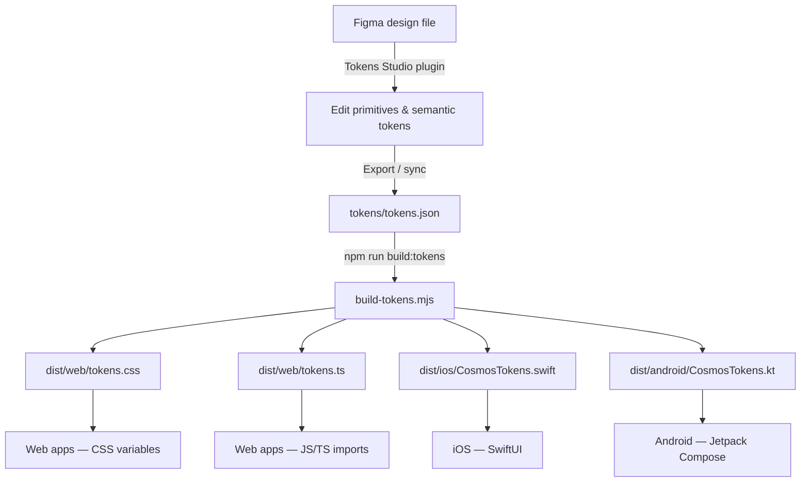

# MakeMyTrip Cosmos Design Tokens

Single source of truth for the MakeMyTrip Cosmos Design System. Tokens are authored in [Tokens Studio](https://tokens.studio/) format, stored in `tokens/tokens.json`, and compiled to web, iOS, and Android outputs via [Style Dictionary](https://styledictionary.com/).

```bash
npm install
npm run build:tokens
```

| Output | Path |
|--------|------|
| CSS custom properties | `dist/web/tokens.css` |
| JavaScript / TypeScript (ESM) | `dist/web/tokens.ts` |
| SwiftUI enum | `dist/ios/CosmosTokens.swift` |
| Jetpack Compose object | `dist/android/CosmosTokens.kt` |

The iOS and Android outputs are namespaced as `CosmosTokens` (Kotlin package `com.makemytrip.cosmos.tokens`) so an app can consume Cosmos tokens alongside another token set without symbol collisions.

---

## End-to-end workflow

Design tokens move from Figma authoring through a single JSON source file into platform-specific code. The pipeline is intentionally linear: one source of truth, one build command, four outputs.



### 1. Author in Figma (Tokens Studio)

Designers maintain the token system in Figma using the [Tokens Studio](https://tokens.studio/) plugin. The file is organized into two token sets that mirror the JSON structure:

| Token set | Contents |
|-----------|----------|
| **primitives** | Raw values — color palettes, font stacks, pixel scales |
| **semantic** | Role-based aliases that reference primitives via `{category.path}` syntax |

When adding a new semantic color, always reference a primitive (e.g. `{color.brand.600}`) rather than entering a raw hex value.

### 2. Export to JSON

Export or sync from Tokens Studio into `tokens/tokens.json`. This file is the **source of truth** for the repository and the only input the build reads.

The export must preserve:

- `$metadata.tokenSetOrder`: `["primitives", "semantic"]` — primitives resolve first
- W3C DTCG format: each token has `value` and `type`
- Cross-set references: `{fontSize.16}`, `{color.neutral.950}`, etc.

### 3. Build platform outputs

```bash
npm install        # once
npm run build:tokens
```

`build-tokens.mjs` runs [Style Dictionary](https://styledictionary.com/) with Tokens Studio transforms and custom MMT transforms. The build:

1. **Preprocesses** the dictionary (`tokens-studio` hoists token sets; `mmt/rename-negative` renames `-12` spacing keys to `minus12`)
2. **Expands** composite typography tokens into individual `fontFamily`, `fontWeight`, `fontSize`, `lineHeight`, and `letterSpacing` properties
3. **Resolves** all `{references}` to final values (including `{color.*}` refs embedded inside gradient strings via `mmt/resolve-gradient-colors`)
4. **Transforms** values per platform:
   - Font weight names → numbers; italic styles split into weight + `fontStyle`
   - Dimensions: `px` → unitless (iOS), `sp`/`dp` (Android)
   - **Colors (iOS/Android only):** hex → native `Color(...)` / `Brush.linearGradient(...)` — web keeps hex strings and CSS gradients
5. **Emits** CSS, ESM, Swift, and Kotlin files into `dist/`

Both `primitives` and `semantic` tokens land in a **flat output namespace** — there is no `primitives.` prefix in generated code.

### 4. Consume in product code

| Platform | Import | Naming | Example |
|----------|--------|--------|---------|
| Web (CSS) | `@import "./dist/web/tokens.css"` | kebab-case CSS vars | `var(--color-text-primary)` |
| Web (TS) | `import tokens from "./dist/web/tokens.ts"` | camelCase object keys | `tokens.colorTextPrimary` |
| iOS | Copy / link `CosmosTokens.swift` | camelCase static lets | `CosmosTokens.colorTextPrimary` (`Color`) |
| Android | Copy / link `CosmosTokens.kt` | camelCase vals in `com.makemytrip.cosmos.tokens` | `CosmosTokens.colorTextPrimary` (`Color`) |

**Rule of thumb:** product code should consume **semantic** tokens (`text-primary`, `radius-md`, `body.sm.medium`) rather than primitives (`neutral-950`, `borderRadius-8`).

### 5. Commit and ship

After any token change:

1. Update `tokens/tokens.json` (via Figma export or direct edit)
2. Run `npm run build:tokens`
3. Commit **both** the source JSON and regenerated `dist/` files together
4. Publish or copy `dist/` artifacts into consuming apps

---

## Architecture

```
Figma (Tokens Studio plugin)
        ↓ export
tokens/tokens.json
  ├── primitives   — raw values (colors, sizes, fonts)
  └── semantic     — role-based aliases that reference primitives
        ↓ Style Dictionary + custom transforms
dist/web · dist/ios · dist/android
```

The token set order is fixed in `$metadata.tokenSetOrder`: **primitives first, semantic second**. Primitives must resolve before semantic aliases can reference them.

### Build pipeline internals

`build-tokens.mjs` configures Style Dictionary with the following processing stages:

| Stage | Name | What it does |
|-------|------|--------------|
| Preprocessor | `tokens-studio` | Hoists `primitives` and `semantic` sets to the dictionary root so cross-set references like `{fontSize.16}` resolve |
| Preprocessor | `mmt/rename-negative` | Renames keys like `spacing.-12` → `spacing.minus12` to avoid collisions after camelCase/kebab-case conversion |
| Preprocessor | `mmt/resolve-gradient-colors` | Inlines `{color.family.step}` references inside `linear-gradient(...)` strings before platform transforms run |
| Expand | `typesMap: true` | Splits composite `typography` tokens into individual output properties |
| Transform | `mmt/fontWeight/number` | Converts string weights (`"Italic"`, `"Semibold Italic"`) to numeric weights; italic styles become weight + `fontStyle: italic` |
| Transform | `mmt/dimension/unitless` (iOS) | Strips `px` suffix for CGFloat-compatible numbers |
| Transform | `mmt/dimension/compose` (Android) | Converts `px` → `sp` for text metrics, `dp` for layout |
| Transform | `mmt/string/quote` (iOS/Android) | Wraps font family strings as native string literals |
| Transform | `mmt/color/ios` (iOS) | Hex colors → `Color(red:green:blue:)` (or sRGB + opacity for `#RRGGBBAA`) |
| Transform | `mmt/color/ios-gradient` (iOS) | CSS `linear-gradient(...)` → SwiftUI `LinearGradient(gradient:startPoint:endPoint:)` |
| Transform | `mmt/color/android` (Android) | Hex colors → Compose `Color(0xAARRGGBB)` |
| Transform | `mmt/color/android-gradient` (Android) | CSS `linear-gradient(...)` → Compose `Brush.linearGradient(...)` |

**Platform outputs:**

| Platform key | Transforms | Format | Output |
|--------------|------------|--------|--------|
| `web-css` | kebab-case names; hex / CSS gradients unchanged | `css/variables` | `dist/web/tokens.css` |
| `web-js` | camelCase names; hex / CSS gradients unchanged | `javascript/esm` | `dist/web/tokens.ts` |
| `ios` | unitless dimensions, quoted strings, native `Color` / `LinearGradient` | `ios-swift/enum.swift` | `dist/ios/CosmosTokens.swift` |
| `android` | compose units, quoted strings, native `Color` / `Brush` | `compose/object` | `dist/android/CosmosTokens.kt` |

#### Native color transforms (iOS & Android)

Web outputs keep token colors as hex strings (or CSS `linear-gradient(...)` for AI tokens). iOS and Android get **compile-ready native types** so engineers do not wrap hex values manually.

| Input (resolved token value) | iOS output | Android output |
|------------------------------|------------|----------------|
| `#294DFF` | `Color(red: 0.160784, green: 0.301961, blue: 1)` | `Color(0xFF294DFF)` |
| `#RRGGBBAA` (8-digit hex) | `Color(.sRGB, red: …, green: …, blue: …, opacity: …)` | `Color(0xAARRGGBB)` |
| `linear-gradient(90deg, #FFD230 0%, …)` | `LinearGradient(gradient: Gradient(stops: […]), startPoint: …, endPoint: …)` | `Brush.linearGradient(0f to Color(…), …, start = Offset(…), end = Offset(…))` |

How gradient conversion works:

1. **`mmt/resolve-gradient-colors`** walks the dictionary and replaces `{color.violet.50}`-style references inside gradient strings with resolved hex values.
2. The CSS angle (e.g. `105deg`, `225deg`) is converted to normalized start/end points (CSS 0° = upward; converted for SwiftUI/Compose coordinate systems).
3. Each color stop (`#hex NN%`) becomes a native gradient stop with a 0–1 location.

Gradient transforms run **before** solid-color transforms on each platform (`mmt/color/ios-gradient` → `mmt/color/ios`, same on Android) so already-converted values are not double-processed.

**Affected tokens:** all 214 color tokens — primitive palette steps plus semantic roles. Solid semantic colors (e.g. `color.text-primary`) and gradient semantic colors (e.g. `color.bg-fill-ai`, `color.text-ai`, `color.border-ai-variant*`) all emit native types on mobile.

---

## Major Design Decisions

### 1. Two-tier token model (primitives → semantic)

| Layer | Purpose | Who uses it |
|-------|---------|-------------|
| **Primitives** | Raw design values — hex colors, pixel sizes, font stacks | Token authors, design system maintainers |
| **Semantic** | Role-based names that describe *intent* (`text-primary`, `bg-fill-brand`) | Product engineers, designers in Figma |

**Why:** Primitives can be updated globally (e.g. re-tint the brand palette) without touching component code. Semantic tokens give engineers stable, meaningful API names that survive palette changes.

### 2. Tokens Studio as the authoring format

- Source file follows W3C Design Tokens Community Group conventions (`value` + `type` pairs).
- `$metadata.tokenSetOrder` enforces build order.
- `$themes` is currently empty — **one light theme only**; no dark mode or multi-brand variants yet.

### 3. Semantic color taxonomy (Polaris-inspired)

Semantic colors are grouped by **role**, not by hue:

| Role prefix | Meaning |
|-------------|---------|
| `bg` | Page-level background |
| `bg-surface-*` | Elevated / grouped surface backgrounds |
| `bg-fill-*` | Interactive or emphasis fills (buttons, badges, banners) |
| `text-*` | Foreground text |
| `border-*` | Strokes and dividers |
| `icon-*` | Icon fill colors |

Within each role, **intent** is expressed with suffixes:

| Suffix | Meaning |
|--------|---------|
| `brand`, `info`, `success`, `caution`, `warning` | Semantic intent |
| `ai`, `userchat` | Product-specific contexts |
| `strong` / `subtle` | Fill intensity pairs |
| `on-bg-fill` / `on-bg-fill-strong` / `on-bg-fill-subtle` | Contrast-safe text on filled backgrounds |

### 4. Color scale system

- **12 palettes:** neutral, brand, red, orange, amber, yellow, lime, green, blue, indigo, violet, purple, fuchsia
- **12 steps per palette:** `0`, `50`, `100`–`900`, `950`
- **Neutral is special:** includes both `0` (white) and `50`–`950`; other palettes start at `50`
- **Brand primary:** `color.brand.600` = `#294DFF`

### 5. Dual-font typography system

| Category | Font | Weights available |
|----------|------|-------------------|
| **Display / Headline** | IvyPresto Headline | regular, semibold, italic, semiboldItalic |
| **Title (lg, md only)** | IvyPresto Headline *or* Avenir | Both families at large sizes |
| **Title (sm–2xs), Body, Label** | Avenir | roman, medium, heavy, black |

Display and headline styles include `letterSpacing.2` (2px). Body and label styles do not.

Typography tokens are **composite** — each bundles `fontFamily`, `fontWeight`, `fontSize`, `lineHeight`, and optionally `letterSpacing`. The build pipeline expands them into individual output properties.

### 6. T-shirt sizing for radius and icon tokens

Semantic radius and icon tokens use abstract size names (`xs`, `sm`, `md`, …) that map to primitive pixel values. This decouples component code from raw numbers.

### 7. Spacing: primitive-only (for now)

A full spacing scale exists in primitives (`spacing.0` through `spacing.64`, plus negative values), but **no semantic spacing aliases** have been defined yet. Layout code currently consumes primitive spacing tokens directly.

### 8. Gradient tokens

AI-related semantic colors use CSS `linear-gradient(...)` strings with embedded primitive references (e.g. `{color.violet.50}`). The build handles them differently per platform:

| Platform | Output |
|----------|--------|
| **Web** | CSS gradient string passed through unchanged |
| **iOS** | SwiftUI `LinearGradient` with `Gradient.Stop` entries and computed `UnitPoint` start/end |
| **Android** | Compose `Brush.linearGradient` with `Color` stops and `Offset` start/end |

The `mmt/resolve-gradient-colors` preprocessor resolves token references inside gradient strings before the native color transforms run. When adding a new gradient token, author it as a CSS gradient in `tokens/tokens.json` — do not hand-write Swift or Kotlin gradient code in product apps.

### 9. Build pipeline customizations

| Transform | Purpose |
|-----------|---------|
| `tokens-studio` preprocessor | Hoists `primitives` / `semantic` sets to root so cross-set `{references}` resolve |
| `mmt/rename-negative` | Renames `-12` spacing keys to `minus12` to avoid name collisions |
| `mmt/resolve-gradient-colors` | Resolves `{color.*}` references embedded in gradient strings |
| `expand` (typography) | Splits composite typography tokens into individual properties |
| `mmt/fontWeight/number` | Converts string weights like `"Italic"` → numeric 400 + italic style |
| `mmt/dimension/unitless` (iOS) | Strips `px` and wraps as `CGFloat(...)` so values drop into SwiftUI APIs |
| `mmt/dimension/compose` (Android) | Converts `px` → `sp` (text) or `dp` (layout) |
| `mmt/string/quote` (iOS/Android) | Wraps font family strings as native literals |
| `mmt/color/ios` / `mmt/color/ios-gradient` | Hex → SwiftUI `Color`; CSS gradients → `LinearGradient` |
| `mmt/color/android` / `mmt/color/android-gradient` | Hex → Compose `Color`; CSS gradients → `Brush.linearGradient` |
| `mmt/ios-line-height-modifier` (iOS format) | Emits `LineHeight.swift` — a `.lineHeight` SwiftUI modifier that converts total line-box height → line spacing |

### 10. Flat output namespace

Both primitives and semantics merge into a single flat namespace in generated outputs. There is no `primitives.` prefix in CSS, JS, Swift, or Kotlin — all tokens are peers.

| Platform | Naming convention | Example |
|----------|-------------------|---------|
| CSS | kebab-case with CTI prefix | `--color-bg-fill-brand` |
| JS / Swift / Kotlin | camelCase | `colorBgFillBrand` |

---

## Best Practices

1. **Always consume semantic tokens in product code.** Use `--color-text-primary`, not `--color-neutral-950`. Semantic names describe intent and survive palette updates.

2. **Edit `tokens/tokens.json` (or Figma via Tokens Studio), never generated files.** Everything in `dist/` is auto-generated and will be overwritten on the next build.

3. **Add new colors to primitives first, then wire semantic aliases.** Never put raw hex values in the semantic layer.

4. **Use paired contrast tokens.** When placing text on a filled background, use the matching `*-on-bg-fill*` token (e.g. `text-info-on-bg-fill-strong` on `bg-fill-info-strong`).

5. **Use composite typography tokens.** Reference the full typography token (e.g. `body.sm.medium`) rather than assembling individual font properties in components.

6. **Run the build after every token change.** `npm run build:tokens` validates references and regenerates all platform outputs.

7. **Keep token set order intact.** `$metadata.tokenSetOrder` must remain `["primitives", "semantic"]`.

8. **Name semantic tokens by role, not value.** Prefer `text-caution` over `text-yellow-700` in the semantic layer (the mapping to yellow happens internally).

9. **Use negative spacing primitives sparingly.** They exist for optical adjustments (overlapping elements, negative margins) — not for general layout gaps.

10. **Document intentional exceptions.** Some mappings are deliberate product choices (e.g. `bg-surface-info` uses `brand.50`, not `blue.50`). Note these when adding new tokens.

---

## Do's and Don'ts

### Do

- Do reference primitives from semantic tokens using `{category.path}` syntax (e.g. `{color.brand.600}`).
- Do use the semantic color role system (`bg-surface`, `bg-fill`, `text`, `border`, `icon`) consistently.
- Do add new palette steps at the primitive layer before creating semantic aliases.
- Do use t-shirt sizes (`radius.md`, `icon.lg`) in components instead of raw pixel values.
- Do expand typography composites via the build — do not manually duplicate font properties.
- Do commit both `tokens/tokens.json` and regenerated `dist/` outputs together.
- Do use `strong` / `subtle` pairs for status fills to maintain visual hierarchy.
- Do test token changes across all three platforms after building.

### Don't

- Don't hardcode hex colors, pixel sizes, or font stacks in application code.
- Don't edit files in `dist/` directly — changes will be lost.
- Don't put raw values in the semantic layer — always alias a primitive.
- Don't skip the build step after modifying tokens.
- Don't use primitive color tokens (e.g. `color.red.500`) directly in UI components — use semantic equivalents.
- Don't create one-off semantic tokens for a single screen — extend the shared taxonomy instead.
- Don't add font sizes without corresponding line heights in the typography scale.
- Don't use negative spacing keys in references — the build renames them (`spacing.-8` → `spacing.minus8` in output).
- Don't hand-convert hex colors or CSS gradients in iOS/Android app code — use the generated `Tokens` values directly.
- Don't remove or rename tokens without checking downstream consumers and Figma sync.

---

## Token Inventory

**Totals:** 228 primitive tokens · 172 semantic tokens

### Primitive tokens (228)

#### Color — 144 tokens (12 palettes × 12 steps)

Token path pattern: `color.{palette}.{step}`

| Step | Neutral | Brand | Red | Orange | Amber | Yellow | Lime | Green | Blue | Indigo | Violet | Purple | Fuchsia |
|------|---------|-------|-----|--------|-------|--------|------|-------|------|--------|--------|--------|---------|
| `0` | #FFFFFF | — | — | — | — | — | — | — | — | — | — | — | — |
| `50` | #FAFAFA | #F0F7FF | #FEF2F2 | #FFF7ED | #FFFBEB | #FEFCE8 | #F7FEE7 | #F0FDF4 | #EFF6FF | #EEF2FF | #F5F3FF | #FAF5FF | #FDF4FF |
| `100` | #F5F5F5 | #E0EEFF | #FFE2E2 | #FFEDD4 | #FEF3C6 | #FEF9C2 | #ECFCCA | #DCFCE7 | #DBEAFE | #E0E7FF | #EDE9FE | #F3E8FF | #FAE8FF |
| `200` | #E6E6E6 | #C2DCFF | #FFC9C9 | #FFD6A8 | #FEE685 | #FFF085 | #D8F999 | #B9F8CF | #BEDBFF | #C6D2FF | #DDD6FF | #E9D4FF | #F6CFFF |
| `300` | #D6D6D6 | #9EC5FF | #FFA2A2 | #FFB86A | #FFD230 | #FFDF20 | #BBF451 | #7BF1A8 | #8EC5FF | #A3B3FF | #C4B4FF | #DAB2FF | #F4A8FF |
| `400` | #A5A5A5 | #75A1FF | #FF6467 | #FF8904 | #FFB900 | #FDC700 | #9AE600 | #05DF72 | #51A2FF | #7C86FF | #A684FF | #C27AFF | #ED6AFF |
| `500` | #767676 | #527DFF | #FB2C36 | #FF6900 | #FE9A00 | #F0B100 | #7CCF00 | #00C950 | #2B7FFF | #615FFF | #8E51FF | #AD46FF | #E12AFB |
| `600` | #575757 | #294DFF | #E7000B | #F54900 | #E17100 | #D08700 | #5EA500 | #00A63E | #155DFC | #4F39F6 | #7F22FE | #9810FA | #C800DE |
| `700` | #434343 | #223FE2 | #C10007 | #CA3500 | #BB4D00 | #A65F00 | #497D00 | #008236 | #1447E6 | #432DD7 | #7008E7 | #8200DB | #A800B7 |
| `800` | #292929 | #1C36B5 | #9F0712 | #9F2D00 | #973C00 | #894B00 | #3C6300 | #016630 | #193CB8 | #372AAC | #5D0EC0 | #6E11B0 | #8A0194 |
| `900` | #1A1A1A | #20348D | #82181A | #7E2A0C | #7B3306 | #733E0A | #35530E | #0D542B | #1C398E | #312C85 | #4D179A | #59168B | #721378 |
| `950` | #000000 | #131D53 | #460809 | #441306 | #461901 | #432004 | #192E03 | #032E15 | #162456 | #1E1A4D | #2F0D68 | #3C0366 | #4B004F |

#### Font family — 2 tokens

| Token | Value |
|-------|-------|
| `fontFamily.ivyPrestoHeadline` | IvyPresto Headline |
| `fontFamily.avenir` | Avenir |

#### Font weight — 8 tokens

| Token | Value | Notes |
|-------|-------|-------|
| `fontWeight.regular` | 400 | IvyPresto |
| `fontWeight.semibold` | 600 | IvyPresto |
| `fontWeight.italic` | `"Italic"` | Build resolves to weight 400 + italic style |
| `fontWeight.semiboldItalic` | `"Semibold Italic"` | Build resolves to weight 600 + italic style |
| `fontWeight.roman` | 400 | Avenir |
| `fontWeight.medium` | 500 | Avenir |
| `fontWeight.heavy` | 800 | Avenir |
| `fontWeight.black` | 900 | Avenir |

#### Font size — 18 tokens

| Token | Value |
|-------|-------|
| `fontSize.9` | 9px |
| `fontSize.10` | 10px |
| `fontSize.11` | 11px |
| `fontSize.12` | 12px |
| `fontSize.14` | 14px |
| `fontSize.16` | 16px |
| `fontSize.18` | 18px |
| `fontSize.20` | 20px |
| `fontSize.22` | 22px |
| `fontSize.25` | 25px |
| `fontSize.28` | 28px |
| `fontSize.32` | 32px |
| `fontSize.36` | 36px |
| `fontSize.40` | 40px |
| `fontSize.45` | 45px |
| `fontSize.51` | 51px |
| `fontSize.58` | 58px |
| `fontSize.65` | 65px |

> `fontSize.9` and `fontSize.10` are defined but not referenced by any semantic typography token.

#### Line height — 15 tokens

| Token | Value |
|-------|-------|
| `lineHeight.12` | 12px |
| `lineHeight.16` | 16px |
| `lineHeight.20` | 20px |
| `lineHeight.24` | 24px |
| `lineHeight.28` | 28px |
| `lineHeight.32` | 32px |
| `lineHeight.36` | 36px |
| `lineHeight.40` | 40px |
| `lineHeight.44` | 44px |
| `lineHeight.52` | 52px |
| `lineHeight.56` | 56px |
| `lineHeight.64` | 64px |
| `lineHeight.72` | 72px |
| `lineHeight.80` | 80px |
| `lineHeight.92` | 92px |

#### Letter spacing — 1 token

| Token | Value |
|-------|-------|
| `letterSpacing.2` | 2px |

#### Spacing — 22 tokens

| Token | Value | Output name |
|-------|-------|-------------|
| `spacing.0` | 0px | `--spacing-0` / `spacing0` |
| `spacing.2` | 2px | `--spacing-2` / `spacing2` |
| `spacing.4` | 4px | `--spacing-4` / `spacing4` |
| `spacing.8` | 8px | `--spacing-8` / `spacing8` |
| `spacing.12` | 12px | `--spacing-12` / `spacing12` |
| `spacing.16` | 16px | `--spacing-16` / `spacing16` |
| `spacing.20` | 20px | `--spacing-20` / `spacing20` |
| `spacing.24` | 24px | `--spacing-24` / `spacing24` |
| `spacing.28` | 28px | `--spacing-28` / `spacing28` |
| `spacing.32` | 32px | `--spacing-32` / `spacing32` |
| `spacing.36` | 36px | `--spacing-36` / `spacing36` |
| `spacing.40` | 40px | `--spacing-40` / `spacing40` |
| `spacing.44` | 44px | `--spacing-44` / `spacing44` |
| `spacing.48` | 48px | `--spacing-48` / `spacing48` |
| `spacing.52` | 52px | `--spacing-52` / `spacing52` |
| `spacing.56` | 56px | `--spacing-56` / `spacing56` |
| `spacing.60` | 60px | `--spacing-60` / `spacing60` |
| `spacing.64` | 64px | `--spacing-64` / `spacing64` |
| `spacing.-2` | -2px | `--spacing-minus2` / `spacingMinus2` |
| `spacing.-4` | -4px | `--spacing-minus4` / `spacingMinus4` |
| `spacing.-8` | -8px | `--spacing-minus8` / `spacingMinus8` |
| `spacing.-12` | -12px | `--spacing-minus12` / `spacingMinus12` |

#### Border radius — 10 tokens

| Token | Value |
|-------|-------|
| `borderRadius.0` | 0px |
| `borderRadius.2` | 2px |
| `borderRadius.4` | 4px |
| `borderRadius.8` | 8px |
| `borderRadius.12` | 12px |
| `borderRadius.16` | 16px |
| `borderRadius.24` | 24px |
| `borderRadius.32` | 32px |
| `borderRadius.40` | 40px |
| `borderRadius.999` | 999px (pill / full) |

#### Icon size — 8 tokens

| Token | Value |
|-------|-------|
| `iconSize.12` | 12px |
| `iconSize.16` | 16px |
| `iconSize.20` | 20px |
| `iconSize.24` | 24px |
| `iconSize.32` | 32px |
| `iconSize.40` | 40px |
| `iconSize.48` | 48px |
| `iconSize.64` | 64px |

---

### Semantic tokens (172)

#### Color — 70 tokens

##### Background — surface (11)

| Token | Role |
|-------|------|
| `color.bg` | Page background |
| `color.bg-surface` | Default elevated surface |
| `color.bg-surface-disabled` | Disabled surface |
| `color.bg-surface-secondary` | Secondary surface |
| `color.bg-surface-brand` | Brand-tinted surface |
| `color.bg-surface-info` | Info surface |
| `color.bg-surface-success` | Success surface |
| `color.bg-surface-caution` | Caution surface |
| `color.bg-surface-warning` | Warning surface |
| `color.bg-surface-userchat` | User chat bubble surface |
| `color.bg-surface-ai` | AI surface (gradient) |

##### Background — fill (14)

| Token | Role |
|-------|------|
| `color.bg-fill` | Default fill |
| `color.bg-fill-disabled` | Disabled fill |
| `color.bg-fill-secondary` | Secondary fill |
| `color.bg-fill-brand` | Brand button / emphasis fill |
| `color.bg-fill-info-strong` | Strong info fill |
| `color.bg-fill-info-subtle` | Subtle info fill |
| `color.bg-fill-success-strong` | Strong success fill |
| `color.bg-fill-success-subtle` | Subtle success fill |
| `color.bg-fill-caution-strong` | Strong caution fill |
| `color.bg-fill-caution-subtle` | Subtle caution fill |
| `color.bg-fill-warning-strong` | Strong warning fill |
| `color.bg-fill-warning-subtle` | Subtle warning fill |
| `color.bg-fill-ai` | AI emphasis fill (gradient) |

##### Text (24)

| Token | Role |
|-------|------|
| `color.text-primary` | Primary body text |
| `color.text-secondary` | Secondary text |
| `color.text-tertiary` | Tertiary / hint text |
| `color.text-disabled` | Disabled text |
| `color.text-inverse` | Text on dark backgrounds |
| `color.text-inverse-disabled` | Disabled inverse text |
| `color.text-link` | Hyperlink text |
| `color.text-brand` | Brand-colored text |
| `color.text-brand-on-bg-fill` | Text on brand fill |
| `color.text-info` | Info status text |
| `color.text-info-on-bg-fill-strong` | Text on strong info fill |
| `color.text-info-on-bg-fill-subtle` | Text on subtle info fill |
| `color.text-success` | Success status text |
| `color.text-success-on-bg-fill-strong` | Text on strong success fill |
| `color.text-success-on-bg-fill-subtle` | Text on subtle success fill |
| `color.text-caution` | Caution status text |
| `color.text-caution-on-bg-fill-strong` | Text on strong caution fill |
| `color.text-caution-on-bg-fill-subtle` | Text on subtle caution fill |
| `color.text-warning` | Warning status text |
| `color.text-warning-on-bg-fill-strong` | Text on strong warning fill |
| `color.text-warning-on-bg-fill-subtle` | Text on subtle warning fill |
| `color.text-ai-on-bg-fill` | Text on AI fill |
| `color.text-userchat` | User chat text |
| `color.text-ai` | AI accent text (gradient) |

##### Border (13)

| Token | Role |
|-------|------|
| `color.border` | Default border |
| `color.border-secondary` | Secondary border |
| `color.border-disabled` | Disabled border |
| `color.border-focus` | Focus ring |
| `color.border-brand` | Brand border |
| `color.border-info` | Info border |
| `color.border-success` | Success border |
| `color.border-caution` | Caution border |
| `color.border-warning` | Warning border |
| `color.border-ai-variant1` | AI border gradient (violet → purple) |
| `color.border-ai-variant2` | AI border gradient (amber → lime → blue) |
| `color.border-ai-variant3` | AI border gradient (fuchsia → blue → fuchsia) |

##### Icon (10)

| Token | Role |
|-------|------|
| `color.icon` | Default icon |
| `color.icon-disabled` | Disabled icon |
| `color.icon-inverse` | Icon on dark backgrounds |
| `color.icon-secondary` | Secondary icon |
| `color.icon-tertiary` | Tertiary icon |
| `color.icon-brand` | Brand icon |
| `color.icon-success` | Success icon |
| `color.icon-caution` | Caution icon |
| `color.icon-warning` | Warning icon |
| `color.icon-info` | Info icon |

#### Typography — 84 composite tokens

| Category | Size | Font size | Line height | Letter spacing | Weight variants |
|----------|------|-----------|-------------|----------------|-----------------|
| display | lg | 65px | 92px | 2px | regular, semibold, italic, semiboldItalic |
| display | md | 58px | 80px | 2px | regular, semibold, italic, semiboldItalic |
| display | sm | 51px | 72px | 2px | regular, semibold, italic, semiboldItalic |
| headline | lg | 45px | 64px | 2px | italic, semiboldItalic |
| headline | md | 40px | 56px | 2px | italic, semiboldItalic |
| headline | sm | 36px | 52px | 2px | italic, semiboldItalic |
| headline | xs | 32px | 44px | 2px | italic, semiboldItalic |
| title | lg | 28px | 40px | — | avenir.roman, avenir.medium, avenir.heavy, avenir.black, ivyPresto.regular, ivyPresto.semibold, ivyPresto.italic, ivyPresto.semiboldItalic |
| title | md | 25px | 36px | — | avenir.roman, avenir.medium, avenir.heavy, avenir.black, ivyPresto.regular, ivyPresto.semibold, ivyPresto.italic, ivyPresto.semiboldItalic |
| title | sm | 22px | 32px | — | avenir.roman, avenir.medium, avenir.heavy, avenir.black |
| title | xs | 20px | 28px | — | avenir.roman, avenir.medium, avenir.heavy, avenir.black |
| title | 2xs | 18px | 24px | — | avenir.roman, avenir.medium, avenir.heavy, avenir.black |
| body | lg | 20px | 32px | — | roman, medium, heavy, black |
| body | md | 18px | 28px | — | roman, medium, heavy, black |
| body | sm | 16px | 24px | — | roman, medium, heavy, black |
| body | xs | 14px | 20px | — | roman, medium, heavy, black |
| body | 2xs | 12px | 16px | — | roman, medium, heavy, black |
| label | xl | 16px | 24px | — | roman, medium, heavy, black |
| label | lg | 14px | 20px | — | roman, medium, heavy, black |
| label | md | 12px | 16px | — | roman, medium, heavy, black |
| label | sm | 11px | 16px | — | roman, medium, heavy, black |

#### Radius — 10 tokens

| Token | Meaning |
|-------|---------|
| `radius.none` | No rounding |
| `radius.xs` | Extra small |
| `radius.sm` | Small |
| `radius.md` | Medium |
| `radius.lg` | Large |
| `radius.xl` | Extra large |
| `radius.2xl` | 2× extra large |
| `radius.3xl` | 3× extra large |
| `radius.4xl` | 4× extra large |
| `radius.full` | Pill / circle |

#### Icon — 8 tokens

| Token | Meaning |
|-------|---------|
| `icon.2xs` | 12px |
| `icon.xs` | 16px |
| `icon.sm` | 20px |
| `icon.md` | 24px |
| `icon.lg` | 32px |
| `icon.xl` | 40px |
| `icon.2xl` | 48px |
| `icon.3xl` | 64px |

---

## Primitive → Semantic Mappings

### Color mappings

| Semantic token | Primitive reference(s) |
|----------------|--------------------------|
| `bg` | `color.neutral.0` |
| `bg-surface` | `color.neutral.100` |
| `bg-surface-disabled` | `color.neutral.50` |
| `bg-surface-secondary` | `color.neutral.0` |
| `bg-surface-brand` | `color.brand.50` |
| `bg-surface-info` | `color.brand.50` |
| `bg-surface-success` | `color.green.50` |
| `bg-surface-caution` | `color.yellow.50` |
| `bg-surface-warning` | `color.red.50` |
| `bg-surface-userchat` | `color.indigo.50` |
| `bg-surface-ai` | `linear-gradient(105deg, color.violet.50 0%, color.purple.50 100%)` |
| `bg-fill` | `color.neutral.0` |
| `bg-fill-disabled` | `color.neutral.300` |
| `bg-fill-secondary` | `color.neutral.100` |
| `bg-fill-brand` | `color.brand.600` |
| `bg-fill-info-strong` | `color.blue.600` |
| `bg-fill-info-subtle` | `color.blue.50` |
| `bg-fill-success-strong` | `color.green.700` |
| `bg-fill-success-subtle` | `color.green.100` |
| `bg-fill-caution-strong` | `color.yellow.600` |
| `bg-fill-caution-subtle` | `color.yellow.100` |
| `bg-fill-warning-strong` | `color.red.700` |
| `bg-fill-warning-subtle` | `color.red.100` |
| `bg-fill-ai` | `linear-gradient(90deg, color.amber.300 0%, color.lime.300 50%, color.blue.100 100%)` |
| `text-primary` | `color.neutral.950` |
| `text-secondary` | `color.neutral.600` |
| `text-tertiary` | `color.neutral.500` |
| `text-disabled` | `color.neutral.400` |
| `text-inverse` | `color.neutral.0` |
| `text-inverse-disabled` | `color.neutral.200` |
| `text-link` | `color.brand.600` |
| `text-brand` | `color.brand.600` |
| `text-brand-on-bg-fill` | `color.neutral.0` |
| `text-info` | `color.blue.700` |
| `text-info-on-bg-fill-strong` | `color.neutral.0` |
| `text-info-on-bg-fill-subtle` | `color.blue.700` |
| `text-success` | `color.green.700` |
| `text-success-on-bg-fill-strong` | `color.neutral.0` |
| `text-success-on-bg-fill-subtle` | `color.green.700` |
| `text-caution` | `color.yellow.600` |
| `text-caution-on-bg-fill-strong` | `color.neutral.0` |
| `text-caution-on-bg-fill-subtle` | `color.yellow.600` |
| `text-warning` | `color.red.700` |
| `text-warning-on-bg-fill-strong` | `color.neutral.0` |
| `text-warning-on-bg-fill-subtle` | `color.red.700` |
| `text-ai-on-bg-fill` | `color.neutral.950` |
| `text-userchat` | `color.indigo.800` |
| `text-ai` | `linear-gradient(90deg, color.brand.600 0%, color.fuchsia.700 100%)` |
| `border` | `color.neutral.300` |
| `border-secondary` | `color.neutral.200` |
| `border-disabled` | `color.neutral.100` |
| `border-focus` | `color.brand.400` |
| `border-brand` | `color.brand.600` |
| `border-info` | `color.blue.100` |
| `border-success` | `color.green.300` |
| `border-caution` | `color.yellow.300` |
| `border-warning` | `color.red.300` |
| `border-ai-variant1` | `linear-gradient(225deg, color.violet.200 0%, color.purple.300 100%)` |
| `border-ai-variant2` | `linear-gradient(90deg, color.amber.300 0%, color.lime.200 44.71%, color.blue.400 100%)` |
| `border-ai-variant3` | `linear-gradient(225deg, color.fuchsia.400 0%, color.blue.500 19.9%, color.fuchsia.400 70.41%, color.fuchsia.400 100%)` |
| `icon` | `color.neutral.950` |
| `icon-disabled` | `color.neutral.200` |
| `icon-inverse` | `color.neutral.50` |
| `icon-secondary` | `color.neutral.600` |
| `icon-tertiary` | `color.neutral.400` |
| `icon-brand` | `color.brand.600` |
| `icon-success` | `color.green.700` |
| `icon-caution` | `color.yellow.600` |
| `icon-warning` | `color.red.700` |
| `icon-info` | `color.blue.700` |

### Radius mappings

| Semantic | Primitive |
|----------|-----------|
| `radius.none` | `borderRadius.0` |
| `radius.xs` | `borderRadius.2` |
| `radius.sm` | `borderRadius.4` |
| `radius.md` | `borderRadius.8` |
| `radius.lg` | `borderRadius.12` |
| `radius.xl` | `borderRadius.16` |
| `radius.2xl` | `borderRadius.24` |
| `radius.3xl` | `borderRadius.32` |
| `radius.4xl` | `borderRadius.40` |
| `radius.full` | `borderRadius.999` |

### Icon size mappings

| Semantic | Primitive |
|----------|-----------|
| `icon.2xs` | `iconSize.12` |
| `icon.xs` | `iconSize.16` |
| `icon.sm` | `iconSize.20` |
| `icon.md` | `iconSize.24` |
| `icon.lg` | `iconSize.32` |
| `icon.xl` | `iconSize.40` |
| `icon.2xl` | `iconSize.48` |
| `icon.3xl` | `iconSize.64` |

### Typography mappings

Each typography token is a composite reference. Pattern:

```
{category}.{size}.{weight}
  → fontFamily.{family}
  → fontWeight.{weight}
  → fontSize.{N}
  → lineHeight.{N}
  → letterSpacing.2   (display & headline only)
```

Full token list with resolved primitive references:

- `display.lg.regular` → fontFamily.ivyPrestoHeadline · fontWeight.regular · 65px · 92px · 2px
- `display.lg.semibold` → fontFamily.ivyPrestoHeadline · fontWeight.semibold · 65px · 92px · 2px
- `display.lg.italic` → fontFamily.ivyPrestoHeadline · fontWeight.italic · 65px · 92px · 2px
- `display.lg.semiboldItalic` → fontFamily.ivyPrestoHeadline · fontWeight.semiboldItalic · 65px · 92px · 2px
- `display.md.regular` → fontFamily.ivyPrestoHeadline · fontWeight.regular · 58px · 80px · 2px
- `display.md.semibold` → fontFamily.ivyPrestoHeadline · fontWeight.semibold · 58px · 80px · 2px
- `display.md.italic` → fontFamily.ivyPrestoHeadline · fontWeight.italic · 58px · 80px · 2px
- `display.md.semiboldItalic` → fontFamily.ivyPrestoHeadline · fontWeight.semiboldItalic · 58px · 80px · 2px
- `display.sm.regular` → fontFamily.ivyPrestoHeadline · fontWeight.regular · 51px · 72px · 2px
- `display.sm.semibold` → fontFamily.ivyPrestoHeadline · fontWeight.semibold · 51px · 72px · 2px
- `display.sm.italic` → fontFamily.ivyPrestoHeadline · fontWeight.italic · 51px · 72px · 2px
- `display.sm.semiboldItalic` → fontFamily.ivyPrestoHeadline · fontWeight.semiboldItalic · 51px · 72px · 2px
- `headline.lg.italic` → fontFamily.ivyPrestoHeadline · fontWeight.italic · 45px · 64px · 2px
- `headline.lg.semiboldItalic` → fontFamily.ivyPrestoHeadline · fontWeight.semiboldItalic · 45px · 64px · 2px
- `headline.md.italic` → fontFamily.ivyPrestoHeadline · fontWeight.italic · 40px · 56px · 2px
- `headline.md.semiboldItalic` → fontFamily.ivyPrestoHeadline · fontWeight.semiboldItalic · 40px · 56px · 2px
- `headline.sm.italic` → fontFamily.ivyPrestoHeadline · fontWeight.italic · 36px · 52px · 2px
- `headline.sm.semiboldItalic` → fontFamily.ivyPrestoHeadline · fontWeight.semiboldItalic · 36px · 52px · 2px
- `headline.xs.italic` → fontFamily.ivyPrestoHeadline · fontWeight.italic · 32px · 44px · 2px
- `headline.xs.semiboldItalic` → fontFamily.ivyPrestoHeadline · fontWeight.semiboldItalic · 32px · 44px · 2px
- `title.lg.avenir.roman` → fontFamily.avenir · fontWeight.roman · 28px · 40px
- `title.lg.avenir.medium` → fontFamily.avenir · fontWeight.medium · 28px · 40px
- `title.lg.avenir.heavy` → fontFamily.avenir · fontWeight.heavy · 28px · 40px
- `title.lg.avenir.black` → fontFamily.avenir · fontWeight.black · 28px · 40px
- `title.lg.ivyPresto.regular` → fontFamily.ivyPrestoHeadline · fontWeight.regular · 28px · 40px
- `title.lg.ivyPresto.semibold` → fontFamily.ivyPrestoHeadline · fontWeight.semibold · 28px · 40px
- `title.lg.ivyPresto.italic` → fontFamily.ivyPrestoHeadline · fontWeight.italic · 28px · 40px
- `title.lg.ivyPresto.semiboldItalic` → fontFamily.ivyPrestoHeadline · fontWeight.semiboldItalic · 28px · 40px
- `title.md.avenir.roman` → fontFamily.avenir · fontWeight.roman · 25px · 36px
- `title.md.avenir.medium` → fontFamily.avenir · fontWeight.medium · 25px · 36px
- `title.md.avenir.heavy` → fontFamily.avenir · fontWeight.heavy · 25px · 36px
- `title.md.avenir.black` → fontFamily.avenir · fontWeight.black · 25px · 36px
- `title.md.ivyPresto.regular` → fontFamily.ivyPrestoHeadline · fontWeight.regular · 25px · 36px
- `title.md.ivyPresto.semibold` → fontFamily.ivyPrestoHeadline · fontWeight.semibold · 25px · 36px
- `title.md.ivyPresto.italic` → fontFamily.ivyPrestoHeadline · fontWeight.italic · 25px · 36px
- `title.md.ivyPresto.semiboldItalic` → fontFamily.ivyPrestoHeadline · fontWeight.semiboldItalic · 25px · 36px
- `title.sm.avenir.roman` → fontFamily.avenir · fontWeight.roman · 22px · 32px
- `title.sm.avenir.medium` → fontFamily.avenir · fontWeight.medium · 22px · 32px
- `title.sm.avenir.heavy` → fontFamily.avenir · fontWeight.heavy · 22px · 32px
- `title.sm.avenir.black` → fontFamily.avenir · fontWeight.black · 22px · 32px
- `title.xs.avenir.roman` → fontFamily.avenir · fontWeight.roman · 20px · 28px
- `title.xs.avenir.medium` → fontFamily.avenir · fontWeight.medium · 20px · 28px
- `title.xs.avenir.heavy` → fontFamily.avenir · fontWeight.heavy · 20px · 28px
- `title.xs.avenir.black` → fontFamily.avenir · fontWeight.black · 20px · 28px
- `title.2xs.avenir.roman` → fontFamily.avenir · fontWeight.roman · 18px · 24px
- `title.2xs.avenir.medium` → fontFamily.avenir · fontWeight.medium · 18px · 24px
- `title.2xs.avenir.heavy` → fontFamily.avenir · fontWeight.heavy · 18px · 24px
- `title.2xs.avenir.black` → fontFamily.avenir · fontWeight.black · 18px · 24px
- `body.lg.roman` → fontFamily.avenir · fontWeight.roman · 20px · 32px
- `body.lg.medium` → fontFamily.avenir · fontWeight.medium · 20px · 32px
- `body.lg.heavy` → fontFamily.avenir · fontWeight.heavy · 20px · 32px
- `body.lg.black` → fontFamily.avenir · fontWeight.black · 20px · 32px
- `body.md.roman` → fontFamily.avenir · fontWeight.roman · 18px · 28px
- `body.md.medium` → fontFamily.avenir · fontWeight.medium · 18px · 28px
- `body.md.heavy` → fontFamily.avenir · fontWeight.heavy · 18px · 28px
- `body.md.black` → fontFamily.avenir · fontWeight.black · 18px · 28px
- `body.sm.roman` → fontFamily.avenir · fontWeight.roman · 16px · 24px
- `body.sm.medium` → fontFamily.avenir · fontWeight.medium · 16px · 24px
- `body.sm.heavy` → fontFamily.avenir · fontWeight.heavy · 16px · 24px
- `body.sm.black` → fontFamily.avenir · fontWeight.black · 16px · 24px
- `body.xs.roman` → fontFamily.avenir · fontWeight.roman · 14px · 20px
- `body.xs.medium` → fontFamily.avenir · fontWeight.medium · 14px · 20px
- `body.xs.heavy` → fontFamily.avenir · fontWeight.heavy · 14px · 20px
- `body.xs.black` → fontFamily.avenir · fontWeight.black · 14px · 20px
- `body.2xs.roman` → fontFamily.avenir · fontWeight.roman · 12px · 16px
- `body.2xs.medium` → fontFamily.avenir · fontWeight.medium · 12px · 16px
- `body.2xs.heavy` → fontFamily.avenir · fontWeight.heavy · 12px · 16px
- `body.2xs.black` → fontFamily.avenir · fontWeight.black · 12px · 16px
- `label.xl.roman` → fontFamily.avenir · fontWeight.roman · 16px · 24px
- `label.xl.medium` → fontFamily.avenir · fontWeight.medium · 16px · 24px
- `label.xl.heavy` → fontFamily.avenir · fontWeight.heavy · 16px · 24px
- `label.xl.black` → fontFamily.avenir · fontWeight.black · 16px · 24px
- `label.lg.roman` → fontFamily.avenir · fontWeight.roman · 14px · 20px
- `label.lg.medium` → fontFamily.avenir · fontWeight.medium · 14px · 20px
- `label.lg.heavy` → fontFamily.avenir · fontWeight.heavy · 14px · 20px
- `label.lg.black` → fontFamily.avenir · fontWeight.black · 14px · 20px
- `label.md.roman` → fontFamily.avenir · fontWeight.roman · 12px · 16px
- `label.md.medium` → fontFamily.avenir · fontWeight.medium · 12px · 16px
- `label.md.heavy` → fontFamily.avenir · fontWeight.heavy · 12px · 16px
- `label.md.black` → fontFamily.avenir · fontWeight.black · 12px · 16px
- `label.sm.roman` → fontFamily.avenir · fontWeight.roman · 11px · 16px
- `label.sm.medium` → fontFamily.avenir · fontWeight.medium · 11px · 16px
- `label.sm.heavy` → fontFamily.avenir · fontWeight.heavy · 11px · 16px
- `label.sm.black` → fontFamily.avenir · fontWeight.black · 11px · 16px

### Spacing (no semantic layer)

Spacing tokens are **primitive-only**. Use them directly:

| CSS variable | Value |
|--------------|-------|
| `--spacing-0` | 0px |
| `--spacing-2` | 2px |
| `--spacing-4` | 4px |
| `--spacing-8` | 8px |
| `--spacing-12` | 12px |
| `--spacing-16` | 16px |
| `--spacing-20` | 20px |
| `--spacing-24` | 24px |
| `--spacing-28` | 28px |
| `--spacing-32` | 32px |
| `--spacing-36` | 36px |
| `--spacing-40` | 40px |
| `--spacing-44` | 44px |
| `--spacing-48` | 48px |
| `--spacing-52` | 52px |
| `--spacing-56` | 56px |
| `--spacing-60` | 60px |
| `--spacing-64` | 64px |
| `--spacing-minus2` | -2px |
| `--spacing-minus4` | -4px |
| `--spacing-minus8` | -8px |
| `--spacing-minus12` | -12px |

---

## Usage Examples

### Web (CSS)

```css
@import "./dist/web/tokens.css";

.card {
  background: var(--color-bg-surface);
  border: 1px solid var(--color-border);
  border-radius: var(--radius-md);
  padding: var(--spacing-16);
  color: var(--color-text-primary);
  font-size: var(--body-sm-medium-font-size);
  line-height: var(--body-sm-medium-line-height);
  font-family: var(--body-sm-medium-font-family);
  font-weight: var(--body-sm-medium-font-weight);
}

.button-brand {
  background: var(--color-bg-fill-brand);
  color: var(--color-text-brand-on-bg-fill);
  border-radius: var(--radius-sm);
}
```

### Web (JavaScript / TypeScript)

```ts
import tokens from "./dist/web/tokens.ts";

console.log(tokens.colorBgFillBrand); // "#294DFF"
```

### iOS (SwiftUI)

Color tokens are emitted as SwiftUI `Color` or `LinearGradient` values — use them directly (no `Color(...)` wrapper). Numeric dimension tokens (font size, line height, letter spacing, radius, spacing) are emitted as `CGFloat`, so they drop straight into SwiftUI APIs without manual casting:

```swift
Text("Hello")
  .font(.system(size: CosmosTokens.bodySmMediumFontSize))
  .foregroundColor(CosmosTokens.colorTextPrimary)

// Solid fill
RoundedRectangle(cornerRadius: CosmosTokens.radiusMd)
  .fill(CosmosTokens.colorBgFillBrand)

// Gradient fill (e.g. AI tokens)
RoundedRectangle(cornerRadius: CosmosTokens.radiusMd)
  .fill(CosmosTokens.colorBgFillAi)
```

#### Line height

⚠️ **Do not pass a `*LineHeight` token to `.lineSpacing(_:)`.** Line-height tokens store the **total line-box height** (the same model Figma, CSS `line-height`, and Compose `lineHeight` use). SwiftUI's `.lineSpacing(_:)` is different — it only adds space *between* lines, so passing the token directly over-spaces text and makes iOS diverge from web/Android.

Use the generated `.lineHeight` modifier (`dist/ios/LineHeight.swift`) instead. It converts the total line height into the correct SwiftUI line spacing (`lineHeight − font.lineHeight`) and pads the top/bottom by half the leading so single lines and the first/last line match the web/Android box:

```swift
// Preferred: pass the exact UIFont you render with (most accurate metrics)
Text("Multi-line copy that wraps")
  .font(.system(size: CosmosTokens.bodyMdRomanFontSize))
  .lineHeight(CosmosTokens.bodyMdRomanLineHeight,
              for: .systemFont(ofSize: CosmosTokens.bodyMdRomanFontSize))

// Convenience: resolve a UIFont from token font family + size
// (falls back to the system font if the custom font isn't registered)
Text("Multi-line copy that wraps")
  .lineHeight(CosmosTokens.bodyMdRomanLineHeight,
              fontName: CosmosTokens.bodyMdRomanFontFamily,
              fontSize: CosmosTokens.bodyMdRomanFontSize)
```

Why this exists: SwiftUI's `Font` doesn't expose line metrics, and `.lineSpacing` models *leading between lines* rather than a total line box. Web (`line-height`) and Android (Compose `lineHeight`) both interpret the token as a total box, so only iOS needs this conversion step to render identically.

### Android (Compose)

Solid color tokens are `Color`; gradient tokens are `Brush`. Use the matching Compose modifier:

```kotlin
Text(
  text = "Hello",
  fontSize = CosmosTokens.bodySmMediumFontSize,
  color = CosmosTokens.colorTextPrimary,
)

// Solid background
Box(
  modifier = Modifier.background(CosmosTokens.colorBgFillBrand),
)

// Gradient background (Brush tokens — colorBgFillAi, colorTextAi, border-ai variants, etc.)
Box(
  modifier = Modifier.background(CosmosTokens.colorBgFillAi),
)
```

---

## File Reference

| File | Description |
|------|-------------|
| `tokens/tokens.json` | Source of truth — edit here or sync from Figma |
| `build-tokens.mjs` | Style Dictionary config and custom transforms |
| `package.json` | Package metadata and build script |
| `dist/web/tokens.css` | Generated CSS custom properties |
| `dist/web/tokens.ts` | Generated ESM token object |
| `dist/ios/CosmosTokens.swift` | Generated SwiftUI enum |
| `dist/ios/LineHeight.swift` | Generated SwiftUI `.lineHeight` modifier (total line-box height → line spacing) |
| `dist/android/CosmosTokens.kt` | Generated Compose object (`com.makemytrip.cosmos.tokens`) |
